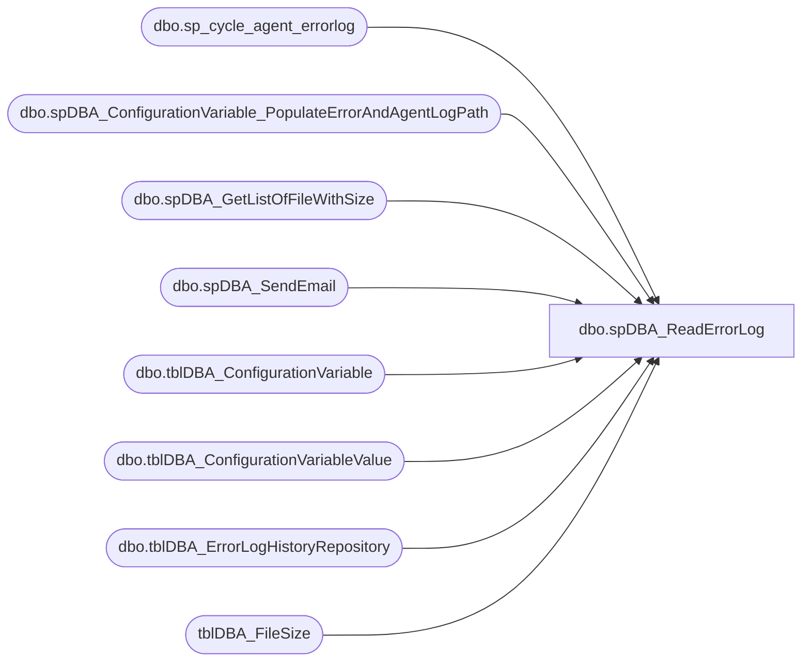

# dbo.spDBA_ReadErrorLog

**Database:** DBAUtility_new  
**Server:** papamart  

## Architecture Diagram



## Table Dependencies

| Referenced Table |
|---|
| dbo.sp_cycle_agent_errorlog |
| dbo.spDBA_ConfigurationVariable_PopulateErrorAndAgentLogPath |
| dbo.spDBA_GetListOfFileWithSize |
| dbo.spDBA_SendEmail |
| dbo.tblDBA_ConfigurationVariable |
| dbo.tblDBA_ConfigurationVariableValue |
| dbo.tblDBA_ErrorLogHistoryRepository |
| tblDBA_FileSize |

## Stored Procedure Code

```sql
CREATE PROCEDURE [dbo].[spDBA_ReadErrorLog]
	@LogVersion int = NULL,--0, --0 is current
	@LogType int = 0, --0 is both, 1 is SQL Server Error log, 2 is agent log
	@String1 varchar(255) = NULL,
	@String2 varchar(255) = NULL,
	@ResultsToTable nvarchar(1) = 'N',
	@FileName	varchar(200) = NULL,
	@Action VARCHAR(20) = 'Process'
AS
-- =============================================================================================================
-- Name: spDBA_ReadErrorLog
--
-- Description:	Returns information from the error and agent log.
--
-- Output: error logging.
-- 
-- Available actions:
-- @Action:
--	'ReturnVersion' = Do not do anything but return the version of the procedure
--	'Process' = Do not return log records to user 
--	'Return' = Return contents of log
-- @ResultsToTable: 
--		'Y' = Record Log to Consolidated Reporting Table
--		'N' = Do not insert records into Reporting table
-- Available actions (2005):
--1.  Value of error log file you want to read: 0 = current, 1 = Archive #1, 2 = Archive #2, etc... 
--2.  Log file type: null is both, 1 is SQL Server Error log, 2 is agent log
--3.  Search string 1: String one you want to search for 
--4.  Search string 2: String two you want to search for to further refine the results 
--5.  ? 
--6.  ? 
--7.  Sort order for results: N'asc' = ascending, N'desc' = descending
--
-- Available actions (2000):
--Parameter 1 : Non zero integer value (use 1 in @LogVersion)
--Parameter 2 : File name of error log (@FileName)
--Parameter 3 : Line number in the file (use 1 in @LogVersion)
--Parameter 4 : Search string (@String1)
--2000 example: EXEC spDBA_ReadErrorLog @LogVersion=1,  @FileName='F:\Program Files\Microsoft SQL Server\MSSQL\log\ERRORLOG', @String1='Error:', @ResultsToTable = 'N'
--				EXEC spDBA_ReadErrorLog @LogVersion=1,  @FileName='F:\Program Files\Microsoft SQL Server\MSSQL\log\ERRORLOG', @String1='Error:', @ResultsToTable = 'Y'
-- Dependencies: 
--	DBAUtility.dbo.spDBA_ConfigurationVariable_PopulateErrorAndAgentLogPath
--  DBAUtility.dbo.spDBA_SendEmail
--	DBAUtility.dbo.spDBA_GetListOfFileWithSize
--	DBAUtility.dbo.tblDBA_FileSize
--
-- Revision History
--		Name:			Date:			Comments:
--		Gary Derikito	04/29/2009		Created based on http://www.mssqltips.com/tip.asp?tip=1476
--		Gary Derikito	05/18/2009		Changed nvarchar(max) to nvarchar(2000) to allow working with SQL2000.
--										Add logic to check if SQL 2000 or 2005 and allow for appropriate version of log output.
--		Mike Pelikan	05/24/2012		Added logic to look at SQL Server Agent log.
--		Mike Pelikan	05/29/2012		Corrected for SQL 2000
--		Mike Pelikan	05/29/2012		FilePath Correction for SQL 2000
--		Mike Pelikan	05/30/2012		Corrected searching for SQL 2000
--		Mike Pelikan	06/06/2012		Added logic to remove extraneous files from ##FileSize
--		Mike Pelikan	06/10/2012		Added @@ServerName to where clause for variable selection
--		Mike Pelikan	06/14/2012		Replaced ##FileSize with tblDBA_FileSize
--		Mike Pelikan	06/25/2012		Corrected bug for Servers that have no records in repository table - Working date was null
--										Changed temporary table (#TempLog) to have a text field, instead of a varchar(2000) field
--		Mike Pelikan	07/10/2012		Changed check date logic so current log will always be checked
--										Corrected DELETE statements to not remove Current Logs
--		Mike Pelikan	12/31/2013		Modifed MAX(LogDate) logic to use a temp table
--		Mike Pelikan	01/02/2014		Increaded #logF.LogSize to BIGINT

DECLARE @Revision DATETIME
SET @Revision = '01/02/2014'
	
/*
DECLARE @LogVersion int ,--0, --0 is current
@LogType int, --0 is both, 1 is SQL Server Error log, 2 is agent log
@String1 varchar(255),
@String2 varchar(255),
@ResultsToTable nvarchar(1),
@FileName	varchar(200),
@Action VARCHAR(20)

SELECT @LogVersion = NULL,--0, --0 is current
@LogType = 0, --0 is both, 1 is SQL Server Error log, 2 is agent log
@String1 = NULL,
@String2 = NULL,
@ResultsToTable = 'Y',
@FileName	= NULL,
@Action = 'Process'

*/
-- =============================================================================================================

----------------------------------------------------------------------------------------------------
--// Set options                                                                                //--
----------------------------------------------------------------------------------------------------
SET NOCOUNT ON

  ----------------------------------------------------------------------------------------------------
  --// Declare variables                                                                          //--
  ----------------------------------------------------------------------------------------------------
DECLARE @TSQL  NVARCHAR(2000)
DECLARE @ProductVersion	NVARCHAR(20)

DECLARE @SQLWorkingDate DATETIME
DECLARE @AgentWorkingDate DATETIME
----------------------------------------------------------------------------------------------------
--// Revision                                                                                //--
----------------------------------------------------------------------------------------------------
IF @Action = 'ReturnVersion'
BEGIN
	SELECT @Revision
	GOTO EndHere
END

--set the product version to allow for differences between 2000 and 2005
SET @ProductVersion =  CAST(SERVERPROPERTY('productversion') AS VARCHAR)

IF object_id('tempdb..#TempLog','u')  IS NOT NULL
	DROP TABLE #TempLog

CREATE TABLE #TempLog (
	  ServerName	VARCHAR(100),
	  LogType		VARCHAR(100),
      LogDate     DATETIME,
      ProcessInfo VARCHAR(50),
      LogText TEXT,

      --LogText VARCHAR(2000),
	  ContinuationRow	TINYINT,--2000 only
	  InsertDate [datetime] NOT NULL DEFAULT (GETDATE()))

IF object_id('tempdb..#logF','u')  IS NOT NULL
	DROP TABLE #logF

CREATE TABLE #logF (
	LogType INT NULL, 
	ArchiveNumber     INT,
	LogDate           DATETIME,
	LogSize           BIGINT,
	LogPath			  VARCHAR(2000) NULL, 
	isProcessed		  BIT DEFAULT(0)
)

  ----------------------------------------------------------------------------------------------------
  --// Declare variables                                                                          //--
  ----------------------------------------------------------------------------------------------------

  DECLARE @StartMessage nvarchar(2000)
  DECLARE @EndMessage nvarchar(2000)
  DECLARE @DatabaseMessage nvarchar(2000)
  DECLARE @ErrorMessage nvarchar(2000)

  DECLARE @CurrentID int
  DECLARE @CurrentDatabase nvarchar(2000)

  DECLARE @CurrentCommand01 nvarchar(2000)

  DECLARE @CurrentCommandOutput01 int

  DECLARE @tmpDatabases TABLE (ID int IDENTITY PRIMARY KEY,
                               DatabaseName nvarchar(2000),
                               Completed bit)

  DECLARE @Error int

  SET @Error = 0

DECLARE @SQLAgentLogPath VARCHAR(1000)
  ----------------------------------------------------------------------------------------------------
  --// Log initial information                                                                    //--
  ----------------------------------------------------------------------------------------------------
--not currently doing anything with start message
--  SET @StartMessage = 'DateTime: ' + CONVERT(nvarchar,GETDATE(),120) + CHAR(13) + CHAR(10)
--  SET @StartMessage = @StartMessage + 'Server: ' + CAST(SERVERPROPERTY('ServerName') AS nvarchar) + CHAR(13) + CHAR(10)
--  SET @StartMessage = @StartMessage + 'Version: ' + CAST(SERVERPROPERTY('ProductVersion') AS nvarchar) + CHAR(13) + CHAR(10)
--  SET @StartMessage = @StartMessage + 'Edition: ' + CAST(SERVERPROPERTY('Edition') AS nvarchar) + CHAR(13) + CHAR(10)
--  SET @StartMessage = @StartMessage + 'Procedure: ' + QUOTENAME(DB_NAME(DB_ID())) + '.' + QUOTENAME(OBJECT_SCHEMA_NAME(@@PROCID)) + '.' + QUOTENAME(OBJECT_NAME(@@PROCID)) + CHAR(13) + CHAR(10)
--  SET @StartMessage = @StartMessage + 'Parameters: @LogVersion = ' + ISNULL('''' + REPLACE(@LogVersion,'''','''''') + '''','NULL')
--  SET @StartMessage = @StartMessage + ', @LogType = ' + ISNULL('''' + REPLACE(@LogType,'''','''''') + '''','NULL')
--  SET @StartMessage = @StartMessage + ', @String1 = ' + ISNULL('''' + REPLACE(@String1,'''','''''') + '''','NULL')
--  SET @StartMessage = @StartMessage + ', @String2 = ' + ISNULL('''' + REPLACE(@String2,'''','''''') + '''','NULL')
--  SET @StartMessage = @StartMessage + ', @ResultsToTable = ' + ISNULL('''' + REPLACE(@ResultsToTable,'''','''''') + '''','NULL')
--  SET @StartMessage = @StartMessage + CHAR(13) + CHAR(10)
--  SET @StartMessage = REPLACE(@StartMessage,'%','%%')
--  RAISERROR(@StartMessage,10,1) WITH NOWAIT


  ----------------------------------------------------------------------------------------------------
  --// Check input parameters                                                                     //--
  ----------------------------------------------------------------------------------------------------

  IF @LogVersion < 0 
  BEGIN
    SET @ErrorMessage = 'The value for parameter @LogVersion is not supported.' + CHAR(13) + CHAR(10)
    RAISERROR(@ErrorMessage,16,1) WITH LOG
    SET @Error = @@ERROR
  END

  IF @LogType NOT IN (0, 1, 2) 
  BEGIN
    SET @ErrorMessage = 'The value for parameter @LogType is not supported.' + CHAR(13) + CHAR(10)
    RAISERROR(@ErrorMessage,16,1) WITH LOG
    SET @Error = @@ERROR
  END

 IF @ResultsToTable NOT IN ('Y','N') OR @ResultsToTable IS NULL
  BEGIN
    SET @ErrorMessage = 'The value for parameter @ResultsToTable is not supported.' + CHAR(13) + CHAR(10)
    RAISERROR(@ErrorMessage,16,1) WITH LOG
    SET @Error = @@ERROR
  END

----------------------------------------------------------------------------------------------------
--// Check error variable                                                                       //--
----------------------------------------------------------------------------------------------------

IF @Error <> 0 GOTO EndHere

----------------------------------------------------------------------------------------------------
--// Execute commands                                                                           //--
----------------------------------------------------------------------------------------------------
--Populate #logF with all log files of approirate type(s)

IF @LogVersion IS NULL 
BEGIN
	IF @LogType = 0 OR @LogType = 1
	BEGIN
	--Error Log		
		SELECT @SQLAgentLogPath = cvv.VariableValue
		FROM COREDB01_MAINT.DBAUtilityMaster.dbo.tblDBA_ConfigurationVariableValue cvv 
		INNER JOIN COREDB01_MAINT.DBAUtilityMaster.dbo.tblDBA_ConfigurationVariable cv ON cvv.VariableID = cv.VariableID
		WHERE cv.VariableName = 'SQLErrorLogPath' AND cvv.InstanceName = @@SERVERNAME

		DELETE FROM tblDBA_FileSize WHERE Process = @@SPID AND UserName = SYSTEM_USER

		IF @SQLAgentLogPath IS NULL 
			EXEC DBAUtility.dbo.spDBA_ConfigurationVariable_PopulateErrorAndAgentLogPath 
		
		SELECT @SQLAgentLogPath = cvv.VariableValue
		FROM COREDB01_MAINT.DBAUtilityMaster.dbo.tblDBA_ConfigurationVariableValue cvv
		INNER JOIN COREDB01_MAINT.DBAUtilityMaster.dbo.tblDBA_ConfigurationVariable cv ON cvv.VariableID = cv.VariableID
		WHERE cv.VariableName = 'SQLErrorLogPath' AND cvv.InstanceName = @@SERVERNAME

		SELECT @SQLAgentLogPath = REPLACE (@SQLAgentLogPath, '.OUT', '.') + '*'
		
		EXEC DBAUtility.dbo.spDBA_GetListOfFileWithSize @SQLAgentLogPath
	
		-- the Error log will end with G, all other alpha records should be removed from temp table		
		DELETE FROM tblDBA_FileSize WHERE PATINDEX('%[a-z]%',RIGHT(FilePath,1)) = 1 AND UPPER(RIGHT(FilePath, 1)) <> 'G' AND Process = @@SPID AND UserName = SYSTEM_USER
		 
		INSERT INTO #logF (LogType, ArchiveNumber, LogDate, LogSize, LogPath)
		SELECT 1, CASE RIGHT(FilePath, 1) WHEN 'T' THEN 0 WHEN 'G' THEN 0 ELSE CAST(RIGHT(FilePath, 1) AS INT) END, ModifiedDate, SizeInKB * 1024, 
					CASE RIGHT(FilePath, 1) 
				WHEN 'G' THEN REPLACE (@SQLAgentLogPath, '.*', '') 
				ELSE REPLACE (@SQLAgentLogPath, '.*', '.' + RIGHT(FilePath, 1)) END FilePath  
		FROM tblDBA_FileSize 
		WHERE Process = @@SPID AND UserName = SYSTEM_USER
		ORDER BY 2
		
	END
	SET @SQLAgentLogPath = NULL
	IF @LogType = 0 OR @LogType = 2
	BEGIN
	--Agent Log
		SELECT @SQLAgentLogPath = cvv.VariableValue
		FROM COREDB01_MAINT.DBAUtilityMaster.dbo.tblDBA_ConfigurationVariableValue cvv
		INNER JOIN COREDB01_MAINT.DBAUtilityMaster.dbo.tblDBA_ConfigurationVariable cv ON cvv.VariableID = cv.VariableID
		WHERE cv.VariableName = 'SQLAgentLogPath' AND cvv.InstanceName = @@SERVERNAME


		IF @SQLAgentLogPath IS NULL 
			EXEC DBAUtility.dbo.spDBA_ConfigurationVariable_PopulateErrorAndAgentLogPath 
		
		SELECT @SQLAgentLogPath = cvv.VariableValue
		FROM COREDB01_MAINT.DBAUtilityMaster.dbo.tblDBA_ConfigurationVariableValue cvv
		INNER JOIN COREDB01_MAINT.DBAUtilityMaster.dbo.tblDBA_ConfigurationVariable cv ON cvv.VariableID = cv.VariableID
		WHERE cv.VariableName = 'SQLAgentLogPath' AND cvv.InstanceName = @@SERVERNAME

		SELECT @SQLAgentLogPath = REPLACE (@SQLAgentLogPath, '.OUT', '.*')
		
		DELETE FROM tblDBA_FileSize WHERE Process = @@SPID AND UserName = SYSTEM_USER
					
		EXEC DBAUtility.dbo.spDBA_GetListOfFileWithSize @SQLAgentLogPath
		
		-- the Agent log will end with T, all other alpha records should be removed from temp table		
		DELETE FROM tblDBA_FileSize WHERE PATINDEX('%[a-z]%',RIGHT(FilePath,1)) = 1 AND UPPER(RIGHT(FilePath, 1)) <> 'T' AND Process = @@SPID AND UserName = SYSTEM_USER
		
		INSERT INTO #logF (LogType, ArchiveNumber, LogDate, LogSize, LogPath)
		SELECT 2, CASE RIGHT(FilePath, 1) WHEN 'T' THEN 0 ELSE CAST(RIGHT(FilePath, 1) AS INT) END, ModifiedDate, SizeInKB * 1024, 
			CASE RIGHT(FilePath, 1) 
				WHEN 'T' THEN REPLACE (@SQLAgentLogPath, '.*', '.OUT') 
				ELSE REPLACE (@SQLAgentLogPath, '.*', '.' + RIGHT(FilePath, 1)) END FilePath  
		FROM tblDBA_FileSize 
		WHERE Process = @@SPID AND UserName = SYSTEM_USER
		ORDER BY 2
		
	END
END
ELSE
	BEGIN 

	IF @LogType = 0 
	BEGIN
		INSERT INTO #logF(LogType, ArchiveNumber)
		VALUEs (1, @LogVersion)
		INSERT INTO #logF(LogType, ArchiveNumber)
		VALUEs (2, @LogVersion)
	END
	ELSE
	BEGIN
		INSERT INTO #logF(LogType, ArchiveNumber)
		VALUES (@LogType, @LogVersion)
	END	
END   

--Check repository for latest archive for this Instance.
IF @ResultsToTable = 'Y'
BEGIN
	IF OBJECT_ID('tempdb..#RepositoryDates','u')  IS NOT NULL
		DROP TABLE #RepositoryDates

	SELECT MAX(LogDate) LogDate, InstanceName, LogType
	INTO #RepositoryDates
	FROM COREDB01_MAINT.DBAUtilityMaster.dbo.tblDBA_ErrorLogHistoryRepository
	GROUP BY InstanceName, LogType
	
	IF REPLACE(@LogType,0,1) = 1
	BEGIN
		SET @SQLWorkingDate = NULL
		SELECT @SQLWorkingDate = MAX(LogDate) FROM #RepositoryDates
		WHERE InstanceName = @@SERVERNAME AND LogType = 'SQL Server'
		
		IF @SQLWorkingDate IS NULL
			SET @SQLWorkingDate = DATEADD(mm, -3, GETDATE() )
		DELETE FROM #logF WHERE LogType = 1 AND LogDate < ISNULL(@SQLWorkingDate, DATEADD(mm, -3, GETDATE() ))  AND LogPath NOT LIKE '%ERRORLOG'

	END
	
	IF REPLACE(@LogType,0,2) = 2
	BEGIN
		SELECT @AgentWorkingDate = MAX(LogDate) FROM #RepositoryDates
		WHERE InstanceName = @@SERVERNAME AND LogType = 'Agent'
		
		IF @AgentWorkingDate IS NULL
					SET @AgentWorkingDate = DATEADD(mm, -3, GETDATE() )

		DELETE FROM #logF WHERE LogType = 2 AND LogDate < ISNULL(@AgentWorkingDate, DATEADD(mm, -3, GETDATE() )) AND LogPath NOT LIKE '%.OUT'

	END
END
IF (@Action = 'Process' AND @ResultsToTable = 'Y') OR @Action = 'Return'
BEGIN
	WHILE (SELECT COUNT(*) FROM #logF WHERE isProcessed = 0) > 0
	BEGIN
		SELECT TOP 1 @LogType = LogType, @LogVersion = ArchiveNumber, @FileName = LogPath
		FROM #logF
		WHERE isProcessed = 0
		ORDER BY LogType, ArchiveNumber
		
		IF SUBSTRING(@ProductVersion, 1, 1) = '8'
		BEGIN
			INSERT INTO #TempLog( LogText, ContinuationRow)
			EXEC msdb.dbo.sp_readerrorlog @LogVersion, @FileName, @LogVersion, @String1 
			
			IF ISNULL(@String1, '') <> ''
				DELETE FROM #TempLog WHERE CAST(LogText AS VARCHAR(2000)) NOT LIKE '%'+@String1+'%'
				
			IF @LogType = 1
			BEGIN
				UPDATE #TempLog
				SET LogDate = CAST(LEFT(CAST(LogText AS VARCHAR(2000)) ,22) AS DATETIME), 
					ProcessInfo = SUBSTRING(CAST(LogText AS VARCHAR(2000)) , 23, 10), 
					LogText = SUBSTRING(CAST(LogText AS VARCHAR(2000))  , 34, 2000) 
				WHERE ContinuationRow = 0 AND CAST(LogText AS VARCHAR(2000))  LIKE '20%' 
			END
			ELSE
			BEGIN
				UPDATE #TempLog
				SET LogDate = CAST(LEFT(CAST(LogText AS VARCHAR(2000)) ,19) AS DATETIME), 
					ProcessInfo = 'Agent', 
					LogText = SUBSTRING(CAST(LogText AS VARCHAR(2000))  , 25, 2000) 
				WHERE ContinuationRow = 0 AND CAST(LogText AS VARCHAR(2000))  LIKE '20%' 
			END
			
		END
		ELSE--If not 2000 then assume 2005
		BEGIN
			INSERT INTO #TempLog( LogDate, ProcessInfo, LogText)
			EXEC msdb.dbo.sp_readerrorlog @LogVersion,  @LogType, @String1, @String2
		END
		
		--finally insert clean data into permanent table
		IF @ResultsToTable = 'Y'
		BEGIN
			INSERT INTO COREDB01_MAINT.DBAUtilityMaster.dbo.tblDBA_ErrorLogHistoryRepository(InstanceName, LogType, LogDate, ProcessInfo, MessageText, InsertDate)
			SELECT @@ServerName,
			CASE 
				WHEN @LogType IS NULL OR @LogType = 1 THEN 'SQL Server' 
				WHEN @LogType = 2 THEN 'Agent' 
			END AS 'LogType', LogDate, ProcessInfo, CAST(LogText AS VARCHAR(2000)), InsertDate
			FROM #TempLog
			WHERE LogDate > CASE @LogType WHEN 1 THEN @SQLWorkingDate ELSE @AgentWorkingDate END
			
			SET @Error = @@ERROR
			IF @Error <> 0 SET @CurrentCommandOutput01 = @Error
			DELETE FROM #TempLog		
		END
		
		UPDATE #logF
		SET isProcessed = 1
		WHERE @LogType = LogType AND @LogVersion = ArchiveNumber
	END
END
IF @ResultsToTable = 'N' AND @Action = 'Return'
BEGIN
	SELECT @@ServerName ServerName,
	CASE 
		WHEN @LogType IS NULL OR @LogType = 1 THEN 'SQL Server' 
		WHEN @LogType = 2 THEN 'Agent' 
	END AS 'LogType', LogDate, ProcessInfo, LogText, InsertDate
	FROM #TempLog
	SET @Error = @@ERROR
	IF @Error <> 0 SET @CurrentCommandOutput01 = @Error
END

  ----------------------------------------------------------------------------------------------------
  --// Cycle Log                                                                 //--
  ----------------------------------------------------------------------------------------------------
IF (SELECT LogSize FROM #logF WHERE ArchiveNumber = 0  AND LogType = 1) > 10485760-- 10 Mb
BEGIN
	EXEC msdb.dbo.sp_cycle_errorlog
END
IF (SELECT LogSize FROM #logF WHERE ArchiveNumber = 0  AND LogType = 2) > 10485760-- 10 Mb
BEGIN
	IF SUBSTRING(@ProductVersion, 1, 1) = '8'
	BEGIN
		DECLARE @EmailSubject VARCHAR(1000), @EmailMessage VARCHAR(1000)
		SELECT @EmailSubject = @@ServerName + ': SQL Server Agent Error Log needs to be cycled', 
		@EmailMessage = 'SQL Server Agent Error Log needs to be cycled' + CHAR(13) + CHAR(13) + CHAR(13) + CHAR(13) + CHAR(13) + 'Sent From ' + @@ServerName + '.DBAUtiltity.dbo.spDBA_ReadErrorLog'
	
		EXEC DBAUtility.dbo.spDBA_SendEmail  @recipients = 'databears@buildabear.com',
		@subject = @EmailSubject, @MessageTxt = @EmailMessage
	END
	ELSE
	BEGIN
		EXEC msdb.dbo.sp_cycle_agent_errorlog
	END
END


DELETE FROM tblDBA_FileSize WHERE Process = @@SPID AND UserName = SYSTEM_USER

 ----------------------------------------------------------------------------------------------------
  --// Log completing information                                                                 //--
  ----------------------------------------------------------------------------------------------------
--disable logging because makes an entry in the error log that is returned by this procedure.
--  Logging:
--  SET @EndMessage = 'DateTime: ' + CONVERT(nvarchar,GETDATE(),120)
--  SET @EndMessage = REPLACE(@EndMessage,'%','%%')
--  RAISERROR(@EndMessage,10,1) WITH LOG
  
  --RETURN 0
  ----------------------------------------------------------------------------------------------------

EndHere:
	IF @Error <> 0
		SET @EndMessage = 'DateTime: ' + CONVERT(nvarchar,GETDATE(),120) + ' Error with ' + OBJECT_NAME(@@PROCID)
	ELSE
		SET @EndMessage = 'DateTime: ' + CONVERT(nvarchar,GETDATE(),120) + ' ' + OBJECT_NAME(@@PROCID) + ' Completed.'
	SET @EndMessage = REPLACE(@EndMessage,'%','%%')
	RAISERROR(@EndMessage,10,1) WITH Log
	--RETURN 99
/* record error log entries in a common table                             */
/**************************************************************************/
```

