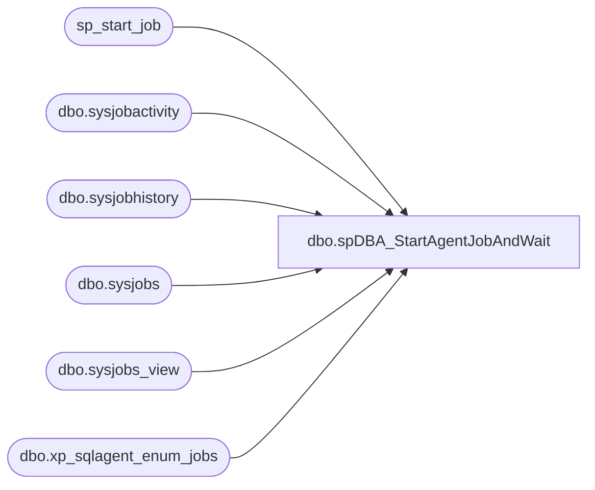

# dbo.spDBA_StartAgentJobAndWait

**Database:** DBAUtility_new  
**Server:** papamart  

## Architecture Diagram



## Table Dependencies

| Referenced Table |
|---|
| sp_start_job |
| dbo.sysjobactivity |
| dbo.sysjobhistory |
| dbo.sysjobs |
| dbo.sysjobs_view |
| dbo.xp_sqlagent_enum_jobs |

## Stored Procedure Code

```sql
CREATE procedure [dbo].[spDBA_StartAgentJobAndWait](@job nvarchar(128), @maxwaitmins int = 32767, @bolRunningOK bit = 0) --, @result int output)
WITH EXECUTE AS 'bab\SQLServices'
AS
-- =============================================================================================================
-- Name: spDBA_StartAgentJobAndWait
--
-- Description:	Starts a SQLAgent Job and waits for it to finish or until a specified wait period elapsed
--
-- @Job: The SQL Server Agent Job to be run
-- @maxwaitmins: (Optional) The maximum number of minutes to wait.
--
-- @result: 1 -> OK
--          0 -> still running after maxwaitmins
--
-- Dependency: None
--
-- Revision History
--		Name:			Date:			Comments:
--		Gary Murrish	7/18/2013		Created based upon http://stackoverflow.com/questions/10648475/need-to-start-agent-job-and-wait-until-completes-and-get-success-or-failure
--		Mike Pelikan	08/08/2014		Added already running logic
--		Mike Pelikan	10/23/2014		Added Execute as logic
--
DECLARE @Revision DATETIME
SET @Revision = 08/08/2014

-- =============================================================================================================

set NOCOUNT ON;
set XACT_ABORT ON;

    BEGIN TRY

    declare @running as int
    declare @seccount as int
    declare @maxseccount as int
    declare @start_job as bigint
    declare @run_status as int

    set @start_job = cast(convert(varchar, getdate(), 112) as bigint) * 1000000 + datepart(hour, getdate()) * 10000 + datepart(minute, getdate()) * 100 + datepart(second, getdate())

    set @maxseccount = 60*@maxwaitmins
    set @seccount = 0
    set @running = 0

    declare @job_owner sysname
    declare @job_id UNIQUEIDENTIFIER

    set @job_owner = SUSER_SNAME()

    -- get job id
    select @job_id=job_id
    from msdb.dbo.sysjobs sj
    where sj.name=@job

    -- invalid job name then exit with an error
    if @job_id is null
        RAISERROR (N'Unknown job: %s.', 16, 1, @job)

    -- output from stored procedure xp_sqlagent_enum_jobs is captured in the following table
    declare @xp_results TABLE ( job_id                UNIQUEIDENTIFIER NOT NULL,
                                last_run_date         INT              NOT NULL,
                                last_run_time         INT              NOT NULL,
                                next_run_date         INT              NOT NULL,
                                next_run_time         INT              NOT NULL,
                                next_run_schedule_id  INT              NOT NULL,
                                requested_to_run      INT              NOT NULL, -- BOOL
                                request_source        INT              NOT NULL,
                                request_source_id     sysname          COLLATE database_default NULL,
                                running               INT              NOT NULL, -- BOOL
                                current_step          INT              NOT NULL,
                                current_retry_attempt INT              NOT NULL,
                                job_state             INT              NOT NULL)

    -- check to see if job is already runing
declare @r as int
    
IF @bolRunningOK =1
BEGIN
    IF NOT EXISTS(     
        select 1 
        from msdb.dbo.sysjobs_view job  
        inner join msdb.dbo.sysjobactivity activity on job.job_id = activity.job_id 
        where  
            activity.run_Requested_date is not null  
        and activity.stop_execution_date is null  
        and job.name = @job 
        ) 
	BEGIN      
		exec @r = msdb..sp_start_job @job
	END 
	ELSE 
	BEGIN 
		PRINT 'Job ''' + @job + ''' is already started '; 
	END 
END
ELSE
BEGIN
	exec @r = msdb..sp_start_job @job
END	
    -- quit if unable to start
    if @r<>0
        RAISERROR (N'Could not start job: %s.', 16, 2, @job)

    -- start with an initial delay to allow the job to appear in the job list (maybe I am missing something ?)
    WAITFOR DELAY '0:0:01';
    set @seccount = 1

    -- check job run state
    insert into @xp_results
    execute master.dbo.xp_sqlagent_enum_jobs 1, @job_owner, @job_id

    set @running= (SELECT top 1 running from @xp_results)

    while @running<>0 and @seccount < @maxseccount
    begin
        WAITFOR DELAY '0:1:0';	-- Wait for 1 minute
        set @seccount = @seccount + 1

        delete from @xp_results

        insert into @xp_results
        execute master.dbo.xp_sqlagent_enum_jobs 1, @job_owner, @job_id

        set @running= (SELECT top 1 running from @xp_results)
    end

    -- result: not ok (=1) if still running

    if @running <> 0 begin
        -- still running
        return 0
    end
    else begin

        -- did it finish ok ?
        set @run_status = 0

        select @run_status=run_status
        from msdb.dbo.sysjobhistory
        where job_id=@job_id
          and cast(run_date as bigint) * 1000000 + run_time >= @start_job

        if @run_status=1
            return 1  --finished ok
        else  --error
            RAISERROR (N'job %s did not finish successfully.', 16, 2, @job)

    end

    END TRY
    BEGIN CATCH

    DECLARE
        @ErrorMessage    NVARCHAR(4000),
        @ErrorNumber     INT,
        @ErrorSeverity   INT,
        @ErrorState      INT,
        @ErrorLine       INT,
        @ErrorProcedure  NVARCHAR(200);

    SELECT
        @ErrorNumber = ERROR_NUMBER(),
        @ErrorSeverity = ERROR_SEVERITY(),
        @ErrorState = ERROR_STATE(),
        @ErrorLine = ERROR_LINE(),
        @ErrorProcedure = ISNULL(ERROR_PROCEDURE(), '-');

    SELECT @ErrorMessage =
        N'Error %d, Level %d, State %d, Procedure %s, Line %d, ' +
            'Message: '+ ERROR_MESSAGE();

    RAISERROR
        (
        @ErrorMessage,
        @ErrorSeverity,
        1,
        @ErrorNumber,    -- original error number.
        @ErrorSeverity,  -- original error severity.
        @ErrorState,     -- original error state.
        @ErrorProcedure, -- original error procedure name.
        @ErrorLine       -- original error line number.
        );

    END CATCH
```

