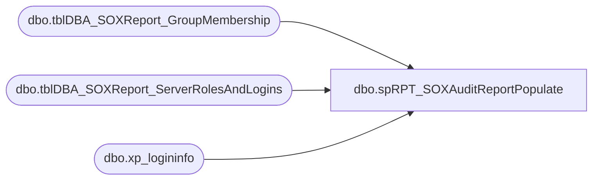

# dbo.spRPT_SOXAuditReportPopulate

**Database:** DBAUtility_new  
**Server:** papamart  

## Architecture Diagram



## Table Dependencies

| Referenced Table |
|---|
| dbo.tblDBA_SOXReport_GroupMembership |
| dbo.tblDBA_SOXReport_ServerRolesAndLogins |
| dbo.xp_logininfo |

## Stored Procedure Code

```sql
CREATE PROCEDURE [dbo].[spRPT_SOXAuditReportPopulate] 
@strYear CHAR(4) = '2012', 
@strQuarter CHAR(2) = 'Q1',
@Action VARCHAR(20) = 'Process'

AS
-- =============================================================================================================
-- Name: spRPT_SOXAuditReportPopulate
--
-- Description:	Populates SOX Audit Report on Repository
--
-- Output: none
-- 
-- Available actions:
-- @Action:
--	'ReturnVersion' = Do not do anything but return the version of the objects
--	'Process' = populate the repository table

-- Dependencies: 
--		COREDB01_MAINT.DBAUtilityMaster.dbo.tblDBA_SOXReport_ServerRolesAndLogins
--
-- Revision History:
--		Mike Pelikan	06/27/2012		Modified for versioning
--										Added Comments
--		Mike Pelikan	07/12/2012		Added Logic for populating Group memebership 
--		Mike Pelikan	08/27/2012		Added master.dbo. to xp_logininfo executions
--		Mike Pelikan	10/03/2012		Added some logic to the WHERE clause of the group membership portion to keep from infinte loops

-- =============================================================================================================
DECLARE @Revision DATETIME
SET @Revision = '10/03/2012'


--[spRPT_SOXAuditReportPopulate] '2012', 'Q3'
----------------------------------------------------------------------------------------------------
--// Set options                                                                                //--
----------------------------------------------------------------------------------------------------
SET NOCOUNT ON

----------------------------------------------------------------------------------------------------
--// Revision                                                                                  //--
----------------------------------------------------------------------------------------------------
IF @Action = 'ReturnVersion'
BEGIN
	GOTO EndHere
END
DECLARE @RunDate DATETIME
SET @RunDate = DATEADD(dd, 0, DATEDIFF(dd, 0, GETDATE()))


----------------------------------------------------------------------------------------------------
INSERT INTO COREDB01_MAINT.DBAUtilityMaster.dbo.tblDBA_SOXReport_ServerRolesAndLogins (InstanceName, name, dbname, 
sysadmin, securityadmin, serveradmin, setupadmin, processadmin, diskadmin, dbcreator, bulkadmin, 
RunYear, RunQuarter, RunDate)

SELECT @@SERVERNAME InstanceName, name
,dbname
,CASE WHEN sysadmin = 1 THEN 'Yes'
	ELSE 'No'
	END AS 'sysadmin'
,CASE WHEN securityadmin = 1 THEN 'Yes'
	ELSE 'No'
	END AS 'securityadmin'
,CASE WHEN serveradmin = 1 THEN 'Yes'
	ELSE 'No'
	END AS 'serveradmin'
,CASE WHEN setupadmin = 1 THEN 'Yes'
	ELSE 'No'
	END AS 'setupadmin'
,CASE WHEN processadmin = 1 THEN 'Yes'
	ELSE 'No'
	END AS 'processadmin'
,CASE WHEN diskadmin = 1 THEN 'Yes'
	ELSE 'No'
	END AS 'diskadmin'
,CASE WHEN dbcreator = 1 THEN 'Yes'
	ELSE 'No'
	END AS 'dbcreator'
,CASE WHEN bulkadmin = 1 THEN 'Yes'
	ELSE 'No'
	END AS 'bulkadmin'
, @strYear RunYear
, @strQuarter RunQuarter
, @RunDate RunDate
FROM master.dbo.syslogins
WHERE sysadmin = 1
OR securityadmin = 1
OR serveradmin = 1
OR setupadmin = 1
OR processadmin = 1
OR diskadmin = 1
OR dbcreator = 1
OR bulkadmin = 1


DECLARE @NTLogin nvarchar(128)

DECLARE @Groups TABLE (GroupName VARCHAR(250), isProcessed BIT )
INSERT INTO @Groups
SELECT name, 0 FROM master.dbo.syslogins 
WHERE isntgroup = 1
AND [name] NOT IN ('NT SERVICE\MSSQLSERVER', 'NT SERVICE\SQLSERVERAGENT', 'BAB\', 'NT AUTHORITY\SYSTEM')AND [name] IS NOT NULL

WHILE EXISTS(SELECT GroupName FROM @Groups WHERE isProcessed = 0)
BEGIN
	SELECT TOP 1 @NTLogin = GroupName FROM @Groups WHERE isProcessed = 0

	IF object_id('tempdb..#UserList','u')  IS NOT NULL
		DROP TABLE #UserList
	
	CREATE TABLE #UserList
	(
	[Account Name] nvarchar(128),
	[Type] nvarchar(128),
	[Privilege] nvarchar(128),
	[Mapped Login Name] nvarchar(128),
	[Permission Path]nvarchar(128)
	)
	
	INSERT INTO #UserList ([Permission Path], [Type], Privilege, [Mapped Login Name],[Account Name])  EXEC master.dbo.xp_logininfo @NTLogin, 'all' --insert group information
		INSERT INTO #UserList EXEC master.dbo.xp_logininfo @NTLogin, 'members' --insert member information
	
	--grab any groups inside of groups
	INSERT INTO @Groups 
	SELECT [Account Name], 0 FROM #UserList where Type = 'Group' AND [Permission Path] IS NOT NULL AND [Account Name] IS NOT NULL
	AND  [Account Name] NOT IN ('BAB\', 'NT AUTHORITY\SYSTEM')
	
	INSERT INTO  COREDB01_MAINT.DBAUtilityMaster.dbo.tblDBA_SOXReport_GroupMembership (InstanceName, GroupName, MemberName, RunDate)
	SELECT @@ServerName, [Permission Path], [Account Name], @RunDate
	FROM #UserList
	
	DROP TABLE #UserList
	UPDATE @Groups 
	SET isProcessed = 1
	WHERE GroupName = @NTLogin
END

EndHere:
IF @Action = 'ReturnVersion'
BEGIN
	SELECT @Revision 
END
```

