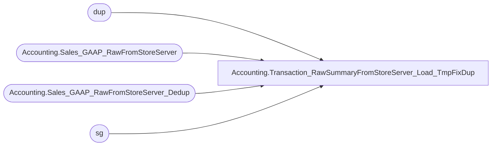

# Accounting.Transaction_RawSummaryFromStoreServer_Load_TmpFixDup

**Database:** DWStaging  
**Server:** papamart  

## Architecture Diagram



## Table Dependencies

| Referenced Table |
|---|
| dup |
| Accounting.Sales_GAAP_RawFromStoreServer |
| Accounting.Sales_GAAP_RawFromStoreServer_Dedup |
| sg |

## Stored Procedure Code

```sql
CREATE PROCEDURE [Accounting].[Transaction_RawSummaryFromStoreServer_Load_TmpFixDup]
	
AS
BEGIN
	/*  This is such a hack, please don't ever do this in production
		I'm leaving tomorrow, so I have no time to figure out where the dup is coming from
		It's not consistent, I could reload all store for months April, May, without duplicates, but loading the last 21 days give me some
		Someone needs to figure this out
	*/
	SET NOCOUNT ON;

	
	CREATE TABLE [Accounting].[Sales_GAAP_RawFromStoreServer_Dedup](
		[store_key] [int] NOT NULL,
		[date_key] [int] NOT NULL,
		[TransactionDatetime] [datetime] NULL,
		[location_code] [varchar](4) NULL,
		[location_name] [varchar](50) NULL,
		[net_sales] [decimal](14, 2) NULL,
		[entry_date] [datetime] NULL,
		[source] [varchar](50) NULL,
		[RTL_TRN_ID] [int] NULL,
		[STORE_NO] [int] NULL,
		[WORKSTATION_NO] [int] NULL,
		[RTL_TRN_NO] [int] NULL,
		[OPERATOR_NO] [int] NULL,
		[RTL_TRN_TYPE_CODE] [char](4) NULL,
		[ITEM_NO] [varchar](20) NULL,
		[VOID_FLG] [smallint] NULL,
		[CNT] [int] NULL
	) ON [PRIMARY]


	INSERT INTO [Accounting].[Sales_GAAP_RawFromStoreServer_Dedup]
		([store_key]
		  ,[date_key]
		  , [RTL_TRN_ID]
		  , CNT)
	SELECT [store_key]
		  ,[date_key]
		  ,[RTL_TRN_ID]
		  , COUNT(*) AS CNT
	FROM [Accounting].[Sales_GAAP_RawFromStoreServer] WITH(NOLOCK)
	GROUP BY [store_key]
		  ,[date_key]
		  ,[RTL_TRN_ID]
	HAVING COUNT(*) > 1

	UPDATE dup
	SET [TransactionDatetime] = sg.[TransactionDatetime]
		,[location_code] = sg.[location_code]
		,[location_name] = sg.[location_name]
		,[net_sales] = sg.[net_sales]
		,[entry_date] = sg.[entry_date]
		,[source] = sg.[source]
		,[STORE_NO] = sg.[STORE_NO]
		,[WORKSTATION_NO] = sg.[WORKSTATION_NO]
		,[RTL_TRN_NO] = sg.[RTL_TRN_NO]
		,[OPERATOR_NO] = sg.[OPERATOR_NO]
		,[RTL_TRN_TYPE_CODE] = sg.[RTL_TRN_TYPE_CODE]
		,[ITEM_NO] = sg.[ITEM_NO]
		,[VOID_FLG] = sg.[VOID_FLG]
	FROM [Accounting].[Sales_GAAP_RawFromStoreServer_Dedup] dup 
		INNER JOIN [Accounting].[Sales_GAAP_RawFromStoreServer] sg WITH(NOLOCK)
			ON  sg.store_key = dup.store_key
				AND sg.date_key = dup.date_key
				AND sg.RTL_TRN_ID = dup.RTL_TRN_ID


	DELETE sg
	FROM [Accounting].[Sales_GAAP_RawFromStoreServer] sg WITH(NOLOCK)
		INNER JOIN [Accounting].[Sales_GAAP_RawFromStoreServer_Dedup] dup
			ON sg.store_key = dup.store_key
				AND sg.date_key = dup.date_key
				AND sg.RTL_TRN_ID = dup.RTL_TRN_ID


	INSERT INTO [Accounting].[Sales_GAAP_RawFromStoreServer]
			   ([store_key]
			   ,[date_key]
			   ,[TransactionDatetime]
			   ,[location_code]
			   ,[location_name]
			   ,[net_sales]
			   ,[entry_date]
			   ,[source]
			   ,[RTL_TRN_ID]
			   ,[STORE_NO]
			   ,[WORKSTATION_NO]
			   ,[RTL_TRN_NO]
			   ,[OPERATOR_NO]
			   ,[RTL_TRN_TYPE_CODE]
			   ,[ITEM_NO]
			   ,[VOID_FLG])
	SELECT [store_key]
			   ,[date_key]
			   ,[TransactionDatetime]
			   ,[location_code]
			   ,[location_name]
			   ,[net_sales]
			   ,[entry_date]
			   ,[source]
			   ,[RTL_TRN_ID]
			   ,[STORE_NO]
			   ,[WORKSTATION_NO]
			   ,[RTL_TRN_NO]
			   ,[OPERATOR_NO]
			   ,[RTL_TRN_TYPE_CODE]
			   ,[ITEM_NO]
			   ,[VOID_FLG]
	FROM [Accounting].[Sales_GAAP_RawFromStoreServer_Dedup] where [TransactionDatetime] is not null
	GROUP BY [store_key]
			   ,[date_key]
			   ,[TransactionDatetime]
			   ,[location_code]
			   ,[location_name]
			   ,[net_sales]
			   ,[entry_date]
			   ,[source]
			   ,[RTL_TRN_ID]
			   ,[STORE_NO]
			   ,[WORKSTATION_NO]
			   ,[RTL_TRN_NO]
			   ,[OPERATOR_NO]
			   ,[RTL_TRN_TYPE_CODE]
			   ,[ITEM_NO]
			   ,[VOID_FLG]

	DROP TABLE [Accounting].[Sales_GAAP_RawFromStoreServer_Dedup]

END
```

