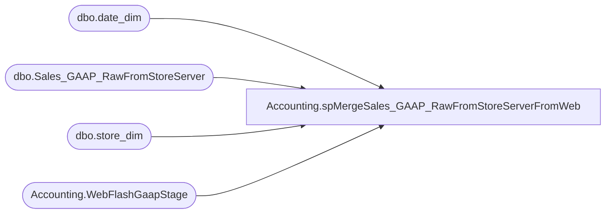

# Accounting.spMergeSales_GAAP_RawFromStoreServerFromWeb

**Database:** DWStaging  
**Server:** papamart  

## Architecture Diagram



## Table Dependencies

| Referenced Table |
|---|
| dbo.date_dim |
| dbo.Sales_GAAP_RawFromStoreServer |
| dbo.store_dim |
| Accounting.WebFlashGaapStage |

## Stored Procedure Code

```sql
-- =============================================-- =============================================
--	2020-01-15	- Dan Tweedie	Created Proc
-- =============================================-- =============================================
CREATE PROCEDURE [Accounting].[spMergeSales_GAAP_RawFromStoreServerFromWeb]
	
AS


merge into dw.dbo.Sales_GAAP_RawFromStoreServer as target 
using 
		(
			select 
				sd.store_key,
				dd.date_key,
				s.FulfillmentLocation as location_code,
				s.FulfillmentLocationName as location_name,
				s.TransactionID as RTL_TRN_ID, --Orders.OrderID
				sd.store_id as STORE_NO,
				s.OrderNumber as RTL_TRN_NO, --web order number
				s.TransactionType as RTL_TRN_TYPE_CODE,
				max(s.TransactionDate) as TransactionDatetime,
				sum(s.FlashGaapSales) net_sales,
				max(s.TransactionDate) as entry_date,
				'Web Cart' as source,
				s.SalesAuditTransactionID as TransactionID,
				s.OrderNumber as WebOrderNumber,
				s.isBOSISorBOPIS,
				s.SalesAuditRegisterNumber,
				s.SalesAuditTransactionRemark,
				s.GaapSalesDW,
				s.isGaapDW
			from  Accounting.WebFlashGaapStage s 
			join dw.dbo.store_dim sd  on cast(s.FulfillmentLocation as int) = sd.store_id
			join dw.dbo.date_dim dd on cast(s.TransactionDate as date) = cast(dd.actual_date as date)
			group by 
				sd.store_key,
				dd.date_key,
				s.FulfillmentLocation,
				s.FulfillmentLocationName,
				s.TransactionID,
				sd.store_id,
				s.OrderNumber,
				s.TransactionType,
				s.SalesAuditTransactionID,
				s.OrderNumber,
				s.isBOSISorBOPIS,
				s.SalesAuditRegisterNumber,
				s.SalesAuditTransactionRemark,
				s.GaapSalesDW,
				s.isGaapDW
		) as source 
on 
	(
		target.[source]=source.[source]
		and
		target.store_key=source.store_key
		and
		target.date_key=source.date_key
		and
		target.rtl_trn_id=source.rtl_trn_id
		and 
		target.RTL_TRN_NO=source.RTL_TRN_NO
		and
		target.RTL_TRN_TYPE_CODE=source.RTL_TRN_TYPE_CODE
	)
when matched 
	and 
		(
			isnull(target.net_sales,0) <> isnull(source.net_sales,0)
			OR
			isnull(target.rtl_trn_type_code,99) <> isnull(source.rtl_trn_type_code,99)
			OR
			isnull(target.TransactionID, 0)<>isnull(source.TransactionID,0)
			OR
			isnull(target.WebOrderNumber,'x')<>isnull(source.WebOrderNumber,'x')
			or
			isnull(target.isBOSISorBOPIS,99)<>isnull(source.isBOSISorBOPIS,99)
			or
			isnull(target.SalesAuditRegisterNumber,99)<>isnull(source.SalesAuditRegisterNumber,99)
			or
			isnull(target.SalesAuditTransactionRemark,'xx')<>isnull(source.SalesAuditTransactionRemark,'xx')
			or
			isnull(target.GaapSalesDW,0)<>isnull(source.GaapSalesDW,0)
			or
			isnull(target.isGaapDW,99)<>isnull(source.isGaapDW,99)
		)
then update
	set 
		target.net_sales = source.net_sales,
		target.rtl_trn_type_code = source.rtl_trn_type_code,
		target.TransactionID=source.TransactionID,
		target.WebOrderNumber=source.WebOrderNumber,
		target.isBOSISorBOPIS=source.isBOSISorBOPIS,
		target.SalesAuditRegisterNumber=source.SalesAuditRegisterNumber,
		target.SalesAuditTransactionRemark=source.SalesAuditTransactionRemark,
		target.GaapSalesDW=source.GaapSalesDW,
		target.isGaapDW=source.isGaapDW,
		target.UpdateDate = getdate()

when not matched by target
	then insert
		(
			store_key,
			date_key,
			TransactionDatetime,
			location_code,
			location_name,
			net_sales,
			entry_date,
			source,
			RTL_TRN_ID,
			STORE_NO,
			RTL_TRN_NO,
			RTL_TRN_TYPE_CODE,
			TransactionID,
			WebOrderNumber,
			isBOSISorBOPIS,
			SalesAuditRegisterNumber,
			SalesAuditTransactionRemark,
			GaapSalesDW,
			isGaapDW,
			InsertDate
		)
	values
		(
			source.store_key,
			source.date_key,
			source.TransactionDatetime,
			source.location_code,
			source.location_name,
			source.net_sales,
			source.entry_date,
			source.source,
			source.RTL_TRN_ID,
			source.STORE_NO,
			source.RTL_TRN_NO,
			source.RTL_TRN_TYPE_CODE,
			source.TransactionID,
			source.WebOrderNumber,
			source.isBOSISorBOPIS,
			source.SalesAuditRegisterNumber,
			source.SalesAuditTransactionRemark,
			source.GaapSalesDW,
			source.isGaapDW,
			getdate()
		)
;

----post merge update for web orders with updated location code (easier here than in the merge..)
--I think no longer necessary since I'm using OrderID instead of TransactionID from web data
--update dw
--set dw.location_code=s.LocationCode
--from Accounting.Sales_GAAP_RawFromStoreServer dw with (nolock)
--join Accounting.WebFlashGaapStage s on dw.RTL_TRN_ID=s.TransactionID
--where dw.location_code<>s.LocationCode
```

