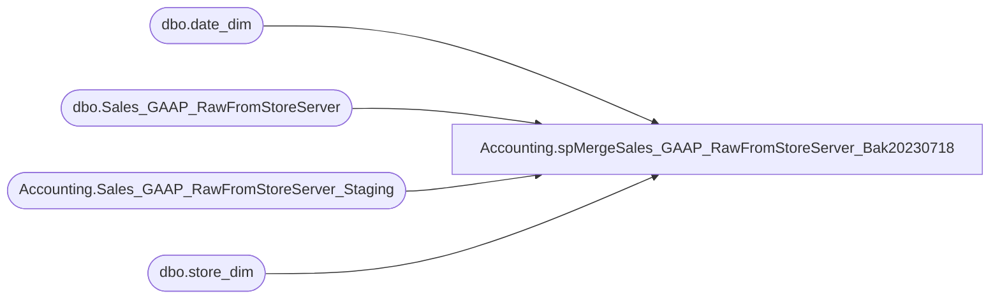

# Accounting.spMergeSales_GAAP_RawFromStoreServer_Bak20230718

**Database:** DWStaging  
**Server:** papamart  

## Architecture Diagram



## Table Dependencies

| Referenced Table |
|---|
| dbo.date_dim |
| dbo.Sales_GAAP_RawFromStoreServer |
| Accounting.Sales_GAAP_RawFromStoreServer_Staging |
| dbo.store_dim |

## Stored Procedure Code

```sql
-- =============================================-- =============================================
--	2020-01-15	- Dan Tweedie	Create Proc
-- =============================================-- =============================================
CREATE PROCEDURE [Accounting].[spMergeSales_GAAP_RawFromStoreServer_Bak20230718]
	
AS

set nocount on 

--Identify Duplicates 

IF OBJECT_ID(N'tempdb..#Dupes') IS NOT NULL
DROP TABLE #Dupes
select 
s.source,
sd.store_key, 
dd.date_key, 
s.RTL_TRN_ID, 
s.RTL_TRN_NO, 
s.WORKSTATION_NO, 
count (*) as RowCountz
into #Dupes
from  Accounting.Sales_GAAP_RawFromStoreServer_Staging s 
join dw.dbo.store_dim sd  on cast(s.location_code as int) = sd.store_id
join dw.dbo.date_dim dd on cast(s.TransactionDateTime as date) = cast(dd.actual_date as date)
where s.location_code not in ('0013', '2013') ---not really needed, there should be no web sales in the table
group by 
s.source,
sd.store_key, 
dd.date_key, 
s.RTL_TRN_ID, 
s.RTL_TRN_NO, 
s.WORKSTATION_NO
having count (*) > 1


merge into dw.dbo.Sales_GAAP_RawFromStoreServer as target 
using 
		(
			select 
				sd.store_key,
				dd.date_key,
				s.location_code,
				s.location_name,
				s.RTL_TRN_ID as RTL_TRN_ID,
				s.STORE_NO,
				s.WORKSTATION_NO,
				cast(s.RTL_TRN_NO as varchar) as RTL_TRN_NO,
				s.OPERATOR_NO,
				s.RTL_TRN_TYPE_CODE,
				s.ITEM_NO,
				s.VOID_FLG,
				s.TransactionDatetime,
				s.net_sales,
				s.entry_date,
				s.source,
				s.TransactionID,
				s.WebOrderNumber,
				0 as isBOSISorBOPIS,
				NULL as SalesAuditRegisterNumber,
				NULL as SalesAuditTransactionRemark,
				NULL as GaapSalesDW,
				NULL as isGaapDW
			from  Accounting.Sales_GAAP_RawFromStoreServer_Staging s 
			join dw.dbo.store_dim sd  on cast(s.location_code as int) = sd.store_id
			join dw.dbo.date_dim dd on cast(s.TransactionDateTime as date) = cast(dd.actual_date as date)
			left join #Dupes du on du.source=s.source
							and du.store_key=sd.store_key
							and du.date_key=dd.date_key
							and du.RTL_TRN_ID=s.RTL_TRN_ID
							and du.RTL_TRN_NO=s.RTL_TRN_NO
							and du.WORKSTATION_NO=s.WORKSTATION_NO
			where 1=1
			and s.location_code not in ('0013', '2013') ---not really needed, there should be no web sales in the table
			and du.source is null -- Only includes non duplicate records 
		) as source 
on 
	(
		isnull(target.[source],'x')=isnull(source.[source],'x') -- Modified on 6/15/2023 to add isnull logic
		and
		isnull(target.store_key,0)=isnull(source.store_key,0) -- Modified on 6/15/2023 to add isnull logic
		and
		isnull(target.date_key,0)=isnull(source.date_key,0) -- Modified on 6/15/2023 to add isnull logic
		and
		isnull(target.rtl_trn_id,0)=isnull(source.rtl_trn_id,0) -- Modified on 6/15/2023 to add isnull logic
		and 
		isnull(target.RTL_TRN_NO,0)=isnull(source.RTL_TRN_NO,0) -- Modified on 6/15/2023 to add isnull logic
		and		
		isnull(target.item_no,'x')= isnull(source.item_no,'x') -- Modified on 6/15/2023 to add isnull logic
		and 
		isnull(target.WORKSTATION_NO,0)=isnull(source.WORKSTATION_NO,0) -- Added 6/15/2023
	)
when matched 
	and 
		(
			isnull(target.net_sales,0) <> isnull(source.net_sales,0)
			OR
			isnull(target.void_flg,9) <> isnull(source.void_flg,9)
			OR
			isnull(target.rtl_trn_type_code,99) <> isnull(source.rtl_trn_type_code,99)
			OR
			isnull(target.TransactionID, 0)<>isnull(source.TransactionID,0)
			OR
			isnull(target.WebOrderNumber,'x')<>isnull(source.WebOrderNumber,'x')
			or
			isnull(target.isBOSISorBOPIS,99)<>isnull(source.isBOSISorBOPIS,99)
			or
			isnull(target.SalesAuditRegisterNumber,99)<>isnull(source.SalesAuditRegisterNumber,99)
			or
			isnull(target.SalesAuditTransactionRemark,'xx')<>isnull(source.SalesAuditTransactionRemark,'xx')
			or
			isnull(target.GaapSalesDW,0)<>isnull(source.GaapSalesDW,0)
			or
			isnull(target.isGaapDW,99)<>isnull(source.isGaapDW,99)
		)
then update
	set 
		target.net_sales = source.net_sales,
		target.void_flg = source.void_flg,
		target.rtl_trn_type_code = source.rtl_trn_type_code,
		target.TransactionID=source.TransactionID,
		target.WebOrderNumber=source.WebOrderNumber,
		target.isBOSISorBOPIS=source.isBOSISorBOPIS,
		target.SalesAuditRegisterNumber=source.SalesAuditRegisterNumber,
		target.SalesAuditTransactionRemark=source.SalesAuditTransactionRemark,
		target.GaapSalesDW=source.GaapSalesDW,
		target.isGaapDW=source.isGaapDW,
		target.UpdateDate = getdate()

when not matched by target
	then insert
		(
			store_key,
			date_key,
			TransactionDatetime,
			location_code,
			location_name,
			net_sales,
			entry_date,
			source,
			RTL_TRN_ID,
			STORE_NO,
			WORKSTATION_NO ,
			RTL_TRN_NO,
			OPERATOR_NO,
			RTL_TRN_TYPE_CODE,
			ITEM_NO,
			VOID_FLG,
			TransactionID,
			WebOrderNumber,
			isBOSISorBOPIS,
			SalesAuditRegisterNumber,
			SalesAuditTransactionRemark,
			GaapSalesDW,
			isGaapDW,
			InsertDate
		)
	values
		(
			source.store_key,
			source.date_key,
			source.TransactionDatetime,
			source.location_code,
			source.location_name,
			source.net_sales,
			source.entry_date,
			source.source,
			source.RTL_TRN_ID,
			source.STORE_NO,
			source.WORKSTATION_NO ,
			source.RTL_TRN_NO,
			source.OPERATOR_NO,
			source.RTL_TRN_TYPE_CODE,
			source.ITEM_NO,
			source.VOID_FLG,
			source.TransactionID,
			source.WebOrderNumber,
			source.isBOSISorBOPIS,
			source.SalesAuditRegisterNumber,
			source.SalesAuditTransactionRemark,
			source.GaapSalesDW,
			source.isGaapDW,
			getdate()
		)
;

----post merge update for web orders with updated location code (easier here than in the merge..)
--I think no longer necessary since I'm using OrderID instead of TransactionID from web data
--update dw
--set dw.location_code=s.LocationCode
--from Accounting.Sales_GAAP_RawFromStoreServer dw with (nolock)
--join Accounting.WebFlashGaapStage s on dw.RTL_TRN_ID=s.TransactionID
--where dw.location_code<>s.LocationCode
```

