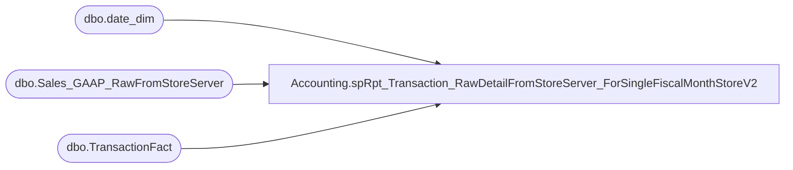

# Accounting.spRpt_Transaction_RawDetailFromStoreServer_ForSingleFiscalMonthStoreV2

**Database:** DWStaging  
**Server:** papamart  

## Architecture Diagram



## Table Dependencies

| Referenced Table |
|---|
| dbo.date_dim |
| dbo.Sales_GAAP_RawFromStoreServer |
| dbo.TransactionFact |

## Stored Procedure Code

```sql
-- =============================================
-- Author:		Shyr, Kevin
-- Create date: 7/29/2015
-- Description:	<Description,,>
-- =============================================
CREATE PROCEDURE [Accounting].[spRpt_Transaction_RawDetailFromStoreServer_ForSingleFiscalMonthStoreV2]
	@FiscalYear INT
	, @FiscalPeriod INT
	, @StoreID INT
	, @isBosisBopis int
AS
BEGIN
	-- SET NOCOUNT ON added to prevent extra result sets from
	-- interfering with SELECT statements.
	SET NOCOUNT ON;

	SELECT 
		trs.location_code,
		trs.location_name,
		dd.actual_date AS CapturedDate,
		trs.TransactionDatetime,
		trs.rtl_trn_no as POSTransactionNumber,
		case 
			--when RTL_TRN_TYPE_CODE in ('credit', 'return') 
			when (RTL_TRN_TYPE_CODE in ('credit', 'return')  and trs.source <> 'JumpMind') -- Replaced above on 7/11/2023 - TimC
				or trs.SalesAuditRegisterNumber=7 
			then trs.net_sales *-1
			else trs.net_sales 
		end as net_sales,
		trs.WebOrderNumber,
		--trs.TransactionID,
		tf.transaction_no as TransactionID,
		trs.SalesAuditRegisterNumber,	
		trs.SalesAuditTransactionRemark,	
		trs.isBOSISorBOPIS,
		trs.isGaapDW,
		trs.GaapSalesDW,
		case 
			when trs.isBOSISorBOPIS = 1 
				then 'WebToStore' 
			else 'NormalSale' 
		end as OrderType,
		trs.RTL_TRN_TYPE_CODE
	--FROM [Accounting].[Sales_GAAP_RawFromStoreServer] trs WITH(NOLOCK)
	from dw.dbo.Sales_GAAP_RawFromStoreServer trs
		INNER JOIN dw.dbo.date_dim dd WITH(NOLOCK)
			--ON trs.date_key = dd.date_key
			ON CASE 
				--WHEN cast(trs.TransactionDateTime as time) > '00:00:00' AND cast(trs.TransactionDateTime as time) < '02:59:00' then trs.date_key-1
				WHEN datepart(hh, TransactionDateTime) between 0 and 2 then trs.date_key-1
				ELSE trs.date_key
				END = dd.date_key
	left join dw.dbo.TransactionFact tf on trs.TransactionID=tf.transaction_id
	WHERE dd.fiscal_year = @FiscalYear
		AND dd.fiscal_period = @FiscalPeriod
		AND trs.location_code = @StoreID
		and (trs.isBOSISorBOPIS = @isBosisBopis or @isBosisBopis is null)

END
```

