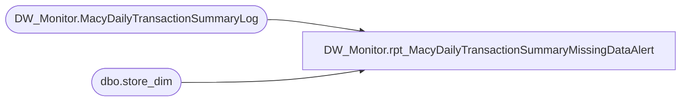

# DW_Monitor.rpt_MacyDailyTransactionSummaryMissingDataAlert

**Database:** DWStaging  
**Server:** papamart  

## Architecture Diagram



## Table Dependencies

| Referenced Table |
|---|
| DW_Monitor.MacyDailyTransactionSummaryLog |
| dbo.store_dim |

## Stored Procedure Code

```sql
CREATE PROCEDURE [DW_Monitor].[rpt_MacyDailyTransactionSummaryMissingDataAlert]
	@RollingDays INT = 5
AS
BEGIN
	SET NOCOUNT ON;
	DECLARE @DateRangeStart AS DATETIME
	DECLARE @DateRangeEnd AS DATETIME
	SET @DateRangeEnd = DATEADD(dd, -1, CAST(FLOOR(CAST(GETDATE() AS FLOAT)) AS DateTime))
	SET @DateRangeStart = DATEADD(dd, -@RollingDays+1, @DateRangeEnd)

	SELECT
		mdtsl.StoreNumber
		, mdtsl.StoreName
		, mdtsl.SaleDate
		, mdtsl.PLUAmount
	FROM DW_Monitor.MacyDailyTransactionSummaryLog mdtsl WITH(NOLOCK)
		INNER JOIN dw.dbo.store_dim sd WITH(NOLOCK)
			ON mdtsl.StoreNumber = sd.store_id
	WHERE mdtsl.SaleDate BETWEEN @DateRangeStart AND @DateRangeEnd
		AND mdtsl.PLUAmount = 0
	ORDER BY mdtsl.StoreNumber
		, mdtsl.SaleDate
		
END
```

