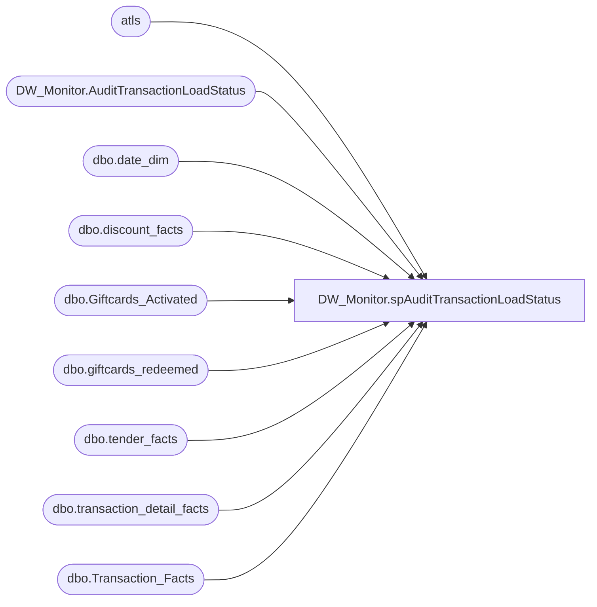

# DW_Monitor.spAuditTransactionLoadStatus

**Database:** DWStaging  
**Server:** papamart  

## Architecture Diagram



## Table Dependencies

| Referenced Table |
|---|
| atls |
| DW_Monitor.AuditTransactionLoadStatus |
| dbo.date_dim |
| dbo.discount_facts |
| dbo.Giftcards_Activated |
| dbo.giftcards_redeemed |
| dbo.tender_facts |
| dbo.transaction_detail_facts |
| dbo.Transaction_Facts |

## Stored Procedure Code

```sql
CREATE PROCEDURE [DW_Monitor].[spAuditTransactionLoadStatus]
	@DaysToCheck INT = 60
AS
BEGIN
	SET NOCOUNT ON
	
	-- 2014-09-24, leaving parameter as an input variable
	---- SET number of days back to check for count result
	--DECLARE @DaysToCheck INT
	--SET @DaysToCheck = 60
	
	DECLARE @TodayDate DATETIME
	DECLARE @minDateKey INT
	DECLARE @maxDateKey INT
	
	-- Get the Date Keys
	SET @TodayDate = DATEADD(dd, -1, CAST(FLOOR(CAST(GETDATE() AS FLOAT)) AS DATETIME))
	SELECT @minDateKey = date_key FROM dw.dbo.date_dim dd WITH(NOLOCK) WHERE dd.actual_date = DATEADD(d, -@DaysToCheck, @TodayDate)
	SELECT @maxDateKey = date_key FROM dw.dbo.date_dim dd WITH(NOLOCK) WHERE dd.actual_date = @TodayDate
	--SELECT @minDateKey, @maxDateKey
	
	-- Create temp table to hold results
	IF OBJECT_ID('DW_Monitor.AuditTransactionLoadStatus') IS NULL
	BEGIN
	CREATE TABLE DW_Monitor.AuditTransactionLoadStatus
		(dateKey INT NOT NULL
		, ActualDate DATETIME NOT NULL
		--, TransactionHeaderCount INT NOT NULL DEFAULT(0)
		, TransactionCount INT NOT NULL DEFAULT(0)
		, TransactionDetailFactCount INT NOT NULL DEFAULT(0)
		, TenderFactCount INT NOT NULL DEFAULT(0)
		, DiscountFactCount INT NOT NULL DEFAULT(0)
		, GiftcardActivatedCount INT NOT NULL DEFAULT(0)
		, GiftcardRedeemedCount INT NOT NULL DEFAULT(0)
		)
	END
	
	TRUNCATE TABLE DW_Monitor.AuditTransactionLoadStatus
	
	-- populate temp table with all the dates to check
	INSERT INTO DW_Monitor.AuditTransactionLoadStatus
		(dateKey, ActualDate)
	SELECT date_key
		, actual_date
	FROM dw.dbo.date_dim dd WITH(NOLOCK) 
	WHERE dd.date_key BETWEEN @minDateKey AND @maxDateKey
	
	-- 2014-09-24, commented out because aw_transaction_header is a temp table
	---- GET transaction header count per day
	--UPDATE atls
	--SET TransactionHeaderCount = sub.cnt
	--FROM #AuditTransactionLoadStatus atls 
	--	INNER JOIN (SELECT date_key
	--					, COUNT(transaction_id) AS cnt
	--				FROM aw_Transaction_Header WITH(NOLOCK)
	--				WHERE date_key BETWEEN @minDateKey AND @maxDateKey
	--				GROUP BY date_key
	--	) sub
	--		ON atls.DateKey = sub.date_key
	
	-- GET Transaction_Facts count per day
	UPDATE atls
	SET TransactionCount = sub.cnt
	FROM DW_Monitor.AuditTransactionLoadStatus atls 
		INNER JOIN (SELECT date_key
						, COUNT(transaction_id) AS cnt
					FROM dw.dbo.Transaction_Facts WITH(NOLOCK)
					WHERE date_key BETWEEN @minDateKey AND @maxDateKey
					GROUP BY date_key
		) sub
			ON atls.DateKey = sub.date_key
	
	-- GET transaction_detail_facts count per day
	UPDATE atls
	SET TransactionDetailFactCount = sub.cnt
	FROM DW_Monitor.AuditTransactionLoadStatus atls 
		INNER JOIN (SELECT date_key
						, COUNT(transaction_id) AS cnt
					FROM dw.dbo.transaction_detail_facts WITH(NOLOCK)
					WHERE date_key BETWEEN @minDateKey AND @maxDateKey
					GROUP BY date_key
		) sub
			ON atls.DateKey = sub.date_key
	
	-- GET tender_facts count per day
	UPDATE atls
	SET TenderFactCount = sub.cnt
	FROM DW_Monitor.AuditTransactionLoadStatus atls 
		INNER JOIN (SELECT date_key
						, COUNT(transaction_id) AS cnt
					FROM dw.dbo.tender_facts WITH(NOLOCK)
					WHERE date_key BETWEEN @minDateKey AND @maxDateKey
					GROUP BY date_key
		) sub
			ON atls.DateKey = sub.date_key

	-- GET discount_facts count per day
	UPDATE atls
	SET DiscountFactCount = sub.cnt
	FROM DW_Monitor.AuditTransactionLoadStatus atls 
		INNER JOIN (SELECT date_key
						, COUNT(transaction_id) AS cnt
					FROM dw.dbo.discount_facts WITH(NOLOCK)
					WHERE date_key BETWEEN @minDateKey AND @maxDateKey
					GROUP BY date_key
		) sub
			ON atls.DateKey = sub.date_key
	
	-- GET Giftcards_Activated count per day
	UPDATE atls
	SET GiftcardActivatedCount = sub.cnt
	FROM DW_Monitor.AuditTransactionLoadStatus atls 
		INNER JOIN (SELECT date_key
						, COUNT(transaction_id) AS cnt
					FROM dw.dbo.Giftcards_Activated WITH(NOLOCK)
					WHERE date_key BETWEEN @minDateKey AND @maxDateKey
					GROUP BY date_key
		) sub
			ON atls.DateKey = sub.date_key
	
	-- GET giftcards_redeemed count per day
	UPDATE atls
	SET GiftcardRedeemedCount = sub.cnt
	FROM DW_Monitor.AuditTransactionLoadStatus atls 
		INNER JOIN (SELECT date_key
						, COUNT(transaction_id) AS cnt
					FROM dw.dbo.giftcards_redeemed WITH(NOLOCK)
					WHERE date_key BETWEEN @minDateKey AND @maxDateKey
					GROUP BY date_key
		) sub
			ON atls.DateKey = sub.date_key

	--SELECT dateKey
	--	, ActualDate
	--	, TransactionCount
	--	, TransactionDetailFactCount
	--	, TenderFactCount
	--	, DiscountFactCount
	--	, GiftcardActivatedCount
	--	, GiftcardRedeemedCount
	--FROM #AuditTransactionLoadStatus WITH(NOLOCK)
	
END
```

