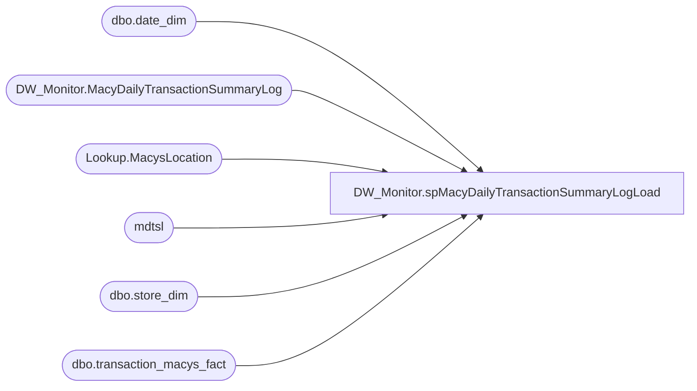

# DW_Monitor.spMacyDailyTransactionSummaryLogLoad

**Database:** DWStaging  
**Server:** papamart  

## Architecture Diagram



## Table Dependencies

| Referenced Table |
|---|
| dbo.date_dim |
| DW_Monitor.MacyDailyTransactionSummaryLog |
| Lookup.MacysLocation |
| mdtsl |
| dbo.store_dim |
| dbo.transaction_macys_fact |

## Stored Procedure Code

```sql
CREATE PROCEDURE [DW_Monitor].[spMacyDailyTransactionSummaryLogLoad]
	@RollingDays INT = 5
AS
BEGIN
	SET NOCOUNT ON;
	DECLARE @DateRangeStart AS DATETIME
	DECLARE @DateRangeEnd AS DATETIME
	SET @DateRangeEnd = DATEADD(dd, -1, CAST(FLOOR(CAST(GETDATE() AS FLOAT)) AS DateTime))
	SET @DateRangeStart = DATEADD(dd, -@RollingDays+1, @DateRangeEnd)

	IF NOT EXISTS(SELECT * FROM sys.all_objects WHERE name = 'MacyDailyTransactionSummaryLog') 
	BEGIN
		CREATE TABLE DW_Monitor.MacyDailyTransactionSummaryLog(
			MacyDailyTransactionSummaryLogID INT IDENTITY(1,1),
			StoreNumber INT NOT NULL,
			StoreName VARCHAR(255) NOT NULL,
			SaleDate DATETIME NOT NULL,
			PLUAmount DECIMAL(10, 2) NOT NULL,
			CONSTRAINT [PK_MacyDailyTransactionSummaryLog] PRIMARY KEY CLUSTERED 
			(
				MacyDailyTransactionSummaryLogID ASC
			)
		) ON [PRIMARY]
	END
	
	-- remove previous load
	DELETE FROM DW_Monitor.MacyDailyTransactionSummaryLog
	WHERE SaleDate BETWEEN @DateRangeStart AND @DateRangeEnd

	-- add in all combination of stores and dates
	INSERT INTO DW_Monitor.MacyDailyTransactionSummaryLog
		(StoreNumber
		, StoreName
		, SaleDate
		, PLUAmount)
	SELECT
		s.store_id
		, s.store_name
		, d.actual_date
		, 0
	FROM (SELECT sd.store_id
				, sd.store_name
			FROM Lookup.MacysLocation ml WITH(NOLOCK)
				INNER JOIN dw.dbo.store_dim sd WITH(NOLOCK)
					ON ml.store_key = sd.store_key
		) s
		CROSS APPLY ( SELECT dd.actual_date
					FROM dw.dbo.date_dim dd WITH(NOLOCK)
					WHERE dd.actual_date BETWEEN @DateRangeStart AND @DateRangeEnd
		) d
	ORDER BY d.actual_date, s.store_id
	
	-- update the sum amount
	UPDATE mdtsl
	SET PLUAmount = t.PLUAmount
	FROM DW_Monitor.MacyDailyTransactionSummaryLog mdtsl WITH(NOLOCK)
		INNER JOIN (
				SELECT
					sd.store_id AS StoreNumber
					, dd.actual_date AS SaleDate
					, SUM(tmf.PLUAMOUNT) AS PLUAmount
				FROM (SELECT DISTINCT
							m.TRANS
							, m.SEQUENCE
							, m.PLUAMOUNT
							, m.DATE_KEY
							, m.TIME_KEY
							, m.SELL_LOCATION
						FROM dw.dbo.transaction_macys_fact m WITH(NOLOCK)
					) tmf 
					INNER JOIN dw.dbo.date_dim dd WITH(NOLOCK)
						ON tmf.DATE_KEY = dd.date_key
					INNER JOIN Lookup.MacysLocation ml WITH(NOLOCK)
						ON tmf.SELL_LOCATION = ml.Location
					INNER JOIN dw.dbo.store_dim sd WITH(NOLOCK)
						ON ml.store_key = sd.store_key
				WHERE dd.actual_date BETWEEN @DateRangeStart AND @DateRangeEnd
					AND ml.store_key IS NOT NULL
				GROUP BY sd.store_id
					, sd.store_name
					, dd.actual_date
				--ORDER BY sd.store_id
				--	, dd.actual_date
		) t
			ON mdtsl.StoreNumber = t.StoreNumber
				AND mdtsl.SaleDate = t.SaleDate
		
END
```

