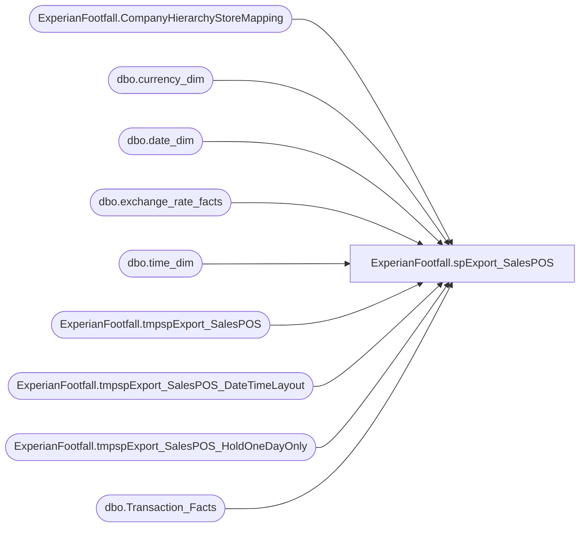

# ExperianFootfall.spExport_SalesPOS

**Database:** DWStaging  
**Server:** papamart  

## Architecture Diagram



## Table Dependencies

| Referenced Table |
|---|
| ExperianFootfall.CompanyHierarchyStoreMapping |
| dbo.currency_dim |
| dbo.date_dim |
| dbo.exchange_rate_facts |
| dbo.time_dim |
| ExperianFootfall.tmpspExport_SalesPOS |
| ExperianFootfall.tmpspExport_SalesPOS_DateTimeLayout |
| ExperianFootfall.tmpspExport_SalesPOS_HoldOneDayOnly |
| dbo.Transaction_Facts |

## Stored Procedure Code

```sql
-- DROP PROCEDURE ExperianFootfall.spExport_SalesPOS
CREATE PROCEDURE [ExperianFootfall].[spExport_SalesPOS]
-- =============================================================================================================
-- Name: spExperianFootfall_Report_POSExport
--
-- Description:	daily load process for ExperianFootfall
--
-- Input:		@ac_path			filepath for output
--				@RecordRange		datetime to start obtaining records
--
-- Output: returns records in textfile and uploads to FTP site through bcp command
--
-- Dependencies: 
--
-- Revision History
--		Name:			Date:			Comments:
--		Kevin Shyr		7/7/2014		Created
--		Kevin Shyr		7/2/2015		Change to roll up all numbers in SaleValue
-- =============================================================================================================
/* TEST SCRIPT
EXEC [dwstaging].ExperianFootfall.spExport_SalesPOS 
	@ac_path = 'I:\ExperianFootfall\Upload\'
	, @RecordRange_StartDateDime = '1/1/2013'
	, @RecordRange_EndDateDime = '12/31/2013'
	, @HierarchyID = 5153 -- BAB

EXEC [dwstaging].ExperianFootfall.spExport_SalesPOS 
	@ac_path = 'I:\ExperianFootfall\Upload\'
	, @RecordRange_StartDateDime = '10/1/2014'
	, @RecordRange_EndDateDime = '10/16/2014'
	, @HierarchyID = 6556 -- UK
*/
    @ac_path VARCHAR(100)
    , @RecordRange_StartDateDime DATETIME
	, @RecordRange_EndDateDime DATETIME
	, @HierarchyID INT
AS 
BEGIN
	SET NOCOUNT ON

	-- Break the process down into one day increment
	DECLARE @CurrentRangeStartDate AS DATETIME
		, @CurrentRangeEndDate AS DATETIME
	SET @CurrentRangeStartDate = @RecordRange_StartDateDime
	SET @CurrentRangeEndDate = DATEADD(dd, 1, @CurrentRangeStartDate)

	IF EXISTS(SELECT * FROM sys.all_objects WHERE name = 'tmpspExport_SalesPOS') 
	DROP TABLE ExperianFootfall.tmpspExport_SalesPOS

	CREATE TABLE ExperianFootfall.tmpspExport_SalesPOS(
		CompanyID INT NULL,
		[HierarchyID] INT NULL,
		NodeName VARCHAR(20) NULL,
		CGValueType INT NOT NULL,
		TimeGrain INT NOT NULL,
		SiteIdentity INT NULL,
		DateAndTime DATETIME NULL,
		TransactionCount INT NULL,
		UnitsSold INT NULL,
		SalesValue DECIMAL(10, 2) NULL,
		NumberOfRefunds INT NULL,
		RefundValue DECIMAL(10, 2) NULL
	) ON [PRIMARY]

	-- Do 1 day at a time
	WHILE @CurrentRangeEndDate < DATEADD(dd, 1, @RecordRange_EndDateDime)
	BEGIN
		IF EXISTS(SELECT * FROM sys.all_objects WHERE name = 'tmpspExport_SalesPOS_HoldOneDayOnly') 
		DROP TABLE ExperianFootfall.tmpspExport_SalesPOS_HoldOneDayOnly
	
		-- layout date and time orders
		IF EXISTS(SELECT * FROM sys.all_objects WHERE name = 'tmpspExport_SalesPOS_DateTimeLayout') 
		DROP TABLE ExperianFootfall.tmpspExport_SalesPOS_DateTimeLayout

		SELECT dd.date_key
			, QtrHour.[hour]
			, DATEADD(minute, (QtrHour.qtr_hour_id-1)*15, DATEADD(hour, QtrHour.[hour], dd.actual_date)) StartDateTime
			, DATEADD(minute, (QtrHour.qtr_hour_id)*15, DATEADD(hour, QtrHour.[hour], dd.actual_date)) EndDateTime
		INTO ExperianFootfall.tmpspExport_SalesPOS_DateTimeLayout
		FROM dw.dbo.date_dim dd WITH (NOLOCK)
			CROSS APPLY (SELECT td.[hour]
							, MIN(td.[minute]) AS FirstMinute
							, MAX(td.[minute]) AS LastMinute
							, td.qtr_hour_id
						FROM dw.dbo.time_dim td WITH(NOLOCK)
						WHERE td.time_key > 0
						GROUP BY td.[hour], td.qtr_hour_id
				) QtrHour
		WHERE dd.actual_date = @CurrentRangeStartDate
		ORDER BY dd.date_key, QtrHour.[hour], QtrHour.qtr_hour_id
				
		SELECT 
			sd.CompanyID
			, sd.[HierarchyID]
			, sd.NodeName
			, 1 AS CGValueType
			, 15 AS TimeGrain
			, sd.SiteIdentity
			, DATEADD(minute, (td.qtr_hour_id-1)*15, DATEADD(hour, td.hour, dd.actual_date)) AS DateAndTime
			, COUNT(tf.transaction_key) AS TransactionCount
			--, SUM(GAAP_transaction_flag) AS TransactionCount -- backing out change made on 2014-08-29 because of conversion rate consistency.
			, CAST(SUM(CASE
					WHEN tf.GAAP_sales_amount > 0
						THEN tf.total_units
					ELSE 0
				END) AS INT) AS UnitsSold
			--, CAST(SUM(CASE
			--		WHEN tf.GAAP_sales_amount > 0
			--			THEN tf.GAAP_sales_amount * ISNULL(erf.bbw_rate, 1)
			--		ELSE 0.00
			--	END) AS DECIMAL(10, 2)) AS SalesValue
			, SUM(tf.GAAP_sales_amount * ISNULL(erf.bbw_rate, 1)) AS SalesValue
			, SUM(CASE
					WHEN tf.GAAP_sales_amount < 0
						THEN 1
					ELSE 0
				END) AS NumberOfRefunds
			, CAST(SUM(CASE
					WHEN tf.GAAP_sales_amount < 0
						THEN tf.GAAP_sales_amount * ISNULL(erf.bbw_rate, 1)
					ELSE 0.00
				END) AS DECIMAL(10, 2)) AS RefundValue
		INTO ExperianFootfall.tmpspExport_SalesPOS_HoldOneDayOnly
		FROM dw.dbo.Transaction_Facts tf WITH(NOLOCK)
			INNER JOIN ExperianFootfall.CompanyHierarchyStoreMapping sd WITH(NOLOCK)
				ON tf.store_key = sd.store_key
					-- AND sd.IsShopperTrak = 1
					-- AND sd.IsFootFall = 1
			INNER JOIN dw.dbo.Date_Dim dd WITH(NOLOCK)
				ON tf.date_key = dd.date_key
			INNER JOIN dw.dbo.time_dim td WITH(NOLOCK)
				ON tf.TIME_KEY = td.TIME_KEY
			LEFT OUTER JOIN dw.dbo.currency_dim cd WITH(NOLOCK)
				ON tf.currency_key = cd.currency_key
			LEFT OUTER JOIN dw.dbo.exchange_rate_facts erf WITH(NOLOCK)
				ON tf.currency_key = erf.from_currency_key
					AND dd.date_key = erf.date_key
					AND cd.currency_code = erf.from_currency_code
					AND sd.CurrencyCode = erf.to_currency_code
		WHERE dd.actual_date = @CurrentRangeStartDate
			--(dd.actual_date >= @RecordRange_StartDateDime 
			--	AND dd.actual_date <= @RecordRange_EndDateDime)
			AND sd.[HierarchyID] = @HierarchyID
			AND sd.IsCurrentlyOffline = 0
			--AND sd.SiteIdentity = 137
		GROUP BY 
			sd.CompanyID
			, sd.[HierarchyID]
			, sd.NodeName
			, sd.SiteIdentity
			, DATEADD(minute, (td.qtr_hour_id-1)*15, DATEADD(hour, td.hour, dd.actual_date))
			, tf.currency_key
		ORDER BY sd.SiteIdentity

		-- Fill in all the 0 rows
		INSERT INTO ExperianFootfall.tmpspExport_SalesPOS
		SELECT 
			s.CompanyID
			, s.[HierarchyID]
			, s.NodeName
			, 1 AS CGValueType
			, 15 AS TimeGrain
			, s.SiteIdentity
			, dtl.StartDateTime AS DateAndTime
			, 0 AS TransactionCount
			, 0 AS UnitsSold
			, 0 AS SalesValue
			, 0 AS NumberOfRefunds
			, 0 AS RefundValue
		FROM ExperianFootfall.tmpspExport_SalesPOS_DateTimeLayout dtl WITH(NOLOCK)
			CROSS APPLY (SELECT DISTINCT te.CompanyID
							, te.[HierarchyID]
							, te.NodeName
							, te.SiteIdentity
							, CONVERT(VARCHAR(10), te.DateAndTime, 121) AS DateOnly
						FROM ExperianFootfall.tmpspExport_SalesPOS_HoldOneDayOnly te WITH(NOLOCK)
						--ORDER BY te.SiteIdentity, CONVERT(VARCHAR(10), te.DateAndTime, 121)
			) s
			LEFT OUTER JOIN ExperianFootfall.tmpspExport_SalesPOS_HoldOneDayOnly tar WITH(NOLOCK)
				ON CONVERT(VARCHAR(10), tar.DateAndTime, 121) = s.DateOnly
					AND s.SiteIdentity = tar.SiteIdentity
					AND dtl.StartDateTime = tar.DateAndTime
		WHERE tar.DateAndTime IS NULL

		INSERT INTO ExperianFootfall.tmpspExport_SalesPOS
			(CompanyID
			,[HierarchyID]
			,NodeName
			,CGValueType
			,TimeGrain
			,SiteIdentity
			,DateAndTime
			,TransactionCount
			,UnitsSold
			,SalesValue
			,NumberOfRefunds
			,RefundValue)
		SELECT CompanyID
			,[HierarchyID]
			,NodeName
			,CGValueType
			,TimeGrain
			,SiteIdentity
			,DateAndTime
			,TransactionCount
			,UnitsSold
			,SalesValue
			,NumberOfRefunds
			,RefundValue
		FROM ExperianFootfall.tmpspExport_SalesPOS_HoldOneDayOnly tar WITH(NOLOCK)

		-- INCREMENT to next day
		SET @CurrentRangeStartDate = @CurrentRangeEndDate
		SET @CurrentRangeEndDate = DATEADD(dd, 1, @CurrentRangeStartDate)
		-- PRINT CAST(@CurrentRangeStartDate AS VARCHAR(50)) + ' to ' + CAST(@CurrentRangeEndDate AS VARCHAR(50))

	END -- end while

	--FORMAT REQUESTED BY ExperianFootfall
	DECLARE @outputsql VARCHAR(1000)
		, @bcpsql VARCHAR(4000)
		, @filename VARCHAR(200)
		, @CompanyID INT
	SELECT TOP 1 @CompanyID = CompanyID FROM ExperianFootfall.tmpspExport_SalesPOS
	SET @outputsql = 'SELECT CompanyID, [HierarchyID], NodeName, CGValueType, TimeGrain'
					+ ', SiteIdentity, CONVERT(VARCHAR(19), DateAndTime, 120)'
					+ ', TransactionCount, UnitsSold, ROUND(SalesValue, 2), NumberOfRefunds, ROUND(RefundValue, 2)'
					+ ' FROM [dwstaging].ExperianFootfall.tmpspExport_SalesPOS'
					+ ' ORDER BY SiteIdentity, CONVERT(VARCHAR(19), DateAndTime, 120)'

	SELECT @filename = 'HS' 
						+ REPLICATE('0', 2 - LEN(DAY(@RecordRange_EndDateDime))) + CAST(DAY(@RecordRange_EndDateDime) AS VARCHAR(2)) 
						+ REPLICATE('0', 2 - LEN(MONTH(@RecordRange_EndDateDime))) + CAST(MONTH(@RecordRange_EndDateDime) AS VARCHAR(2))
						+ CAST(YEAR(@RecordRange_EndDateDime) AS VARCHAR(4))
						+ CAST(CAST(RAND() * 10 AS INT) AS VARCHAR(1)) + CAST(CAST(RAND() * 10 AS INT) AS VARCHAR(1))
						-- + SUBSTRING(CONVERT(VARCHAR(255), NEWID()), 1, 2) -- original guide specified character code
						+ '.' + CAST(@CompanyID AS VARCHAR(10))

	SET @bcpsql = 'bcp "' + @outputsql + '" queryout "' + @ac_path + @filename
				+ '" -t "," -T -c'
	--SELECT @bcpsql

	EXEC master..xp_cmdshell @bcpsql
END
```

