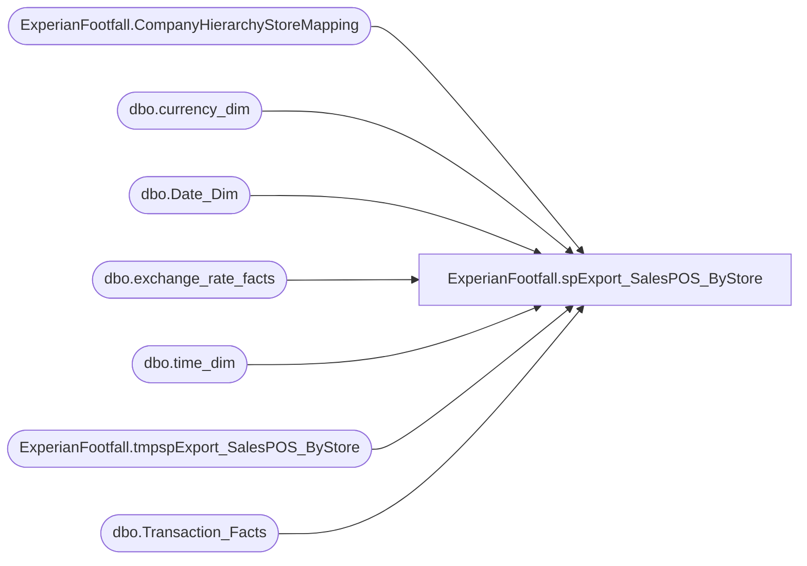

# ExperianFootfall.spExport_SalesPOS_ByStore

**Database:** DWStaging  
**Server:** papamart  

## Architecture Diagram



## Table Dependencies

| Referenced Table |
|---|
| ExperianFootfall.CompanyHierarchyStoreMapping |
| dbo.currency_dim |
| dbo.Date_Dim |
| dbo.exchange_rate_facts |
| dbo.time_dim |
| ExperianFootfall.tmpspExport_SalesPOS_ByStore |
| dbo.Transaction_Facts |

## Stored Procedure Code

```sql
-- DROP PROCEDURE ExperianFootfall.[spExport_SalesPOS_ByStore]
CREATE PROCEDURE [ExperianFootfall].[spExport_SalesPOS_ByStore]
-- =============================================================================================================
-- Name: spExport_SalesPOS_ByStore
--
-- Description:	daily load process for ExperianFootfall

-- =============================================================================================================
/* TEST SCRIPT
SELECT * FROM dw.dbo.store_dim WHERE store_id = 137
SELECT * FROM dw.dbo.date_dim WHERE fiscal_year = 2015 AND fiscal_quarter = 1

EXEC [dwstaging].ExperianFootfall.[spExport_SalesPOS_ByStore] 
	@ac_path = '\\kermode\filerepository\ExperianFootfall\Upload\'
	, @RecordRange_StartDateDime = '2015-01-04'
	, @RecordRange_EndDateDime = '2015-04-04'
	, @HierarchyID = 5153 -- BAB
	, @StoreKey = 139

EXEC [dwstaging].ExperianFootfall.[spExport_SalesPOS_ByStore] 
	@ac_path = '\\kermode\filerepository\ExperianFootfall\Upload\'
	, @RecordRange_StartDateDime = '6/29/2014'
	, @RecordRange_EndDateDime = '9/3/2014'
	, @HierarchyID = 6556 -- UK
	, @StoreKey = 52
*/
    @ac_path VARCHAR(100)
    , @RecordRange_StartDateDime DATETIME
	, @RecordRange_EndDateDime DATETIME
	, @HierarchyID INT
	, @StoreKey INT
AS 
SET NOCOUNT ON

IF EXISTS(SELECT * FROM sys.all_objects WHERE name = 'tmpspExport_SalesPOS_ByStore') 
DROP TABLE ExperianFootfall.tmpspExport_SalesPOS_ByStore

SELECT 
	sd.CompanyID
	, sd.[HierarchyID]
	, sd.NodeName
	, 1 AS CGValueType
	, 15 AS TimeGrain
	, sd.SiteIdentity
	, DATEADD(minute, (td.qtr_hour_id-1)*15, DATEADD(hour, td.hour, dd.actual_date)) AS DateAndTime
	, COUNT(tf.transaction_key) AS TransactionCount
	--, SUM(GAAP_transaction_flag) AS TransactionCount -- backing out change made on 2014-08-29 because of conversion rate consistency.
	, CAST(SUM(CASE
			WHEN tf.receipt_total_amount > 0
				THEN tf.total_units
			ELSE 0
		END) AS INT) AS UnitsSold
	, CAST(SUM(CASE
			WHEN tf.receipt_total_amount > 0
				THEN tf.GAAP_sales_amount * ISNULL(erf.bbw_rate, 1)
			ELSE 0.00
		END) AS DECIMAL(10, 2)) AS SalesValue
	, SUM(CASE
			WHEN tf.receipt_total_amount < 0
				THEN 1
			ELSE 0
		END) AS NumberOfRefunds
	, CAST(SUM(CASE
			WHEN tf.receipt_total_amount < 0
				THEN tf.receipt_total_amount * ISNULL(erf.bbw_rate, 1)
			ELSE 0.00
		END) AS DECIMAL(10, 2)) AS RefundValue
INTO ExperianFootfall.tmpspExport_SalesPOS_ByStore
FROM dw.dbo.Transaction_Facts tf WITH(NOLOCK)
	INNER JOIN ExperianFootfall.CompanyHierarchyStoreMapping sd WITH(NOLOCK)
		ON tf.store_key = sd.store_key
			-- AND sd.IsShopperTrak = 1
			-- AND sd.IsFootFall = 1
	INNER JOIN dw.dbo.Date_Dim dd WITH(NOLOCK)
		ON tf.date_key = dd.date_key
	INNER JOIN dw.dbo.time_dim td WITH(NOLOCK)
		ON tf.TIME_KEY = td.TIME_KEY
	LEFT OUTER JOIN dw.dbo.currency_dim cd WITH(NOLOCK)
		ON tf.currency_key = cd.currency_key
	LEFT OUTER JOIN dw.dbo.exchange_rate_facts erf WITH(NOLOCK)
		ON tf.currency_key = erf.from_currency_key
			AND dd.date_key = erf.date_key
			AND cd.currency_code = erf.from_currency_code
			AND sd.CurrencyCode = erf.to_currency_code
WHERE (dd.actual_date >= @RecordRange_StartDateDime 
		AND dd.actual_date <= @RecordRange_EndDateDime)
	AND sd.[HierarchyID] = @HierarchyID
	AND sd.IsCurrentlyOffline = 0
	AND sd.store_key = @StoreKey
GROUP BY 
	sd.CompanyID
	, sd.[HierarchyID]
	, sd.NodeName
	, sd.SiteIdentity
	, DATEADD(minute, (td.qtr_hour_id-1)*15, DATEADD(hour, td.hour, dd.actual_date))
	, tf.currency_key
ORDER BY sd.SiteIdentity

--FORMAT REQUESTED BY ExperianFootfall
DECLARE @outputsql VARCHAR(1000)
    , @bcpsql VARCHAR(4000)
	, @filename VARCHAR(200)
	, @CompanyID INT
SELECT TOP 1 @CompanyID = CompanyID FROM ExperianFootfall.tmpspExport_SalesPOS_ByStore
SET @outputsql = 'SELECT CompanyID, [HierarchyID], NodeName, CGValueType, TimeGrain'
				+ ', SiteIdentity, CONVERT(VARCHAR(19), DateAndTime, 120)'
				+ ', TransactionCount, UnitsSold, ROUND(SalesValue, 2), NumberOfRefunds, ROUND(RefundValue, 2)'
				+ ' FROM [dwstaging].ExperianFootfall.tmpspExport_SalesPOS_ByStore'
				+ ' ORDER BY SiteIdentity, CONVERT(VARCHAR(19), DateAndTime, 120)'

SELECT @filename = 'HS' 
					+ REPLICATE('0', 2 - LEN(DAY(@RecordRange_EndDateDime))) + CAST(DAY(@RecordRange_EndDateDime) AS VARCHAR(2)) 
					+ REPLICATE('0', 2 - LEN(MONTH(@RecordRange_EndDateDime))) + CAST(MONTH(@RecordRange_EndDateDime) AS VARCHAR(2))
					+ CAST(YEAR(@RecordRange_EndDateDime) AS VARCHAR(4))
					+ CAST(CAST(RAND() * 10 AS INT) AS VARCHAR(1)) + CAST(CAST(RAND() * 10 AS INT) AS VARCHAR(1))
					-- + '_' + CAST(@StoreKey AS VARCHAR(6))
					-- + SUBSTRING(CONVERT(VARCHAR(255), NEWID()), 1, 2) -- original guide specified character code
					+ '.' + CAST(@CompanyID AS VARCHAR(10))

SET @bcpsql = 'bcp "' + @outputsql + '" queryout "' + @ac_path + @filename
			+ '" -t "," -T -c'
--SELECT @bcpsql

EXEC master..xp_cmdshell @bcpsql


Accounting,spRpt_Transaction_RawDetailFromStoreServer_ForSingleFiscalMonthStore,-- =============================================
-- Author:		Shyr, Kevin
-- Create date: 7/29/2015
-- Description:	<Description,,>
-- =============================================
CREATE PROCEDURE [Accounting].[spRpt_Transaction_RawDetailFromStoreServer_ForSingleFiscalMonthStore]
	@FiscalYear INT
	, @FiscalPeriod INT
	, @StoreID INT
	, @isBosisBopis int
AS
BEGIN
	-- SET NOCOUNT ON added to prevent extra result sets from
	-- interfering with SELECT statements.
	SET NOCOUNT ON;

	SELECT 
		trs.location_code,
		trs.location_name,
		dd.actual_date AS CapturedDate,
		trs.TransactionDatetime,
		trs.rtl_trn_no as POSTransactionNumber,
		case 
			when RTL_TRN_TYPE_CODE in ('credit', 'return') 
				or trs.SalesAuditRegisterNumber=7 
			then trs.net_sales *-1
			else trs.net_sales 
		end as net_sales,
		trs.WebOrderNumber,
		--trs.TransactionID,
		tf.transaction_no as TransactionID,
		trs.SalesAuditRegisterNumber,	
		trs.SalesAuditTransactionRemark,	
		trs.isBOSISorBOPIS,
		trs.isGaapDW,
		trs.GaapSalesDW,
		case 
			when trs.isBOSISorBOPIS = 1 
				then 'WebToStore' 
			else 'NormalSale' 
		end as OrderType,
		trs.RTL_TRN_TYPE_CODE
	--FROM [Accounting].[Sales_GAAP_RawFromStoreServer] trs WITH(NOLOCK)
	from dw.dbo.Sales_GAAP_RawFromStoreServer trs
		INNER JOIN dw.dbo.date_dim dd WITH(NOLOCK)
			ON trs.date_key = dd.date_key
	left join dw.dbo.TransactionFact tf on trs.TransactionID=tf.transaction_id
	WHERE dd.fiscal_year = @FiscalYear
		AND dd.fiscal_period = @FiscalPeriod
		AND trs.location_code = @StoreID
		and (trs.isBOSISorBOPIS = @isBosisBopis or @isBosisBopis is null)

END
```

