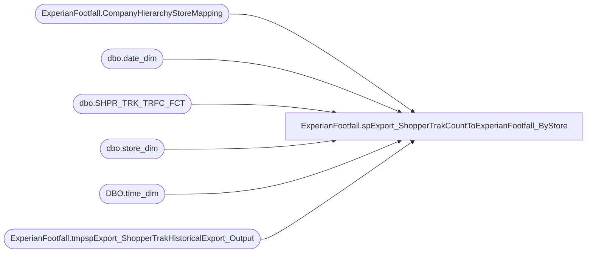

# ExperianFootfall.spExport_ShopperTrakCountToExperianFootfall_ByStore

**Database:** DWStaging  
**Server:** papamart  

## Architecture Diagram



## Table Dependencies

| Referenced Table |
|---|
| ExperianFootfall.CompanyHierarchyStoreMapping |
| dbo.date_dim |
| dbo.SHPR_TRK_TRFC_FCT |
| dbo.store_dim |
| DBO.time_dim |
| ExperianFootfall.tmpspExport_ShopperTrakHistoricalExport_Output |

## Stored Procedure Code

```sql
-- DROP PROCEDURE ExperianFootfall.spExport_ShopperTrakCountToExperianFootfall_ByStore
CREATE PROCEDURE [ExperianFootfall].[spExport_ShopperTrakCountToExperianFootfall_ByStore]
-- =============================================================================================================
-- Revision History
--		Name:			Date:			Comments:
--		Kevin Shyr		8/22/2014		Created
-- =============================================================================================================
/* TEST SCRIPT
EXEC [dwstaging].ExperianFootfall.spExport_ShopperTrakCountToExperianFootfall_ByStore
	@ac_path = 'I:\ExperianFootfall\Upload\'
	, @RecordRange_StartDate = '1/1/2014'
	, @RecordRange_EndDate = '11/10/2014'
*/
    @ac_path VARCHAR(100)
    , @RecordRange_StartDate DATETIME
	, @RecordRange_EndDate DATETIME
AS 
SET NOCOUNT ON

DECLARE @CurrentSiteID AS INT
DECLARE curs_StoreID CURSOR
	FOR SELECT DISTINCT SiteIdentity
		FROM ExperianFootfall.CompanyHierarchyStoreMapping WITH(NOLOCK)
		WHERE IsShopperTrak = 1 
			--AND SiteIdentity = 206
		ORDER BY SiteIdentity
OPEN curs_StoreID
FETCH NEXT FROM curs_StoreID
	INTO @CurrentSiteID

WHILE @@FETCH_STATUS = 0
BEGIN

	DECLARE @outputsql VARCHAR(1000)
		, @bcpsql VARCHAR(4000)
		, @filename VARCHAR(200)

	IF EXISTS(SELECT * FROM sys.all_objects WHERE name = 'tmpspExport_ShopperTrakHistoricalExport_Output') 
	DROP TABLE ExperianFootfall.tmpspExport_ShopperTrakHistoricalExport_Output

	CREATE TABLE ExperianFootfall.tmpspExport_ShopperTrakHistoricalExport_Output
		( ShopperTrakID INT
			, CUST_ID INT
			, DT VARCHAR(8)
			, TM VARCHAR(6)
			, ENTERS INT
			, EXITS INT
			, Data_Ind CHAR(1)
		)

	INSERT INTO ExperianFootfall.tmpspExport_ShopperTrakHistoricalExport_Output
		( ShopperTrakID
			, CUST_ID
			, DT
			, TM
			, ENTERS
			, EXITS
			, Data_Ind
		)
	SELECT
		sd.store_id AS ShopperTrakID
		, sd.store_id AS CUST_ID
		, CASE
			WHEN RIGHT('00000' + 10000*td.[hour] + 100*(td.[minute]-14), 6) = '234500'
				THEN 10000*YEAR(DATEADD(dd, -1, dd.actual_date)) + 100*MONTH(DATEADD(dd, -1, dd.actual_date)) + DAY(DATEADD(dd, -1, dd.actual_date)) 
			ELSE 10000*YEAR(dd.actual_date) + 100*MONTH(dd.actual_date) + DAY(dd.actual_date) 
		END AS DT
		, RIGHT('00000' + LTRIM(RTRIM(CAST(10000*td.[hour] + 100*(td.[minute]-14) AS VARCHAR(6)))), 6) AS TM
		, MAX(sttf.ENTERS) AS ENTERS
		, MAX(sttf.EXITS) AS EXITS
		, 'A' AS Data_Ind
	FROM dw.dbo.SHPR_TRK_TRFC_FCT sttf WITH(NOLOCK)
		INNER JOIN dw.dbo.store_dim sd WITH(NOLOCK)
			ON sttf.STR_KEY = sd.store_key
		INNER JOIN ExperianFootfall.CompanyHierarchyStoreMapping chsm WITH(NOLOCK)
			ON sd.store_key = chsm.store_key
				AND chsm.IsShopperTrak = 1
		INNER JOIN dw.DBO.time_dim td WITH(NOLOCK)
			ON sttf.TM_key = td.time_key
		INNER JOIN dw.dbo.date_dim dd WITH(NOLOCK)
			ON sttf.DT_key = dd.date_key
	WHERE dd.actual_date BETWEEN @RecordRange_StartDate AND @RecordRange_EndDate
		AND sd.store_id = @CurrentSiteID
	GROUP BY 
		sd.store_id
		, CASE
			WHEN RIGHT('00000' + 10000*td.[hour] + 100*(td.[minute]-14), 6) = '234500'
				THEN 10000*YEAR(DATEADD(dd, -1, dd.actual_date)) + 100*MONTH(DATEADD(dd, -1, dd.actual_date)) + DAY(DATEADD(dd, -1, dd.actual_date)) 
			ELSE 10000*YEAR(dd.actual_date) + 100*MONTH(dd.actual_date) + DAY(dd.actual_date) 
		END
		, RIGHT('00000' + LTRIM(RTRIM(CAST(10000*td.[hour] + 100*(td.[minute]-14) AS VARCHAR(6)))), 6)
	--ORDER BY 
	--	sd.store_id
	--	, 10000*YEAR(dd.actual_date) + 100*MONTH(dd.actual_date) + DAY(dd.actual_date)
	--	, 10000*td.[hour] + 100*(td.[minute]-14)
	/*****************************************************************/
	  -- The following block was done to zero out some bad shopperTrak sites
	/*****************************************************************/

	--SELECT
	--	sd.store_id AS ShopperTrakID
	--	, sd.store_id AS CUST_ID
	--	, 10000*YEAR(dd.actual_date) + 100*MONTH(dd.actual_date) + DAY(dd.actual_date) AS DT
	--	, 10000*td.[hour] + 100*(td.[minute]) AS TM
	--	, CAST(0 AS INT) AS ENTERS
	--	, CAST(0 AS INT) AS EXITS
	--	, 'A' AS Data_Ind
	--FROM dw.dbo.SHPR_TRK_TRFC_STG sttf WITH(NOLOCK)
	--	INNER JOIN [dw].dbo.store_dim sd WITH(NOLOCK)
	--		ON sttf.CUST_ID = sd.store_id
	--	INNER JOIN [dw].DBO.time_dim td WITH(NOLOCK)
	--		ON CAST(SUBSTRING(sttf.TM, 1, 2) AS INT) = td.[hour]
	--			AND CAST(SUBSTRING(sttf.TM, 3, 2) AS INT) = td.[minute]
	--	INNER JOIN [dw].dbo.date_dim dd WITH(NOLOCK)
	--		ON CONVERT(DATETIME, sttf.DT, 103) = dd.actual_date
	--WHERE dd.actual_date BETWEEN @RecordRange_StartDate AND @RecordRange_EndDate
	--	AND sttf.SHPR_TRK_ORG_ID LIKE '4%'
	/*****************************************************************/

	SET @outputsql = 'SELECT ShopperTrakID, CUST_ID, DT, TM, ENTERS, EXITS, Data_Ind '
					+ ' FROM [dwstaging].ExperianFootfall.tmpspExport_ShopperTrakHistoricalExport_Output '
					+ ' ORDER BY CUST_ID, DT, TM '

	SELECT @filename = '15M' 
						+ CAST(YEAR(@RecordRange_EndDate) AS VARCHAR(4))
						+ REPLICATE('0', 2 - LEN(MONTH(@RecordRange_EndDate))) + CAST(MONTH(@RecordRange_EndDate) AS VARCHAR(2))
						+ REPLICATE('0', 2 - LEN(DAY(@RecordRange_EndDate))) + CAST(DAY(@RecordRange_EndDate) AS VARCHAR(2)) 
						-- + '.csv'
						+ '_historical_' + CAST(@CurrentSiteID AS VARCHAR(4)) + '.csv'

	SET @bcpsql = 'bcp "' + @outputsql + '" queryout "' + @ac_path + @filename
	+ '" -t "," -T -c'
	--SELECT @bcpsql

	EXEC master..xp_cmdshell @bcpsql

	-- current loop end	
	FETCH NEXT FROM curs_StoreID
		INTO @CurrentSiteID
END 
CLOSE curs_StoreID;
DEALLOCATE curs_StoreID;
```

