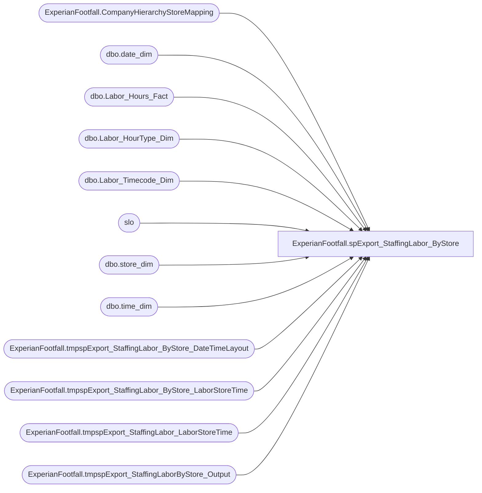

# ExperianFootfall.spExport_StaffingLabor_ByStore

**Database:** DWStaging  
**Server:** papamart  

## Architecture Diagram



## Table Dependencies

| Referenced Table |
|---|
| ExperianFootfall.CompanyHierarchyStoreMapping |
| dbo.date_dim |
| dbo.Labor_Hours_Fact |
| dbo.Labor_HourType_Dim |
| dbo.Labor_Timecode_Dim |
| slo |
| dbo.store_dim |
| dbo.time_dim |
| ExperianFootfall.tmpspExport_StaffingLabor_ByStore_DateTimeLayout |
| ExperianFootfall.tmpspExport_StaffingLabor_ByStore_LaborStoreTime |
| ExperianFootfall.tmpspExport_StaffingLabor_LaborStoreTime |
| ExperianFootfall.tmpspExport_StaffingLaborByStore_Output |

## Stored Procedure Code

```sql
-- DROP PROCEDURE ExperianFootfall.spExport_StaffingLabor_ByStore
CREATE PROCEDURE [ExperianFootfall].[spExport_StaffingLabor_ByStore]
-- =============================================================================================================
-- Name: ExperianFootfall.spExport_StaffingLabor_ByStore
-- =============================================================================================================
/* TEST SCRIPT
EXEC [dwstaging].ExperianFootfall.spExport_StaffingLabor_ByStore
	@ac_path = 'I:\ExperianFootfall\Upload\'
	, @RecordRange_StartDate = '9/24/2014'
	, @RecordRange_EndDate = '9/25/2014'
	, @HierarchyID = 5154 -- BAB
	, @StoreID = 52
*/
    @ac_path VARCHAR(100)
    , @RecordRange_StartDate DATETIME
	, @RecordRange_EndDate DATETIME
	, @HierarchyID INT
	, @StoreID INT
AS 
BEGIN
	SET NOCOUNT ON

	-- Break the process down into one day increment
	DECLARE @CurrentRangeStartDate AS DATETIME
		, @CurrentRangeEndDate AS DATETIME
	SET @CurrentRangeStartDate = @RecordRange_StartDate
	SET @CurrentRangeEndDate = DATEADD(dd, 1, @CurrentRangeStartDate)
	--PRINT CAST(@CurrentRangeStartDate AS VARCHAR(50)) + ' to ' + CAST(@CurrentRangeEndDate AS VARCHAR(50))

	IF EXISTS(SELECT * FROM sys.all_objects WHERE name = 'tmpspExport_StaffingLaborByStore_Output') 
	DROP TABLE ExperianFootfall.tmpspExport_StaffingLaborByStore_Output

	CREATE TABLE ExperianFootfall.tmpspExport_StaffingLaborByStore_Output
		( CompanyID INT
			, [HierarchyID] INT
			, NodeName VARCHAR(100)
			, CGValueType INT
			, TimeGrain INT
			, SiteIdentity INT
			, DateAndTime DATETIME
			, MinutesWorked INT NULL
			, HoursWorkedCalculation DECIMAL(10, 2) NULL
			, NumberOfStaffForExport VARCHAR(10) NULL
			, HoursWorkedForExport VARCHAR(10) NULL
			, StaffCosts VARCHAR(10) NULL
			-- META data fields
			, store_key INT
		)

	-- Do 12 hours at a time
	WHILE @CurrentRangeEndDate <= DATEADD(dd, 1, @RecordRange_EndDate)
	BEGIN
		-- layout date and time orders
		IF EXISTS(SELECT * FROM sys.all_objects WHERE name = 'tmpspExport_StaffingLabor_ByStore_DateTimeLayout') 
		DROP TABLE ExperianFootfall.tmpspExport_StaffingLabor_ByStore_DateTimeLayout

		SELECT dd.date_key
			, AllHours.[hour]
			, DATEADD(hour, AllHours.[hour], dd.actual_date) StartDateTime
			, DATEADD(second, 59, DATEADD(minute, 59, DATEADD(hour, AllHours.[hour], dd.actual_date))) EndDateTime
			--, DATEADD(minute, (QtrHour.qtr_hour_id-1)*15, DATEADD(hour, QtrHour.[hour], dd.actual_date)) StartDateTime
			--, DATEADD(minute, (QtrHour.qtr_hour_id)*15, DATEADD(hour, QtrHour.[hour], dd.actual_date)) EndDateTime
		INTO ExperianFootfall.tmpspExport_StaffingLabor_ByStore_DateTimeLayout
		FROM dw.dbo.date_dim dd WITH (NOLOCK)
			CROSS APPLY (SELECT td.[hour]
							--, MIN(td.[minute]) AS FirstMinute
							--, MAX(td.[minute]) AS LastMinute
							--, td.qtr_hour_id
						FROM dw.dbo.time_dim td WITH(NOLOCK)
						WHERE td.time_key > 0
						GROUP BY td.[hour]--, td.qtr_hour_id
				) AllHours
		WHERE dd.actual_date = @CurrentRangeStartDate
		ORDER BY dd.date_key, AllHours.[hour]

		-- select labor record for that day
		IF EXISTS(SELECT * FROM sys.all_objects WHERE name = 'tmpspExport_StaffingLabor_ByStore_LaborStoreTime') 
		DROP TABLE ExperianFootfall.tmpspExport_StaffingLabor_ByStore_LaborStoreTime
		
		SELECT
			lhf.store_key
			, dd.actual_date + lhf.start_Time AS LaborStartDateTime 
			, dd.actual_date + lhf.end_Time AS LaborEndDateTime
		INTO ExperianFootfall.tmpspExport_StaffingLabor_ByStore_LaborStoreTime
		FROM dw.dbo.Labor_Hours_Fact lhf WITH(NOLOCK)
			INNER JOIN dw.dbo.store_dim sd WITH(NOLOCK)
				ON lhf.store_key = sd.store_key
			INNER JOIN dw.dbo.date_dim dd WITH(NOLOCK)
				ON lhf.date_key = dd.date_key
			INNER JOIN dw.dbo.Labor_HourType_Dim h WITH(NOLOCK)
				ON lhf.HOURTYPE_KEY = h.HOURTYPE_KEY
			INNER JOIN dw.dbo.Labor_Timecode_Dim t WITH(NOLOCK)
				ON lhf.timecode_key = t.timecode_key
		WHERE sd.store_id = @StoreID
			AND t.isWork = 1
			AND h.isPaid = 1
			AND lhf.start_Time <> lhf.end_Time
			AND ( dd.actual_date + lhf.start_Time BETWEEN @CurrentRangeStartDate AND @CurrentRangeEndDate
				OR dd.actual_date + lhf.end_Time BETWEEN @CurrentRangeStartDate AND @CurrentRangeEndDate)

		-- If EndDateTime < StartDateTime, that means the log hours cross over a day
		UPDATE ExperianFootfall.tmpspExport_StaffingLabor_LaborStoreTime
		SET LaborEndDateTime = DATEADD(dd, 1, LaborEndDateTime)
		WHERE LaborEndDateTime < LaborStartDateTime
		
		INSERT INTO ExperianFootfall.tmpspExport_StaffingLaborByStore_Output
			(store_key
			, DateAndTime
			--, NumberOfStaff
			, MinutesWorked
			)
		SELECT
			sl.store_key
			, so.StartDateTime
			--, SUM(CASE 
			--	WHEN sl.LaborStartDateTime <= so.StartDateTime 
			--			AND sl.LaborEndDateTime >= so.EndDateTime
			--		THEN 1
			--	ELSE 0
			--END) AS NumberOfStaff
			/* -- 
			--, CAST(SUM(CASE 
			--		WHEN sl.LaborStartDateTime <= so.StartDateTime
			--			AND sl.LaborEndDateTime >= so.EndDateTime
			--			THEN 1
			--		ELSE 0
			--END) AS DECIMAL(5, 2)) AS HoursWorked
			*/
			, SUM(CASE 
				WHEN sl.LaborStartDateTime <= so.StartDateTime
					THEN CASE WHEN sl.LaborEndDateTime <= so.StartDateTime
							THEN 0 -- no time worked in this period
						WHEN sl.LaborEndDateTime >= so.EndDateTime
							THEN 60 -- worked the full hour
						ELSE DATEDIFF(mi, so.StartDateTime, sl.LaborEndDateTime) % 60
						END
				ELSE -- WHEN sl.LaborStartDateTime > so.StartDateTime
					CASE WHEN sl.LaborStartDateTime >= so.EndDateTime
							THEN 0 -- no time worked in this period
						WHEN sl.LaborEndDateTime >= so.EndDateTime
							THEN (DATEDIFF(mi, sl.LaborStartDateTime, so.EndDateTime)+1) % 60
						ELSE DATEDIFF(mi, sl.LaborStartDateTime, sl.LaborEndDateTime) % 60
						END
			END) AS MinutesWorked
		FROM ExperianFootfall.tmpspExport_StaffingLabor_ByStore_LaborStoreTime sl WITH(NOLOCK)
			CROSS APPLY ExperianFootfall.tmpspExport_StaffingLabor_ByStore_DateTimeLayout so WITH(NOLOCK)
		GROUP BY 
			sl.store_key
			, so.StartDateTime
		--HAVING SUM(CASE 
		--				WHEN sl.LaborStartDateTime <= so.StartDateTime 
		--						AND sl.LaborEndDateTime >= so.EndDateTime
		--					THEN 1
		--				ELSE 0
		--			END) > 0

		SET @CurrentRangeStartDate = @CurrentRangeEndDate
		SET @CurrentRangeEndDate = DATEADD(dd, 1, @CurrentRangeStartDate)
		--PRINT CAST(@CurrentRangeStartDate AS VARCHAR(50)) + ' to ' + CAST(@CurrentRangeEndDate AS VARCHAR(50))

	END -- end while

	UPDATE slo
	SET CompanyID = sm.CompanyID
		, [HierarchyID] = sm.[HierarchyID]
		, NodeName = sm.NodeName
		, CGValueType = 1
		, TimeGrain = 100 -- 100 is hourly, 15 is 15 minutes
		, SiteIdentity = sm.SiteIdentity
		, StaffCosts = '0.00'
	FROM ExperianFootfall.tmpspExport_StaffingLaborByStore_Output AS slo
		INNER JOIN ExperianFootfall.CompanyHierarchyStoreMapping AS sm
			ON slo.store_key = sm.store_key
	WHERE sm.IsCurrentlyOffline = 0
		AND sm.[HierarchyID] = @HierarchyID

	UPDATE slo
	SET HoursWorkedCalculation = CAST(MinutesWorked AS DECIMAL(10, 2)) / 60
	FROM ExperianFootfall.tmpspExport_StaffingLaborByStore_Output AS slo
	
	UPDATE slo
	SET HoursWorkedForExport = CAST(HoursWorkedCalculation AS VARCHAR(20))
		, NumberOfStaffForExport = CAST(HoursWorkedCalculation AS VARCHAR(20))
	FROM ExperianFootfall.tmpspExport_StaffingLaborByStore_Output AS slo
	
	--FORMAT REQUESTED BY ExperianFootfall
	DECLARE @outputsql VARCHAR(1000)
		, @bcpsql VARCHAR(4000)
		, @filename VARCHAR(200)
		, @CompanyID INT
	SELECT TOP 1 @CompanyID = CompanyID FROM ExperianFootfall.tmpspExport_StaffingLaborByStore_Output
	SET @outputsql = 'SELECT CompanyID, [HierarchyID], NodeName, CGValueType, TimeGrain'
					+ ', SiteIdentity, CONVERT(VARCHAR(19), DateAndTime, 120)'
					+ ', NumberOfStaffForExport'
					-- + ', CAST(ROUND(HoursWorked, 2) AS FLOAT)'
					+ ', HoursWorkedForExport'
					+ ', StaffCosts'
					+ ' FROM [dwstaging].ExperianFootfall.tmpspExport_StaffingLaborByStore_Output'
					+ ' ORDER BY SiteIdentity, CONVERT(VARCHAR(19), DateAndTime, 120)'

	SELECT @filename = 'ST' 
						+ REPLICATE('0', 2 - LEN(DAY(@RecordRange_EndDate))) + CAST(DAY(@RecordRange_EndDate) AS VARCHAR(2)) 
						+ REPLICATE('0', 2 - LEN(MONTH(@RecordRange_EndDate))) + CAST(MONTH(@RecordRange_EndDate) AS VARCHAR(2))
						+ CAST(YEAR(@RecordRange_EndDate) AS VARCHAR(4))
						+ CAST(CAST(RAND() * 10 AS INT) AS VARCHAR(1)) + CAST(CAST(RAND() * 10 AS INT) AS VARCHAR(1))
						-- + '_' + CAST(@StoreID AS VARCHAR(6))
						-- + SUBSTRING(CONVERT(VARCHAR(255), NEWID()), 1, 2) -- original guide specified character code
						+ '.' + CAST(@CompanyID AS VARCHAR(10))

	SET @bcpsql = 'bcp "' + @outputsql + '" queryout "' + @ac_path + @filename
	+ '" -t "," -T -c'
	--SELECT @bcpsql

	EXEC master..xp_cmdshell @bcpsql
END
```

