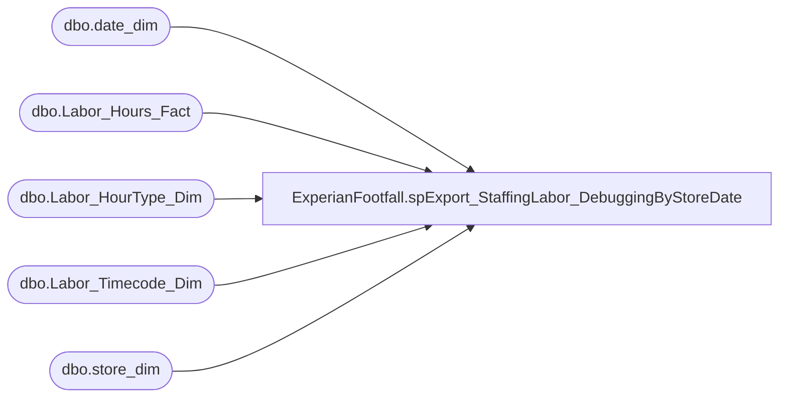

# ExperianFootfall.spExport_StaffingLabor_DebuggingByStoreDate

**Database:** DWStaging  
**Server:** papamart  

## Architecture Diagram



## Table Dependencies

| Referenced Table |
|---|
| dbo.date_dim |
| dbo.Labor_Hours_Fact |
| dbo.Labor_HourType_Dim |
| dbo.Labor_Timecode_Dim |
| dbo.store_dim |

## Stored Procedure Code

```sql
CREATE PROCEDURE [ExperianFootfall].[spExport_StaffingLabor_DebuggingByStoreDate]
    @RecordRange_StartDate DATETIME
	, @RecordRange_EndDate DATETIME
	, @StoreID INT
AS 
/* TEST SCRIPT
EXEC [dwstaging].ExperianFootfall.spExport_StaffingLabor_DebuggingByStoreDate 
	@RecordRange_StartDate = '11/2/2014'
	, @RecordRange_EndDate = '11/4/2014'
	, @StoreID = 62 -- BAB

*/
BEGIN
	SET NOCOUNT ON

	SELECT
		dd.actual_date
		, lhf.*
		--lhf.store_key
		--, dd.actual_date + lhf.start_Time AS LaborStartDateTime 
		--, dd.actual_date + lhf.end_Time AS LaborEndDateTime
	FROM dw.dbo.Labor_Hours_Fact lhf WITH(NOLOCK)
		INNER JOIN dw.dbo.store_dim sd WITH(NOLOCK)
			ON lhf.store_key = sd.store_key
		INNER JOIN dw.dbo.date_dim dd WITH(NOLOCK)
			ON lhf.date_key = dd.date_key
		INNER JOIN dw.dbo.Labor_HourType_Dim h WITH(NOLOCK)
			ON lhf.HOURTYPE_KEY = h.HOURTYPE_KEY
		INNER JOIN dw.dbo.Labor_Timecode_Dim t WITH(NOLOCK)
			ON lhf.timecode_key = t.timecode_key
	WHERE sd.store_id = @StoreID
		AND t.isWork = 1
		AND h.isPaid = 1
		AND lhf.start_Time <> lhf.end_Time
		AND ( dd.actual_date + lhf.start_Time BETWEEN @RecordRange_StartDate AND @RecordRange_EndDate
			OR dd.actual_date + lhf.end_Time BETWEEN @RecordRange_StartDate AND @RecordRange_EndDate)
	ORDER BY dd.actual_date, lhf.start_Time

END
```

