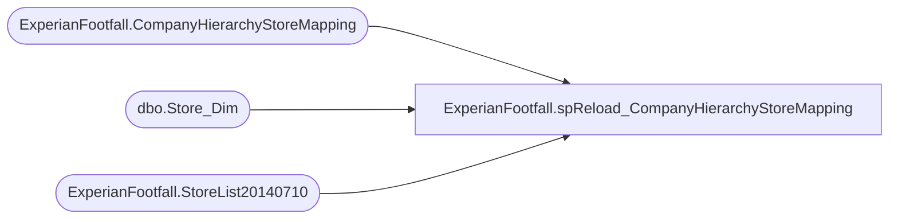

# ExperianFootfall.spReload_CompanyHierarchyStoreMapping

**Database:** DWStaging  
**Server:** papamart  

## Architecture Diagram



## Table Dependencies

| Referenced Table |
|---|
| ExperianFootfall.CompanyHierarchyStoreMapping |
| dbo.Store_Dim |
| ExperianFootfall.StoreList20140710 |

## Stored Procedure Code

```sql
CREATE PROCEDURE [ExperianFootfall].[spReload_CompanyHierarchyStoreMapping]
AS
SET NOCOUNT ON;

TRUNCATE TABLE ExperianFootfall.CompanyHierarchyStoreMapping

/************************ insert ShopperTrak stores #1 ************************/
-- POS data in USD
INSERT INTO ExperianFootfall.CompanyHierarchyStoreMapping
	(	store_key
		, SiteIdentity
		, IsShopperTrak
		, IsFootFall
		, IsCurrentlyOffline
		, CompanyID
		, [HierarchyID]
		, NodeName
		, CurrencyCode
	)
	SELECT
		sd.store_key
		, sd.store_id AS SiteIdentity
		, CASE
			WHEN st.ShopperTrak = 'ShopperTrak'
				THEN CAST(1 AS BIT)
			ELSE CAST(0 AS BIT)
		END AS IsShopperTrak
		, CASE
			WHEN st.Experian = 'Experian'
				THEN CAST(1 AS BIT)
			ELSE CAST(0 AS BIT)
		END AS IsFootFall
		, CAST(0 AS BIT) AS IsCurrentlyOffline
		, 1798 AS CompanyID
		, 5153 AS [HierarchyID]
		, 'Total Sales' AS NodeName
		, 'USD' AS CurrencyCode
	FROM ExperianFootfall.StoreList20140710 st WITH(NOLOCK)
		INNER JOIN dw.dbo.Store_Dim sd WITH(NOLOCK)
			ON st.STORE_ID = sd.store_id

/************************ insert ShopperTrak stores #2 ************************/
-- POS data in GBP
INSERT INTO ExperianFootfall.CompanyHierarchyStoreMapping
	(	store_key
		, SiteIdentity
		, IsShopperTrak
		, IsFootFall
		, IsCurrentlyOffline
		, CompanyID
		, [HierarchyID]
		, NodeName
		, CurrencyCode
	)
	SELECT
		sd.store_key
		, sd.store_id AS SiteIdentity
		, CASE
			WHEN st.ShopperTrak = 'ShopperTrak'
				THEN CAST(1 AS BIT)
			ELSE CAST(0 AS BIT)
		END AS IsShopperTrak
		, CASE
			WHEN st.Experian = 'Experian'
				THEN CAST(1 AS BIT)
			ELSE CAST(0 AS BIT)
		END AS IsFootFall
		, CAST(0 AS BIT) AS IsCurrentlyOffline
		, 1798 AS CompanyID -- prior 2014-08-11: 1872 AS CompanyID
		, 6556 AS [HierarchyID] -- prior 2014-08-11: 6272 AS [HierarchyID]
		, 'Total Sales' AS NodeName
		, 'GBP' AS CurrencyCode
	FROM ExperianFootfall.StoreList20140710 st WITH(NOLOCK)
		INNER JOIN dw.dbo.Store_Dim sd WITH(NOLOCK)
			ON st.STORE_ID = sd.store_id
	WHERE st.Country = 'UK'


/************************ insert ShopperTrak stores #3 ************************/
-- Staffing data in USD
INSERT INTO ExperianFootfall.CompanyHierarchyStoreMapping
	(	store_key
		, SiteIdentity
		, IsShopperTrak
		, IsFootFall
		, IsCurrentlyOffline
		, CompanyID
		, [HierarchyID]
		, NodeName
		, CurrencyCode
	)
	SELECT
		sd.store_key
		, sd.store_id AS SiteIdentity
		, CASE
			WHEN st.ShopperTrak = 'ShopperTrak'
				THEN CAST(1 AS BIT)
			ELSE CAST(0 AS BIT)
		END AS IsShopperTrak
		, CASE
			WHEN st.Experian = 'Experian'
				THEN CAST(1 AS BIT)
			ELSE CAST(0 AS BIT)
		END AS IsFootFall
		, CAST(0 AS BIT) AS IsCurrentlyOffline
		, 1798 AS CompanyID
		, 5154 AS [HierarchyID]
		, 'Total Staff' AS NodeName
		, 'USD' AS CurrencyCode
	FROM ExperianFootfall.StoreList20140710 st WITH(NOLOCK)
		INNER JOIN dw.dbo.Store_Dim sd WITH(NOLOCK)
			ON st.STORE_ID = sd.store_id

-- #4 commented out 2014-08-11
--/************************ insert ShopperTrak stores #4 ************************/
---- Staffing data in GBP
--INSERT INTO ExperianFootfall.CompanyHierarchyStoreMapping
--	(	store_key
--		, SiteIdentity
--		, IsShopperTrak
--		, IsFootFall
--		, IsCurrentlyOffline
--		, CompanyID
--		, [HierarchyID]
--		, NodeName
--		, CurrencyCode
--	)
--	SELECT
--		sd.store_key
--		, sd.store_id AS SiteIdentity
--		, CASE
--			WHEN st.ShopperTrak = 'ShopperTrak'
--				THEN CAST(1 AS BIT)
--			ELSE CAST(0 AS BIT)
--		END AS IsShopperTrak
--		, CASE
--			WHEN st.Experian = 'Experian'
--				THEN CAST(1 AS BIT)
--			ELSE CAST(0 AS BIT)
--		END AS IsFootFall
--		, CAST(0 AS BIT) AS IsCurrentlyOffline
--		, 1798 AS CompanyID -- prior 2014-08-11: 1872 AS CompanyID
--		, 6273 AS [HierarchyID]
--		, 'Total Staff' AS NodeName
--		, 'GBP' AS CurrencyCode
--	FROM ExperianFootfall.StoreList20140710 st WITH(NOLOCK)
--		INNER JOIN [dw].dbo.Store_Dim sd WITH(NOLOCK)
--			ON st.STORE_ID = sd.store_id


---- insert ShopperTrak stores
--INSERT INTO ExperianFootfall.CompanyHierarchyStoreMapping
--	(	store_key
--		, SiteIdentity
--		, BearritoryNameForLookup
--		, IsShopperTrak
--		, IsFootFall
--	)
--	SELECT 
--		sd.store_key
--		, sd.store_id AS SiteIdentity
--		, sd.bearritory AS BearritoryNameForLookup
--		, CAST(1 AS BIT) AS IsShopperTrak
--		, CAST(0 AS BIT) AS IsFootFall
--	FROM [dw].[dbo].[Store_Shoppertrak_Open_Dim] st WITH(NOLOCK)
--		INNER JOIN [dw].dbo.Store_Dim sd WITH(NOLOCK)
--			ON st.store_key = sd.store_key
--		LEFT OUTER JOIN [dw].dbo.Date_Dim dd WITH(NOLOCK)
--			ON st.date_key_thru = dd.date_key
--	WHERE (st.date_key_thru > 99990 OR dd.actual_date > DATEADD(dd, -31, GETDATE()))
```

