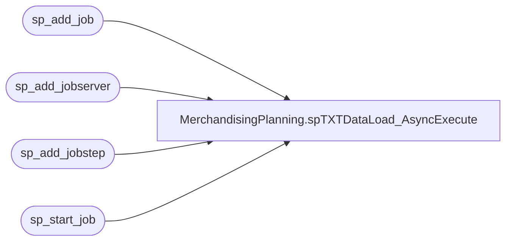

# MerchandisingPlanning.spTXTDataLoad_AsyncExecute

**Database:** DWStaging  
**Server:** papamart  

## Architecture Diagram



## Table Dependencies

| Referenced Table |
|---|
| sp_add_job |
| sp_add_jobserver |
| sp_add_jobstep |
| sp_start_job |

## Stored Procedure Code

```sql
CREATE PROCEDURE MerchandisingPlanning.spTXTDataLoad_AsyncExecute(
	@sql NVARCHAR(4000)
	, @jobname VARCHAR(200) = NULL
	, @database VARCHAR(200) = NULL
	, @owner VARCHAR(200) = NULL ) 
AS BEGIN  
    SET NOCOUNT ON;  
  
	DECLARE @id UNIQUEIDENTIFIER  
	--Create unique job name if the name is not specified  
	IF @jobname IS NULL SET @jobname= 'async'  
	SET @jobname = @jobname + '_' + CAST(NEWID() AS VARCHAR(64))  
  
	IF @database IS NULL SET @database = 'msdb'
	IF @owner IS NULL SET @owner = 'BAB\SQLServices'  
  
	--Create a new job, get job ID
	-- @delete_level = 3 sets the job to execute once and delete itself  
	EXECUTE msdb..sp_add_job @jobname, @owner_login_name=@owner, @delete_level = 3, @job_id=@id OUTPUT  
  
	--Specify a job server for the job  
	EXECUTE msdb..sp_add_jobserver @job_id=@id  
  
	--Specify a first step of the job - the SQL command  
	--(@on_success_action = 3 ... Go to next step)  
	EXECUTE msdb..sp_add_jobstep @job_id=@id
							, @step_name='Step1'
							, @command = @sql
							, @database_name = @database
							, @on_success_action = 3   
  
	--Start the job  
	EXECUTE msdb..sp_start_job @job_id=@id  
  
END
```

