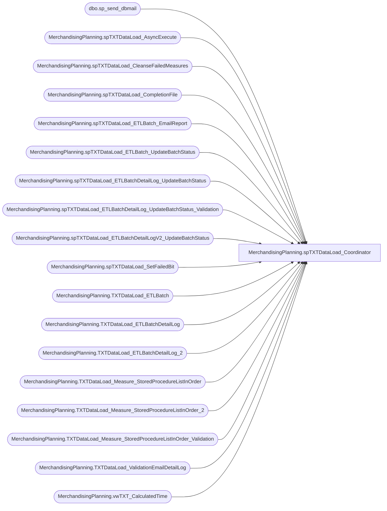

# MerchandisingPlanning.spTXTDataLoad_Coordinator

**Database:** DWStaging  
**Server:** papamart  

## Architecture Diagram



## Table Dependencies

| Referenced Table |
|---|
| dbo.sp_send_dbmail |
| MerchandisingPlanning.spTXTDataLoad_AsyncExecute |
| MerchandisingPlanning.spTXTDataLoad_CleanseFailedMeasures |
| MerchandisingPlanning.spTXTDataLoad_CompletionFile |
| MerchandisingPlanning.spTXTDataLoad_ETLBatch_EmailReport |
| MerchandisingPlanning.spTXTDataLoad_ETLBatch_UpdateBatchStatus |
| MerchandisingPlanning.spTXTDataLoad_ETLBatchDetailLog_UpdateBatchStatus |
| MerchandisingPlanning.spTXTDataLoad_ETLBatchDetailLog_UpdateBatchStatus_Validation |
| MerchandisingPlanning.spTXTDataLoad_ETLBatchDetailLogV2_UpdateBatchStatus |
| MerchandisingPlanning.spTXTDataLoad_SetFailedBit |
| MerchandisingPlanning.TXTDataLoad_ETLBatch |
| MerchandisingPlanning.TXTDataLoad_ETLBatchDetailLog |
| MerchandisingPlanning.TXTDataLoad_ETLBatchDetailLog_2 |
| MerchandisingPlanning.TXTDataLoad_Measure_StoredProcedureListInOrder |
| MerchandisingPlanning.TXTDataLoad_Measure_StoredProcedureListInOrder_2 |
| MerchandisingPlanning.TXTDataLoad_Measure_StoredProcedureListInOrder_Validation |
| MerchandisingPlanning.TXTDataLoad_ValidationEmailDetailLog |
| MerchandisingPlanning.vwTXT_CalculatedTime |

## Stored Procedure Code

```sql
CREATE PROCEDURE [MerchandisingPlanning].[spTXTDataLoad_Coordinator]
	@StartFiscalYear INT
	, @StartFiscalWeek INT
	, @EndFiscalYear INT
	, @EndFiscalWeek INT
	, @MaxConcurrentProcess INT
	, @ServerName VARCHAR(40)
AS


SET NOCOUNT ON;

DECLARE @CurrentETLBatchID INT
	, @CurrentETLBatchDetailLogID INT
	, @JobStepStatement NVARCHAR(4000)
	, @JobStepStatement_V NVARCHAR(4000)
	, @JobStepStatement_V2 NVARCHAR(4000)
	, @TSQL nvarchar(4000)
	, @ID INT
	, @FailBit INT


SET @FailBit = 0

---------------------------------------------------
-- log batch starting
---------------------------------------------------
INSERT INTO MerchandisingPlanning.TXTDataLoad_ETLBatch
	(ETLStatusID
	, MaxConcurrentProcess
	, ETLBatchStartDateTime
	, BatchParameter_StartFiscalYear
	, BatchParameter_StartFiscalWeek
	, BatchParameter_EndFiscalYear
	, BatchParameter_EndFiscalWeek
	)
VALUES
	(1 -- Started
	, @MaxConcurrentProcess
	, GETDATE()
	, @StartFiscalYear
	, @StartFiscalWeek
	, @EndFiscalYear
	, @EndFiscalWeek
	)

SELECT @CurrentETLBatchID = SCOPE_IDENTITY()

---------------------------------------------------
-- Set up dimensions first
---------------------------------------------------
INSERT INTO MerchandisingPlanning.TXTDataLoad_ETLBatchDetailLog
	(ETLBatchID,ETLStatusID,StatementWithoutParameter)
VALUES
	(@CurrentETLBatchID, 0, '[MerchandisingPlanning].[spTXTDataLoad_Dimension_Time]')
	, (@CurrentETLBatchID, 0, '[MerchandisingPlanning].[spTXTDataLoad_Dimension_Location]')
	, (@CurrentETLBatchID, 0, '[MerchandisingPlanning].[spTXTDataLoad_Dimension_Product]')

---------------------------------------------------
-- Set up measure queries PHASE 1
---------------------------------------------------

INSERT INTO MerchandisingPlanning.TXTDataLoad_ETLBatchDetailLog
	(ETLBatchID,ETLStatusID,StatementWithoutParameter,BatchParameter_FiscalYear,BatchParameter_FiscalWeek)
SELECT 
	@CurrentETLBatchID
	, 0
	, a.MeasureStoredProcedureName
	, b.FiscalYear
	, b.FiscalWeek
FROM MerchandisingPlanning.TXTDataLoad_Measure_StoredProcedureListInOrder a
	CROSS APPLY (SELECT DISTINCT
					v.[YEAR] AS FiscalYear
					, v.[WEEK_NUMBER] AS FiscalWeek
					, WEEK_NAME
				FROM Bedrockdb02.ma_01.MerchandisingPlanning.vwTXT_CalculatedTime v
				--WHERE v.WEEK_NAME BETWEEN (2014 * 100 + 01) AND (2014 * 100 + 13) -- TEST
				WHERE v.WEEK_NAME BETWEEN (@StartFiscalYear * 100 + @StartFiscalWeek) AND (@EndFiscalYear * 100 + @EndFiscalWeek)
	) b
ORDER BY b.FiscalYear, b.FiscalWeek, a.[MeasureStoredProcedureListInOrderID]

---------------------------------------------------
-- Set up measure queries PHASE 2
---------------------------------------------------

INSERT INTO MerchandisingPlanning.TXTDataLoad_ETLBatchDetailLog_2
	(ETLBatchID,ETLStatusID,StatementWithoutParameter,BatchParameter_FiscalYear,BatchParameter_FiscalWeek)
SELECT
	@CurrentETLBatchID
	, 0
	, a.MeasureStoredProcedureName
	, b.FiscalYear
	, b.FiscalWeek
FROM MerchandisingPlanning.TXTDataLoad_Measure_StoredProcedureListInOrder_2 a
	CROSS APPLY (SELECT DISTINCT
					v.[YEAR] AS FiscalYear
					, v.[WEEK_NUMBER] AS FiscalWeek
					, WEEK_NAME
				FROM Bedrockdb02.ma_01.MerchandisingPlanning.vwTXT_CalculatedTime v
				--WHERE v.WEEK_NAME = (2014 * 100 + 01) -- TEST
				WHERE v.WEEK_NAME = (@EndFiscalYear * 100 + @EndFiscalWeek)
	) b
ORDER BY b.FiscalYear, b.FiscalWeek, a.[MeasureStoredProcedureListInOrderID]

---------------------------------------------------
-- Set up Validation log for batch
---------------------------------------------------

INSERT INTO MerchandisingPlanning.TXTDataLoad_ValidationEmailDetailLog
	(ETLBatchID,ETLValidationStatusID,MeasureName,LocationCount,ValidationDateTime,BatchParameter_FiscalYear,BatchParameter_FiscalWeek)
  SELECT 
	@CurrentETLBatchID
	, 0
	, a.MeasureStoredProcedureName
	, 0
	, NULL
	, b.FiscalYear
	, b.FiscalWeek
FROM MerchandisingPlanning.TXTDataLoad_Measure_StoredProcedureListInOrder_Validation a
	CROSS APPLY (SELECT DISTINCT
					v.[YEAR] AS FiscalYear
					, v.[WEEK_NUMBER] AS FiscalWeek
					, WEEK_NAME
				FROM Bedrockdb02.ma_01.MerchandisingPlanning.vwTXT_CalculatedTime v
				--WHERE v.WEEK_NAME BETWEEN (2014 * 100 + 01) AND (2014 * 100 + 01) -- TEST
				WHERE v.WEEK_NAME BETWEEN (@StartFiscalYear * 100 + @StartFiscalWeek) AND (@EndFiscalYear * 100 + @EndFiscalWeek)
	) b
ORDER BY b.FiscalYear, b.FiscalWeek, a.[MeasureStoredProcedureListInOrderID]

---------------------------------------------------
-- prep target environment
---------------------------------------------------

SET @TSQL = 'EXEC (''USE BABW_ARCA;
TRUNCATE TABLE [dbo].[ADB_LOCATION]
TRUNCATE TABLE [dbo].[ADB_PRODUCT]
TRUNCATE TABLE [dbo].[ADB_TIME]
;'') AT ' + @ServerName 
EXEC (@TSQL)


SET @TSQL = 'EXEC (''USE BABW_ARCA;
TRUNCATE TABLE [dbo].[AMB_hs Inv EOP Cost Value]
		TRUNCATE TABLE [dbo].[AMB_hs Inv EOP Unit]
		TRUNCATE TABLE [dbo].[AMB_hs Inv EOP Value]
		TRUNCATE TABLE [dbo].[AMB_hs Inv Ch Tfr Cost Value]
		TRUNCATE TABLE [dbo].[AMB_hs Inv Ch Tfr Unit]
		TRUNCATE TABLE [dbo].[AMB_hs Inv Ch Tfr Value]
		TRUNCATE TABLE [dbo].[AMB_hs Markdown Perm Value]
		TRUNCATE TABLE [dbo].[AMB_hs Markdown POS Value]
		TRUNCATE TABLE [dbo].[AMB_hs On Order Cost Value]
		TRUNCATE TABLE [dbo].[AMB_hs On Order Unit]
		TRUNCATE TABLE [dbo].[AMB_hs On Order Value]
		TRUNCATE TABLE [dbo].[AMB_hs Receipts Cost Value]
		TRUNCATE TABLE [dbo].[AMB_hs Receipts Unit]
		TRUNCATE TABLE [dbo].[AMB_hs Receipts Value]
		TRUNCATE TABLE [dbo].[AMB_hs Sales Cost Value Base]
		TRUNCATE TABLE [dbo].[AMB_hs Sales Unit]
		TRUNCATE TABLE [dbo].[AMB_hs Sales Value Base]
		TRUNCATE TABLE [dbo].[AMB_hs Sales Value Local]
		TRUNCATE TABLE [dbo].[AMB_hs Shrink Cost Value]
		TRUNCATE TABLE [dbo].[AMB_hs Shrink Unit]
		TRUNCATE TABLE [dbo].[AMB_hs Shrink Value]
		TRUNCATE TABLE [dbo].[AMB_hs Store Count]
		TRUNCATE TABLE [dbo].[AMB_hs Store Status];'') AT ' + @ServerName 
 EXEC (@TSQL)


---------------------------------------------------
-- PHASE 1 BEGIN -- while there is still statement waiting to be processed
---------------------------------------------------

WHILE (EXISTS(SELECT 1 
				FROM MerchandisingPlanning.TXTDataLoad_ETLBatchDetailLog 
				WHERE ETLBatchID = @CurrentETLBatchID AND ETLStatusID = 0))
BEGIN

---------------------------------------------------
-- if there is still channel open, start the next statement
---------------------------------------------------

	IF (@MaxConcurrentProcess > (SELECT COUNT(*)
								FROM MerchandisingPlanning.TXTDataLoad_ETLBatchDetailLog 
								WHERE ETLBatchID = @CurrentETLBatchID AND ETLStatusID = 1))
	BEGIN

---------------------------------------------------
-- get the next statement
---------------------------------------------------
		SELECT TOP 1 
			@CurrentETLBatchDetailLogID = l.ETLBatchDetailLogID
			, @JobStepStatement = CAST('EXEC Bedrockdb02.ma_01.' AS NVARCHAR(4000)) 
								+ CASE WHEN l.BatchParameter_FiscalYear IS NULL
										THEN  l.StatementWithoutParameter
									ELSE l.StatementWithoutParameter 
										+ ' ' + CAST(l.BatchParameter_FiscalYear AS NVARCHAR(4)) 
										+ ', ' + CAST(l.BatchParameter_FiscalWeek AS NVARCHAR(4)) + ','
									END
								+ ' ' + CAST(l.ETLBatchDetailLogID AS NVARCHAR(40)) + ', ' +  @SERVERNAME
		FROM MerchandisingPlanning.TXTDataLoad_ETLBatchDetailLog l
		WHERE ETLBatchID = @CurrentETLBatchID AND ETLStatusID = 0
		ORDER BY l.ETLBatchDetailLogID


---------------------------------------------------
-- Update Batch Status 
---------------------------------------------------
		EXEC MerchandisingPlanning.spTXTDataLoad_ETLBatchDetailLog_UpdateBatchStatus
			@ETLBatchDetailLogID = @CurrentETLBatchDetailLogID
			, @ETLStatusID = 1

---------------------------------------------------
-- execute it async
---------------------------------------------------
		EXEC MerchandisingPlanning.spTXTDataLoad_AsyncExecute
			@sql = @JobStepStatement
			, @jobname = 'TXTDataLoad_Phase1'
	END
---------------------------------------------------
-- Wait some time before the next loop
---------------------------------------------------
	WAITFOR DELAY '00:00:02'; -- 2 seconds
END

---------------------------------------------------
-- while there is still statement being processed
---------------------------------------------------
WHILE (EXISTS(SELECT 1 
				FROM MerchandisingPlanning.TXTDataLoad_ETLBatchDetailLog 
				WHERE ETLBatchID = @CurrentETLBatchID AND ETLStatusID = 1))
BEGIN

	-- Wait some time before the next loop
	WAITFOR DELAY '00:00:03'; -- 3 seconds
END
---------------------------------------------------
-- At this point, everything should be either succeeded or failed
-- update batch status.
---------------------------------------------------
IF (EXISTS(SELECT 1 
				FROM MerchandisingPlanning.TXTDataLoad_ETLBatchDetailLog 
				WHERE ETLBatchID = @CurrentETLBatchID AND ETLStatusID = 3)) -- Failed
BEGIN
	EXEC MerchandisingPlanning.spTXTDataLoad_ETLBatch_UpdateBatchStatus
		@ETLBatchID = @CurrentETLBatchID
		, @ETLStatusID = 3
END
ELSE BEGIN
	EXEC MerchandisingPlanning.spTXTDataLoad_ETLBatch_UpdateBatchStatus
		@ETLBatchID = @CurrentETLBatchID
		, @ETLStatusID = 2
END

---------------------------------------------------
-- PHASE 2 BEGIN -- while there is still statement waiting to be processed
---------------------------------------------------
WHILE (EXISTS(SELECT 1 
				FROM MerchandisingPlanning.TXTDataLoad_ETLBatchDetailLog_2 
				WHERE ETLBatchID = @CurrentETLBatchID AND ETLStatusID = 0))
BEGIN


---------------------------------------------------
-- if there is still channel open, start the next statement
---------------------------------------------------

	IF (@MaxConcurrentProcess > (SELECT COUNT(*)
								FROM MerchandisingPlanning.TXTDataLoad_ETLBatchDetailLog_2
								WHERE ETLBatchID = @CurrentETLBatchID AND ETLStatusID = 1))
	BEGIN

---------------------------------------------------
-- get the next statement
---------------------------------------------------
		SELECT TOP 1 
			@CurrentETLBatchDetailLogID = l.ETLBatchDetailLogID
			, @JobStepStatement_V2 = CAST('EXEC Bedrockdb02.ma_01.' AS NVARCHAR(4000)) 
								+ CASE WHEN l.BatchParameter_FiscalYear IS NULL
										THEN  l.StatementWithoutParameter
									ELSE l.StatementWithoutParameter 
										+ ' ' + CAST(l.BatchParameter_FiscalYear AS NVARCHAR(4)) 
										+ ', ' + CAST(l.BatchParameter_FiscalWeek AS NVARCHAR(4)) + ','
									END
								+ ' ' + CAST(l.ETLBatchDetailLogID AS NVARCHAR(40)) + ', ' +  @SERVERNAME
		FROM MerchandisingPlanning.TXTDataLoad_ETLBatchDetailLog_2 l
		WHERE ETLBatchID = @CurrentETLBatchID AND ETLStatusID = 0
		ORDER BY l.ETLBatchDetailLogID

---------------------------------------------------
-- Update Batch Status 
---------------------------------------------------
		EXEC MerchandisingPlanning.spTXTDataLoad_ETLBatchDetailLogV2_UpdateBatchStatus
			@ETLBatchDetailLogID = @CurrentETLBatchDetailLogID
			,@ETLStatusID = 1


---------------------------------------------------
-- execute it async
---------------------------------------------------
		EXEC MerchandisingPlanning.spTXTDataLoad_AsyncExecute
			@sql = @JobStepStatement_V2
			, @jobname = 'TXTDataLoad_Phase2'
	END

---------------------------------------------------
-- Wait some time before the next loop
---------------------------------------------------
	WAITFOR DELAY '00:00:02'; -- 2 seconds
END


----------------------------------------------------------------------------------------------
-- VALIDATION BEGINS HERE
----------------------------------------------------------------------------------------------


---------------------------------------------------
-- while there is still statement waiting to be processed
---------------------------------------------------

WHILE (EXISTS(SELECT 1 
				FROM MerchandisingPlanning.TXTDataLoad_ValidationEmailDetailLog 
				WHERE ETLBatchID = @CurrentETLBatchID AND ETLValidationStatusID = 0))
BEGIN

---------------------------------------------------
-- if there is still channel open, start the next statement
---------------------------------------------------

	IF (@MaxConcurrentProcess > (SELECT COUNT(*)
								FROM MerchandisingPlanning.TXTDataLoad_ValidationEmailDetailLog 
								WHERE ETLBatchID = @CurrentETLBatchID AND ETLValidationStatusID = 1))
	BEGIN

---------------------------------------------------
-- get the next statement
---------------------------------------------------


		SELECT TOP 1 
			@ID = l.ID
			, @JobStepStatement_V = CAST('EXEC Bedrockdb02.ma_01.' AS NVARCHAR(4000)) 
								+ CASE WHEN l.BatchParameter_FiscalYear IS NULL
										THEN  l.MeasureName
									ELSE l.MeasureName 
										+ ' ' + CAST(l.BatchParameter_FiscalYear AS NVARCHAR(4)) 
										+ ', ' + CAST(l.BatchParameter_FiscalWeek AS NVARCHAR(4)) 
									END
										+ ', ' +  @SERVERNAME 
		FROM MerchandisingPlanning.TXTDataLoad_ValidationEmailDetailLog l
		WHERE ETLBatchID = @CurrentETLBatchID AND ETLValidationStatusID = 0
		ORDER BY l.ID


---------------------------------------------------
-- Update Batch Status 
---------------------------------------------------
		EXEC MerchandisingPlanning.spTXTDataLoad_ETLBatchDetailLog_UpdateBatchStatus_Validation 
			@ID
---------------------------------------------------
-- Update Validation Batch Status async
---------------------------------------------------
		EXEC MerchandisingPlanning.spTXTDataLoad_AsyncExecute
			@sql = @JobStepStatement_V
			, @jobname = 'TXTDataValidation'
	END
---------------------------------------------------
-- Wait some time before the next loop
---------------------------------------------------
	WAITFOR DELAY '00:00:02'; -- 2 seconds
END

----------------------------------------------------------------------------------------------
-- CLEANSE FAILED MEASURES
----------------------------------------------------------------------------------------------
EXEC [MerchandisingPlanning].[spTXTDataLoad_CleanseFailedMeasures] @ServerName

----------------------------------------------------------------------------------------------
-- VALIDATION SEND EMAIL REPORT
----------------------------------------------------------------------------------------------

EXEC [MerchandisingPlanning].[spTXTDataLoad_ETLBatch_EmailReport] @CurrentETLBatchID
----------------------------------------------------------------------------------------------
-- VALIDATION SET THE FAIL BIT
----------------------------------------------------------------------------------------------
EXEC [MerchandisingPlanning].[spTXTDataLoad_SetFailedBit] @ServerName,@FailBit = @FailBit OUTPUT


IF @FailBit = 1
BEGIN
----------------------------------------------------------------------------------------------
-- SEND Validation Failure Text/Email
----------------------------------------------------------------------------------------------
--PRINT ''
EXEC msdb.dbo.sp_send_dbmail
    @Body = 'Validation_Failed',
    @subject = 'TXTDataLoad',
    @from_address = 'BIAdmin@buildabear.com',
	@recipients = '6362530179@txt.att.net'

EXEC msdb.dbo.sp_sEND_dbmail  @from_address = 'BIAdmin@buildabear.com',
                                @recipients = 'biadmin@buildabear.com;MerchADmin@buildabear.com',
                                @body = 'Validation_Failed',
                                @body_format = 'HTML',
                                @subject = 'TXTDataLoad'
END


IF @FailBit = 0
BEGIN
PRINT ''
----------------------------------------------------------------------------------------------
-- SEND Completetion File to TXT
----------------------------------------------------------------------------------------------
IF @ServerName = 'TXTDB01'
	BEGIN
	--PRINT ''
		EXEC [BEDROCKDB02].[ma_01].[MerchandisingPlanning].[spTXTDataLoad_CompletionFile]
	END
END
```

