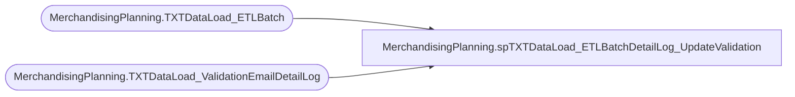

# MerchandisingPlanning.spTXTDataLoad_ETLBatchDetailLog_UpdateValidation

**Database:** DWStaging  
**Server:** papamart  

## Architecture Diagram



## Table Dependencies

| Referenced Table |
|---|
| MerchandisingPlanning.TXTDataLoad_ETLBatch |
| MerchandisingPlanning.TXTDataLoad_ValidationEmailDetailLog |

## Stored Procedure Code

```sql
CREATE PROCEDURE [MerchandisingPlanning].[spTXTDataLoad_ETLBatchDetailLog_UpdateValidation](
	@ID INT
	, @ETLValidationStatusID int
	, @Loc_Cnt int
	, @Prod_Cnt int
) AS

SET NOCOUNT ON;

DECLARE @ETLBatchID INT
SET @ETLBatchID = (SELECT MAX(ETLBatchID) FROM [MerchandisingPlanning].[TXTDataLoad_ETLBatch] WITH(NOLOCK))

BEGIN
	
	UPDATE [MerchandisingPlanning].[TXTDataLoad_ValidationEmailDetailLog] WITH(ROWLOCK)
	SET ETLValidationStatusID = @ETLValidationStatusID
	, ValidationDateTime = getdate()
	, LocationCount = @Loc_Cnt
	, ProductCount = @Prod_Cnt
	WHERE ETLBatchID = @ETLBatchID	
	AND ID = @ID

END
```

