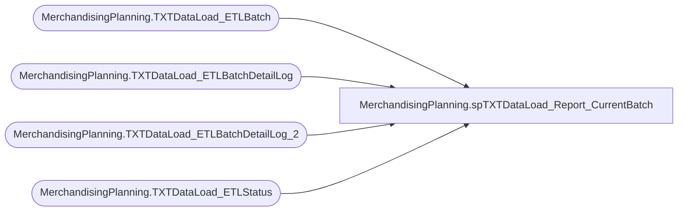

# MerchandisingPlanning.spTXTDataLoad_Report_CurrentBatch

**Database:** DWStaging  
**Server:** papamart  

## Architecture Diagram



## Table Dependencies

| Referenced Table |
|---|
| MerchandisingPlanning.TXTDataLoad_ETLBatch |
| MerchandisingPlanning.TXTDataLoad_ETLBatchDetailLog |
| MerchandisingPlanning.TXTDataLoad_ETLBatchDetailLog_2 |
| MerchandisingPlanning.TXTDataLoad_ETLStatus |

## Stored Procedure Code

```sql
CREATE PROCEDURE [MerchandisingPlanning].[spTXTDataLoad_Report_CurrentBatch]
	
AS
BEGIN

	SET NOCOUNT ON;

	DECLARE @CurrentBatchID INT

	SELECT @CurrentBatchID = MAX(ETLBatchID)
	FROM MerchandisingPlanning.TXTDataLoad_ETLBatch WITH(NOLOCK)

	SELECT * 
	FROM MerchandisingPlanning.TXTDataLoad_ETLBatch WITH(NOLOCK)
	WHERE ETLBatchID = @CurrentBatchID
	
	SELECT StatusDescription, SUM([Phase1_LoadCount]) AS Count FROM(
	SELECT  s.StatusDescription 
		, COUNT(l.ETLBatchDetailLogID) AS [Phase1_LoadCount]
	FROM MerchandisingPlanning.TXTDataLoad_ETLBatchDetailLog l WITH(NOLOCK)
		INNER JOIN MerchandisingPlanning.TXTDataLoad_ETLStatus s WITH(NOLOCK)
			ON l.ETLStatusID = s.ETLStatusID		
	WHERE l.ETLBatchID = @CurrentBatchID 
	GROUP BY s.StatusDescription
	 UNION 
	 SELECT  s.StatusDescription 
					, COUNT(l2.ETLBatchDetailLogID) AS [Phase1_LoadCount]
				FROM MerchandisingPlanning.TXTDataLoad_ETLBatchDetailLog_2 l2 WITH(NOLOCK)
					INNER JOIN MerchandisingPlanning.TXTDataLoad_ETLStatus s WITH(NOLOCK)
						ON l2.ETLStatusID = s.ETLStatusID
						WHERE l2.ETLBatchID = @CurrentBatchID
						GROUP BY s.StatusDescription
	)o
GROUP BY StatusDescription

END
```

