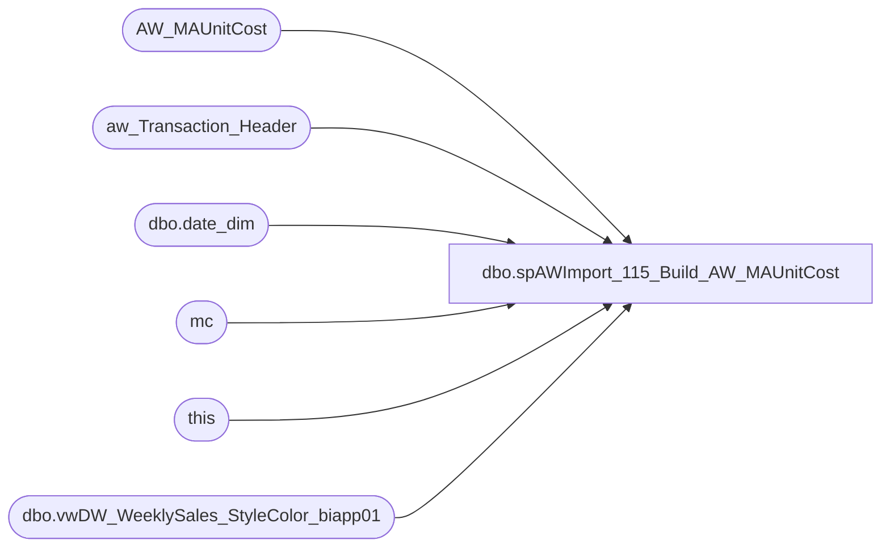

# dbo.spAWImport_115_Build_AW_MAUnitCost

**Database:** DWStaging  
**Server:** papamart  

## Architecture Diagram



## Table Dependencies

| Referenced Table |
|---|
| AW_MAUnitCost |
| aw_Transaction_Header |
| dbo.date_dim |
| mc |
| this |
| dbo.vwDW_WeeklySales_StyleColor_biapp01 |

## Stored Procedure Code

```sql
CREATE PROCEDURE [dbo].[spAWImport_115_Build_AW_MAUnitCost]
-- =============================================================================================================
-- Name: spAWImport_115_Build_AW_MAUnitCost
--
-- Description:	
--	Get the unit cost information for this run from Merchandising
--
--
-- Input:		
--
-- Output: 
--
-- Dependencies: 
--
-- Revision History
--		Name:			Date:			Comments:
--		Gary Murrish	4/17/2013		Created
--		Dan Tweedie		2023-08-14		Changed from truncate and load to merge
-- =============================================================================================================
as

set nocount on

if object_id('tempdb..#AW_MAUnitCost') is not null drop table #AW_MAUnitCost

CREATE TABLE #AW_MAUnitCost(
	[product_key] [varchar](30) NULL,
	[store_key] [varchar](30) NULL,
	[date_key] [int] NOT NULL,
	[netCost] [money] NULL,
	[netUnits] [int] NULL,
	[unitCost] [money] NULL,
	[return_units] [int] NOT NULL,
	[prior_date_key] [int] NULL
) 


	-- Get the date_key of the earliest proposed Transaction being imported

	DECLARE @minActualDate AS datetime
	DECLARE @minMerchWeek AS int
	SELECT
		@minActualDate = MIN(ath.transaction_date)
	FROM
		aw_Transaction_Header ath WITH (NOLOCK)

	SELECT
		@minMerchWeek = dd.fiscal_year * 100 + dd.fiscal_week
	FROM
		dw.dbo.date_dim dd WITH (NOLOCK)
	WHERE
		dd.actual_date = DATEADD(D, -7, @minActualDate)

	INSERT INTO #AW_MAUnitCost
		(	product_key,
			store_key,
			date_key,
			netCost,
			netUnits,
			unitCost,
			return_units,
			prior_date_key)
		SELECT
			x.product_key,
			x.store_key,
			x.date_key,
			sales_total_cost_native - x.return_cost_native AS netCost,
			x.sales_total_units - x.return_units AS netUnits,
			CAST(CASE
				WHEN x.sales_total_units <> 0 THEN (sales_total_cost_native) / (x.sales_total_units)
				WHEN x.return_units <> 0 THEN (x.return_cost_Native) / (x.return_units)
				ELSE 0
			END
			AS money)
			AS unitCost,
			x.return_units,
			CAST(0 AS int) AS prior_date_key
		--INTO #AW_MAUnitCost
		FROM
			bedrockdb02.ma_01.dbo.vwDW_WeeklySales_StyleColor_biapp01 x WITH (NOLOCK)
		WHERE
			x.merch_year_wk >= @minMerchWeek
			AND (x.sales_total_units <> 0
			OR x.return_units <> 0)

	
	begin
		UPDATE this
			SET this.prior_date_key =
			ISNULL((SELECT TOP 1
					date_key
				FROM
					#AW_MAUnitCost prev WITH (NOLOCK)
				WHERE
					prev.product_key = this.product_key
					AND prev.store_key = this.store_key
					AND prev.date_key < this.date_key
				ORDER BY prev.date_key DESC)
			+ 1
			, 0)
		FROM
			#AW_MAUnitCost this

		-- Set the last entry to be 999999
		UPDATE mc
			SET mc.date_key = 999999
		FROM
			#AW_MAUnitCost mc
			INNER JOIN (SELECT
					mc.product_key,
					mc.store_key,
					MAX(mc.date_key) AS date_key
				FROM
					#AW_MAUnitCost mc WITH (NOLOCK)
				GROUP BY	mc.product_key,
							mc.store_key
				HAVING MAX(mc.date_key) <> 999999) toChg
				ON mc.product_key = toChg.product_key
				AND mc.store_key = toChg.store_key
				AND mc.date_key = toChg.date_key
	END
;
merge into AW_MAUnitCost as target
using #AW_MAUnitCost as source
on 
	target.date_key=source.date_key
	and target.product_key=source.product_key
	and target.store_key=source.store_key
when matched 
then update
	set
		target.netcost=source.netCost,
		target.netUnits=source.netUnits,
		target.unitCost=source.unitCost,
		target.return_units=source.return_units,
		target.prior_date_key=source.prior_date_key
when not matched by target
then insert
	(product_key	,store_key	,date_key	,netCost	,netUnits	,unitCost	,return_units	,prior_date_key)
	values
		(
			source.product_key,
			source.store_key,
			source.date_key,
			source.netCost,
			source.netUnits,
			source.UnitCost,
			source.return_units,
			source.prior_date_key
		)
;
```

