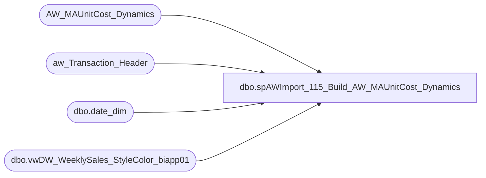

# dbo.spAWImport_115_Build_AW_MAUnitCost_Dynamics

**Database:** DWStaging  
**Server:** papamart  

## Architecture Diagram



## Table Dependencies

| Referenced Table |
|---|
| AW_MAUnitCost_Dynamics |
| aw_Transaction_Header |
| dbo.date_dim |
| dbo.vwDW_WeeklySales_StyleColor_biapp01 |

## Stored Procedure Code

```sql
CREATE PROCEDURE [dbo].[spAWImport_115_Build_AW_MAUnitCost_Dynamics]
-- =============================================================================================================
-- Name: spAWImport_115_Build_AW_MAUnitCost_Dynamics
--
-- Description:	
--	Get the unit cost information for this run from Merchandising
--
--
-- Input:		
--
-- Output: 
--
-- Dependencies: 
--
-- Revision History
--		Name:			Date:			Comments:
--		Gary Murrish	4/17/2013		Created

-- =============================================================================================================
AS
	SET NOCOUNT ON
	-- Get the Cost data from Merch (MA_01) This takes about 1:39 minutes to run with a 15 day horizion.
	-- Drop table AW_MAUnitCost_Dynamics
	TRUNCATE TABLE AW_MAUnitCost_Dynamics

	-- Get the date_key of the earliest proposed Transaction being imported

	DECLARE @minActualDate AS datetime
	DECLARE @minMerchWeek AS int
	SELECT
		@minActualDate = MIN(ath.transaction_date)
	FROM
		aw_Transaction_Header ath WITH (NOLOCK)

	SELECT
		@minMerchWeek = dd.fiscal_year * 100 + dd.fiscal_week
	FROM
		dw.dbo.date_dim dd WITH (NOLOCK)
	WHERE
		dd.actual_date = DATEADD(D, -7, @minActualDate)

	INSERT INTO AW_MAUnitCost_Dynamics
		(	product_key,
			store_key,
			date_key,
			netCost,
			netUnits,
			unitCost,
			return_units,
			prior_date_key)
		SELECT
			x.product_key,
			x.store_key,
			x.date_key,
			sales_total_cost_native - x.return_cost_native AS netCost,
			x.sales_total_units - x.return_units AS netUnits,
			CAST(CASE
				WHEN x.sales_total_units <> 0 THEN (sales_total_cost_native) / (x.sales_total_units)
				WHEN x.return_units <> 0 THEN (x.return_cost_Native) / (x.return_units)
				ELSE 0
			END
			AS money)
			AS unitCost,
			x.return_units,
			CAST(0 AS int) AS prior_date_key
		--INTO AW_MAUnitCost_Dynamics
		FROM
			bedrockdb02.ma_01.dbo.vwDW_WeeklySales_StyleColor_biapp01 x WITH (NOLOCK)
		WHERE
			x.merch_year_wk >= @minMerchWeek
			AND (x.sales_total_units <> 0
			OR x.return_units <> 0)

	if (select count(*) from AW_MAUnitCost_Dynamics) = 0 --IF NO DATA, WAIT 10 MINUTES, RELOAD AND CHECK AGAIN
	begin

		waitfor delay '00:10:00'
		TRUNCATE TABLE AW_MAUnitCost_Dynamics

		INSERT INTO AW_MAUnitCost_Dynamics
			(	product_key,
				store_key,
				date_key,
				netCost,
				netUnits,
				unitCost,
				return_units,
				prior_date_key)
			SELECT
				x.product_key,
				x.store_key,
				x.date_key,
				sales_total_cost_native - x.return_cost_native AS netCost,
				x.sales_total_units - x.return_units AS netUnits,
				CAST(CASE
					WHEN x.sales_total_units <> 0 THEN (sales_total_cost_native) / (x.sales_total_units)
					WHEN x.return_units <> 0 THEN (x.return_cost_Native) / (x.return_units)
					ELSE 0
				END
				AS money)
				AS unitCost,
				x.return_units,
				CAST(0 AS int) AS prior_date_key
			--INTO AW_MAUnitCost_Dynamics
			FROM
				bedrockdb02.ma_01.dbo.vwDW_WeeklySales_StyleColor_biapp01 x WITH (NOLOCK)
			WHERE
				x.merch_year_wk >= @minMerchWeek
				AND (x.sales_total_units <> 0
				OR x.return_units <> 0)
		--if (select count(*) from AW_MAUnitCost_Dynamics) = 0
		--	begin
		--	RAISERROR ('AW_MAUnitCost_Dynamics is empty. Is data not in Merch? Try again.',16,1)
		--	end
	end

	if (select count(*) from AW_MAUnitCost_Dynamics) > 0
	begin
		UPDATE this
			SET this.prior_date_key =
			ISNULL((SELECT TOP 1
					date_key
				FROM
					AW_MAUnitCost_Dynamics prev WITH (NOLOCK)
				WHERE
					prev.product_key = this.product_key
					AND prev.store_key = this.store_key
					AND prev.date_key < this.date_key
				ORDER BY prev.date_key DESC)
			+ 1
			, 0)
		FROM
			AW_MAUnitCost_Dynamics this

		-- Set the last entry to be 999999
		UPDATE mc
			SET mc.date_key = 999999
		FROM
			AW_MAUnitCost_Dynamics mc
			INNER JOIN (SELECT
					mc.product_key,
					mc.store_key,
					MAX(mc.date_key) AS date_key
				FROM
					AW_MAUnitCost_Dynamics mc WITH (NOLOCK)
				GROUP BY	mc.product_key,
							mc.store_key
				HAVING MAX(mc.date_key) <> 999999) toChg
				ON mc.product_key = toChg.product_key
				AND mc.store_key = toChg.store_key
				AND mc.date_key = toChg.date_key
	END
```

