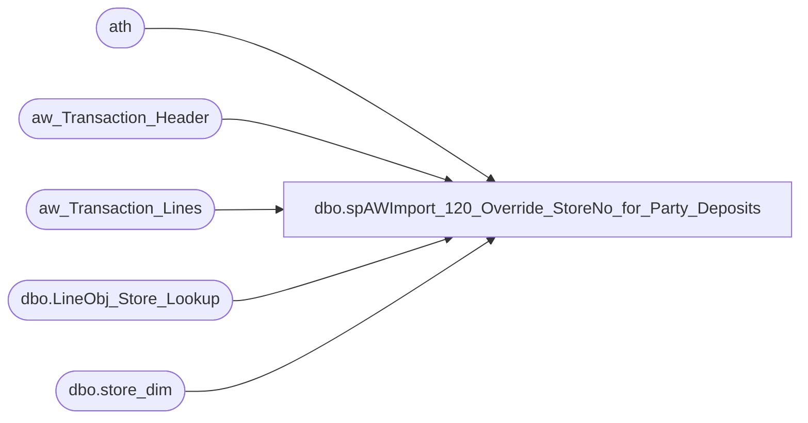

# dbo.spAWImport_120_Override_StoreNo_for_Party_Deposits

**Database:** DWStaging  
**Server:** papamart  

## Architecture Diagram



## Table Dependencies

| Referenced Table |
|---|
| ath |
| aw_Transaction_Header |
| aw_Transaction_Lines |
| dbo.LineObj_Store_Lookup |
| dbo.store_dim |

## Stored Procedure Code

```sql
CREATE PROCEDURE [dbo].[spAWImport_120_Override_StoreNo_for_Party_Deposits]
-- =============================================================================================================
-- Name: spAWImport_120_Override_StoreNo_for_Party_Deposits
--
-- Description:	
--	Overrides the Store Numbers for those transactions which are Party Deposits
--
--
-- Input:		
--
-- Output: 
--
-- Dependencies: 
--
-- Revision History
--		Name:			Date:			Comments:
--		Gary Murrish	4/17/2013		Created

-- =============================================================================================================
AS

	SET NOCOUNT ON


	UPDATE ath
	SET	ath.Store_No = losl.StoreNo,
		ath.store_key = sd.store_key
	FROM aw_Transaction_Lines atl WITH (NOLOCK)
	INNER JOIN dw.dbo.LineObj_Store_Lookup losl WITH (NOLOCK)
		ON atl.Line_Object = losl.STS_line_object
	INNER JOIN aw_Transaction_Header ath WITH (NOLOCK)
		ON atl.transaction_id = ath.transaction_id
	INNER JOIN dw.dbo.store_dim sd WITH (NOLOCK)
		ON losl.StoreNo = sd.store_id
	WHERE losl.StoreNo <> ath.Store_No
	AND ath.Store_No IN (990, 995)
	AND losl.STS_line_object BETWEEN 3000 AND 6999
```

