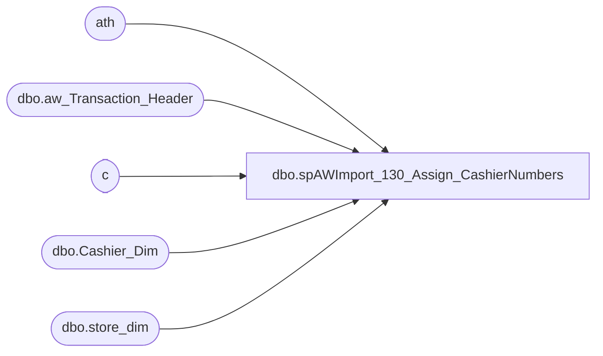

# dbo.spAWImport_130_Assign_CashierNumbers

**Database:** DWStaging  
**Server:** papamart  

## Architecture Diagram



## Table Dependencies

| Referenced Table |
|---|
| ath |
| dbo.aw_Transaction_Header |
| c |
| dbo.Cashier_Dim |
| dbo.store_dim |

## Stored Procedure Code

```sql
CREATE PROCEDURE [dbo].[spAWImport_130_Assign_CashierNumbers]
-- =============================================================================================================
-- Name: spAWImport_130_Assign_CashierNumbers
--
-- Description:	
--	Create any new Cashier numbers in Cashier_Dim and assign them to the transactions
--
--
-- Input:		
--
-- Output: 
--
-- Dependencies: 
--
-- Revision History
--		Name:			Date:			Comments:
--		Gary Murrish	12/3/2013		Created

-- =============================================================================================================
AS

	SET NOCOUNT ON

	IF OBJECT_ID('tempdb..#tmpCashiers') IS NOT NULL
	BEGIN
		DROP TABLE #tmpCashiers
	END

	SELECT
		ath.transaction_id,
		CASE
			WHEN sd.Country = 'US' THEN CAST(ath.cashier_no AS varchar(50))
			ELSE CAST(ath.store_no AS varchar) + '_' + CAST(ath.cashier_no AS varchar)
		END AS cashier_code,
		CAST(-1 AS int) AS cashier_key
	INTO #tmpCashiers
	FROM
		DWStaging.dbo.aw_Transaction_Header ath WITH (NOLOCK)
		LEFT JOIN dw.dbo.store_dim sd WITH (NOLOCK)
			ON ath.store_key = sd.store_key

	-- Insert the missing Cashier_Codes
	INSERT INTO dw.dbo.Cashier_Dim
		(	cashier_code,
			INS_DT)
		SELECT
			c.cashier_code,
			GETDATE() AS INS_DT
		FROM
			(SELECT DISTINCT
					c.cashier_code
				FROM
					#tmpCashiers c WITH (NOLOCK)) c
			LEFT JOIN dw.dbo.Cashier_Dim cd WITH (NOLOCK)
				ON c.cashier_code = cd.cashier_code
		WHERE
			cd.cashier_key IS NULL

	-- Update the Cashier Numbers
	UPDATE c
		SET c.cashier_key = cd.cashier_key
	FROM
		#tmpCashiers c
		INNER JOIN dw.dbo.Cashier_Dim cd WITH (NOLOCK)
			ON c.cashier_code = cd.cashier_code

	-- Update the Auditworks Header
	UPDATE ath
		SET ath.cashier_key = c.cashier_key
	FROM
		DWStaging.dbo.aw_Transaction_Header ath
		INNER JOIN #tmpCashiers c WITH (NOLOCK)
			ON ath.transaction_id = c.transaction_id
```

