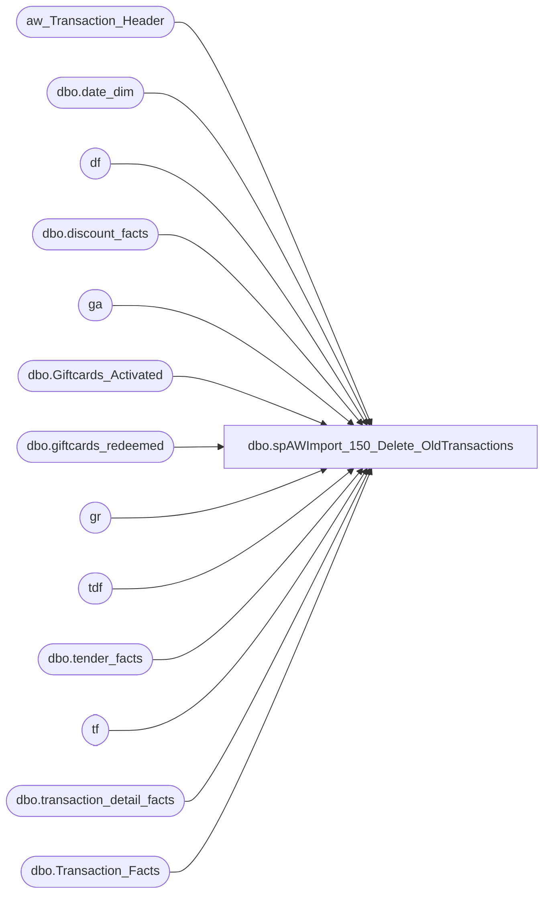

# dbo.spAWImport_150_Delete_OldTransactions

**Database:** DWStaging  
**Server:** papamart  

## Architecture Diagram



## Table Dependencies

| Referenced Table |
|---|
| aw_Transaction_Header |
| dbo.date_dim |
| df |
| dbo.discount_facts |
| ga |
| dbo.Giftcards_Activated |
| dbo.giftcards_redeemed |
| gr |
| tdf |
| dbo.tender_facts |
| tf |
| dbo.transaction_detail_facts |
| dbo.Transaction_Facts |

## Stored Procedure Code

```sql
CREATE PROCEDURE [dbo].[spAWImport_150_Delete_OldTransactions]
-- =============================================================================================================
-- Name: spAWImport_150_Delete_OldTransactions
--
-- Description:	
--	Delete transactions for the data warehouse for this date range
--		which are no longer in the Auditworks extract.
--		This typically means that the transaction was deleted or voided
--		in Auditworks since the last extract into the Data Warehouse
--		This is logically a Delete Cascade.
--
--
-- Input:		
--
-- Output: 
--
-- Dependencies: 
--
-- Revision History
--		Name:			Date:			Comments:
--		Gary Murrish	4/17/2013		Created

-- =============================================================================================================
AS

	SET NOCOUNT ON
	DECLARE @minDate datetime
	DECLARE @maxDate datetime
	DECLARE @minDateKey INT
	DECLARE @maxDateKey INT

	-- Get the min and max dates for this run
	SELECT
		@minDate = MIN(Transaction_Date),
		@maxDate = MAX(Transaction_Date)
	FROM
		aw_Transaction_Header ath WITH (NOLOCK)

	-- Get the Date Keys
	SELECT
		@minDateKey = date_key
	FROM
		dw.dbo.date_dim dd WITH (NOLOCK)
	WHERE
		dd.actual_date = @minDate
	SELECT
		@maxDateKey = date_key
	FROM
		dw.dbo.date_dim dd WITH (NOLOCK)
	WHERE
		dd.actual_date = @maxDate

	-- Find the records to be deleted from Tender Facts
	IF OBJECT_ID('tempdb..#DeleteTender') IS NOT NULL
	BEGIN
		DROP TABLE #DeleteTender
	END

	SELECT
		DWExists.transaction_id
	INTO #DeleteTender
	FROM
		(SELECT DISTINCT
				tf.transaction_id AS transaction_id
			FROM
				dw.dbo.tender_facts tf WITH (NOLOCK)
			WHERE
				tf.date_key BETWEEN @minDateKey AND @maxDateKey) AS DWExists
		LEFT JOIN aw_Transaction_Header ath WITH (NOLOCK)
			ON ath.transaction_id = DWExists.transaction_id
	WHERE
		ath.transaction_id IS NULL

	DELETE tf
		FROM #DeleteTender DT WITH (NOLOCK)
		INNER JOIN dw.dbo.tender_facts tf
			ON DT.transaction_id = tf.transaction_id

	-- Find the records to be deleted from Discount Facts
	IF OBJECT_ID('tempdb..#DeleteDiscount') IS NOT NULL
	BEGIN
		DROP TABLE #DeleteDiscount
	END

	SELECT
		DWExists.transaction_id
	INTO #DeleteDiscount
	FROM
		(SELECT DISTINCT
				df.transaction_id AS transaction_id
			FROM
				dw.dbo.discount_facts df WITH (NOLOCK)
			WHERE
				df.date_key BETWEEN @minDateKey AND @maxDateKey) AS DWExists
		LEFT JOIN aw_Transaction_Header ath WITH (NOLOCK)
			ON ath.transaction_id = DWExists.transaction_id
	WHERE
		ath.transaction_id IS NULL

	DELETE df
		FROM #DeleteDiscount DT WITH (NOLOCK)
		INNER JOIN dw.dbo.discount_facts df
			ON DT.transaction_id = df.transaction_id

	-- Find the records to be deleted from Transaction Detail Facts
	IF OBJECT_ID('tempdb..#DeleteTDF') IS NOT NULL
	BEGIN
		DROP TABLE #DeleteTDF
	END

	SELECT
		DWExists.transaction_id
	INTO #DeleteTDF
	FROM
		(SELECT DISTINCT
				tdf.transaction_id AS transaction_id
			FROM
				dw.dbo.transaction_detail_facts tdf WITH (NOLOCK)
			WHERE
				tdf.date_key BETWEEN @minDateKey AND @maxDateKey) AS DWExists
		LEFT JOIN aw_Transaction_Header ath WITH (NOLOCK)
			ON ath.transaction_id = DWExists.transaction_id
	WHERE
		ath.transaction_id IS NULL

	DELETE tdf
		FROM #DeleteTDF DT WITH (NOLOCK)
		INNER JOIN dw.dbo.transaction_detail_facts tdf
			ON DT.transaction_id = tdf.transaction_id

	-- Find the records to be deleted from Transaction Facts
	IF OBJECT_ID('tempdb..#DeleteTF') IS NOT NULL
	BEGIN
		DROP TABLE #DeleteTF
	END

	SELECT
		DWExists.transaction_id
	INTO #DeleteTF
	FROM
		(SELECT DISTINCT
				tf.transaction_id AS transaction_id
			FROM
				dw.dbo.Transaction_Facts tf WITH (NOLOCK)
			WHERE
				tf.date_key BETWEEN @minDateKey AND @maxDateKey) AS DWExists
		LEFT JOIN aw_Transaction_Header ath WITH (NOLOCK)
			ON ath.transaction_id = DWExists.transaction_id
	WHERE
		ath.transaction_id IS NULL

	DELETE tf
		FROM #DeleteTF DT WITH (NOLOCK)
		INNER JOIN dw.dbo.Transaction_Facts tf
			ON DT.transaction_id = tf.transaction_id

	-- Find the records to be deleted from Giftcards_Activated
	IF OBJECT_ID('tempdb..#DeleteGA') IS NOT NULL
	BEGIN
		DROP TABLE #DeleteGA
	END

	SELECT
		DWExists.transaction_id
	INTO #DeleteGA
	FROM
		(SELECT DISTINCT
				ga.transaction_id AS transaction_id
			FROM
				dw.dbo.Giftcards_Activated ga WITH (NOLOCK)
			WHERE
				ga.date_key BETWEEN @minDateKey AND @maxDateKey
				and ga.source = 'AW') AS DWExists
		LEFT JOIN aw_Transaction_Header ath WITH (NOLOCK)
			ON ath.transaction_id = DWExists.transaction_id
	WHERE
		ath.transaction_id IS NULL

	DELETE ga
		FROM #DeleteGA DT WITH (NOLOCK)
		INNER JOIN dw.dbo.Giftcards_Activated ga
			ON DT.transaction_id = ga.transaction_id

	-- Find the records to be deleted from Giftcards_Redeemed
	IF OBJECT_ID('tempdb..#DeleteGR') IS NOT NULL
	BEGIN
		DROP TABLE #DeleteGR
	END

	SELECT
		DWExists.transaction_id
	INTO #DeleteGR
	FROM
		(SELECT DISTINCT
				gr.transaction_id AS transaction_id
			FROM
				dw.dbo.giftcards_redeemed gr WITH (NOLOCK)
			WHERE
				gr.date_key BETWEEN @minDateKey AND @maxDateKey
				and gr.source = 'AW') AS DWExists
		LEFT JOIN aw_Transaction_Header ath WITH (NOLOCK)
			ON ath.transaction_id = DWExists.transaction_id
	WHERE
		ath.transaction_id IS NULL

	DELETE gr
		FROM #DeleteGR DT WITH (NOLOCK)
		INNER JOIN dw.dbo.giftcards_redeemed gr
			ON DT.transaction_id = gr.transaction_id
```

