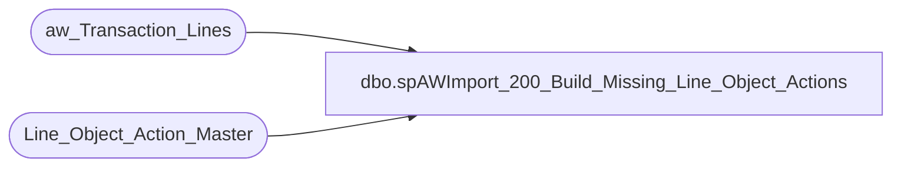

# dbo.spAWImport_200_Build_Missing_Line_Object_Actions

**Database:** DWStaging  
**Server:** papamart  

## Architecture Diagram



## Table Dependencies

| Referenced Table |
|---|
| aw_Transaction_Lines |
| Line_Object_Action_Master |

## Stored Procedure Code

```sql
CREATE PROCEDURE [dbo].[spAWImport_200_Build_Missing_Line_Object_Actions]
-- =============================================================================================================
-- Name: spAWImport_200_Build_Missing_Line_Object_Actions
--
-- Description:	
--	Create any new Line_Object_Action_Master that don't exist.
--
--
-- Input:		
--
-- Output: 
--
-- Dependencies: 
--
-- Revision History
--		Name:			Date:			Comments:
--		Gary Murrish	4/17/2013		Created

-- =============================================================================================================
AS

	SET NOCOUNT ON


	INSERT INTO Line_Object_Action_Master (Line_Object,
	Line_Action,
	target,
	factor)
		SELECT
			new.Line_Object,
			new.Line_Action,
			'?' AS target,
			0 AS factor
		FROM (SELECT
			atl.Line_Object,
			atl.Line_Action
		FROM aw_Transaction_Lines atl WITH (NOLOCK)
		GROUP BY	atl.Line_Object,
					atl.Line_Action) new
		LEFT JOIN Line_Object_Action_Master loam WITH (NOLOCK)
			ON loam.Line_Object = new.Line_Object
			AND loam.Line_Action = new.Line_Action
		WHERE loam.Line_Object IS NULL
```

