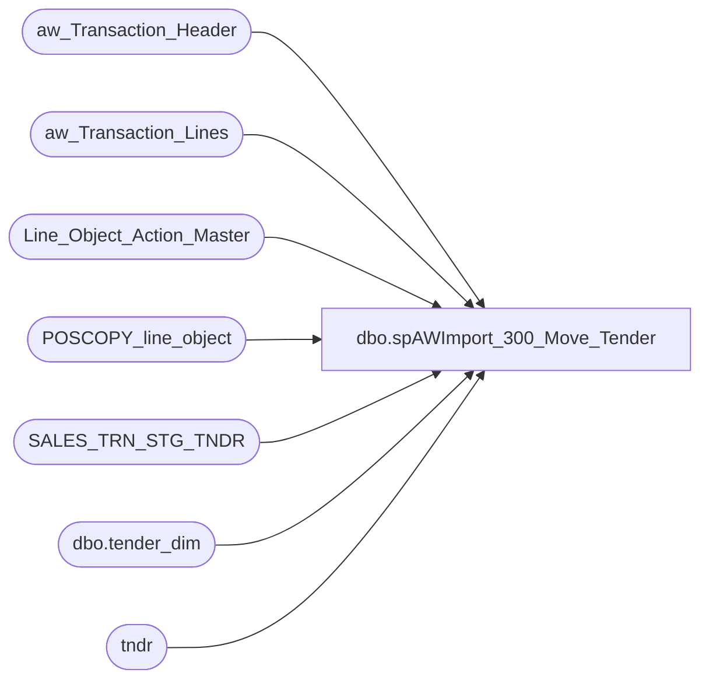

# dbo.spAWImport_300_Move_Tender

**Database:** DWStaging  
**Server:** papamart  

## Architecture Diagram



## Table Dependencies

| Referenced Table |
|---|
| aw_Transaction_Header |
| aw_Transaction_Lines |
| Line_Object_Action_Master |
| POSCOPY_line_object |
| SALES_TRN_STG_TNDR |
| dbo.tender_dim |
| tndr |

## Stored Procedure Code

```sql
CREATE PROCEDURE [dbo].[spAWImport_300_Move_Tender]
-- =============================================================================================================
-- Name: spAWImport_300_Move_Tender
--
-- Description:	
--	Generate the Tender records in Staging.
--
--
-- Input:		
--
-- Output: 
--
-- Dependencies: 
--
-- Revision History
--		Name:			Date:			Comments:
--		Gary Murrish	4/17/2013		Created

-- =============================================================================================================
AS

	SET NOCOUNT ON

	TRUNCATE TABLE SALES_TRN_STG_TNDR

	INSERT INTO SALES_TRN_STG_TNDR (Transaction_Date,
	Store_No,
	transaction_id,
	Gross_Line_Amount,
	Line_Object,
	Reference_No,
	Units,
	Transaction_Begin,
	store_key,
	date_key,
	time_key)
		SELECT
			x.Transaction_Date,
			x.Store_No,
			x.transaction_id,
			SUM(x.gross_line_amount) AS gross_line_amount,
			x.Line_Object,
			x.Reference_No,
			0 AS Units,
			'' AS Transaction_Begin,
			x.store_key,
			x.date_key,
			x.time_key

		FROM (SELECT
			ath.Transaction_Date,
			ath.Store_No,
			ath.transaction_id,
			atl.gross_line_amount * loam.factor AS gross_line_amount,
			atl.Line_Object,
			ISNULL(atl.reference_no, '') AS reference_no,
			ath.store_key,
			ath.date_key,
			ath.time_key
		FROM aw_Transaction_Lines atl WITH (NOLOCK)
		INNER JOIN Line_Object_Action_Master loam WITH (NOLOCK)
			ON atl.Line_Object = loam.Line_Object
			AND atl.Line_Action = loam.Line_Action
		INNER JOIN aw_Transaction_Header ath WITH (NOLOCK)
			ON atl.transaction_id = ath.transaction_id
		WHERE loam.target = 'TNDR'

		UNION ALL
		SELECT
			ath.Transaction_Date,
			ath.Store_No,
			ath.transaction_id,
			atl.gross_line_amount * loam.factor AS gross_line_amount,
			-1 AS line_object,
			ISNULL(atl.reference_no, '') AS reference_no,
			ath.store_key,
			ath.date_key,
			ath.time_key
		FROM aw_Transaction_Lines atl WITH (NOLOCK)
		INNER JOIN Line_Object_Action_Master loam WITH (NOLOCK)
			ON atl.line_object = loam.line_object
			AND atl.Line_Action = loam.Line_Action
		INNER JOIN aw_Transaction_Header ath WITH (NOLOCK)
			ON atl.transaction_id = ath.transaction_id
		WHERE loam.target = 'TAX') x
		GROUP BY	x.Transaction_Date,
					x.Store_No,
					x.transaction_id,
					x.Line_Object,
					x.Reference_No,
					x.store_key,
					x.date_key,
					x.time_key

	-- Check for any missing Tender_Dim records
	INSERT INTO dw.dbo.tender_dim (tender_code,
	tender_desc,
	process_name,
	process_date)
		SELECT
			plo.Line_Object,
			plo.Line_Object_Description,
			'AWImport' AS process_Name,
			GETDATE() AS process_date
		FROM POSCOPY_line_object plo WITH (NOLOCK)
		INNER JOIN (SELECT DISTINCT
			Line_Object
		FROM Line_Object_Action_Master loam WITH (NOLOCK)
		WHERE loam.target = 'TNDR') x
			ON plo.Line_Object = x.Line_Object
		LEFT JOIN dw.dbo.tender_dim td WITH (NOLOCK)
			ON td.tender_code = plo.Line_Object
		WHERE td.tender_key IS NULL

	-- Set the Tender Keys on the records
	UPDATE tndr
	SET tndr.tender_key = td.tender_key
	FROM SALES_TRN_STG_TNDR tndr WITH (NOLOCK)
	INNER JOIN dw.dbo.tender_dim td WITH (NOLOCK)
		ON td.tender_code = tndr.Line_Object
```

