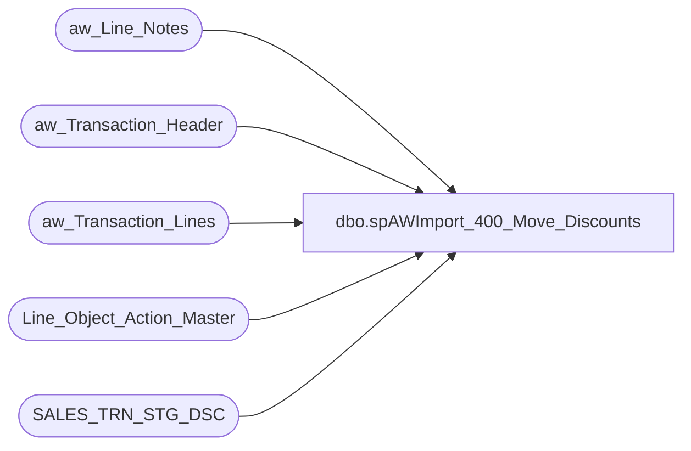

# dbo.spAWImport_400_Move_Discounts

**Database:** DWStaging  
**Server:** papamart  

## Architecture Diagram



## Table Dependencies

| Referenced Table |
|---|
| aw_Line_Notes |
| aw_Transaction_Header |
| aw_Transaction_Lines |
| Line_Object_Action_Master |
| SALES_TRN_STG_DSC |

## Stored Procedure Code

```sql
CREATE PROCEDURE [dbo].[spAWImport_400_Move_Discounts]
-- =============================================================================================================
-- Name: spAWImport_400_Move_Discounts
--
-- Description:	
--	Generate the Discount records in Staging.
--
--
-- Input:		
--
-- Output: 
--
-- Dependencies: 
--
-- Revision History
--		Name:			Date:			Comments:
--		Gary Murrish	4/17/2013		Created
--		Dan Tweedie		07/28/2016		Added collation string to Reference_No due to changes made to allow for handling of Chinese characters in line_note
--		Tim Callahan	01/10/2023		Due to Truncation Issue added right(20) logic to reference_no field 
-- =============================================================================================================
AS

	SET NOCOUNT ON

	-- This will copy the information from the aw_xxxx tables into SALES_TRN_STG_DSC for further work


	TRUNCATE TABLE SALES_TRN_STG_DSC

	INSERT INTO SALES_TRN_STG_DSC (Transaction_Date,
	Store_No,
	transaction_id,
	Line_Sequence,
	Cashier_No,
	Gross_Line_Amount,
	Line_Object,
	Reference_No,
	Line_Action,
	Transaction_No,
	store_key,
	date_key,
	time_key,
	origReference_no)
		SELECT
			x.Transaction_Date,
			x.Store_No,
			x.transaction_id,
			MIN(x.line_sequence) AS line_sequence,
			x.Cashier_No,
			SUM(x.gross_line_amount) AS gross_line_amount,
			x.Line_Object,
			--x.Reference_No,
			case when len(x.Reference_No) > 20 and left(x.Reference_No,1) = ' '
				then right(x.Reference_No,20) 
				else x.Reference_No
				end as Reference_No,				
			x.Line_Action,
			x.Transaction_No,
			x.store_key,
			x.date_key,
			x.time_key,
			x.Reference_No
		FROM (SELECT
			ath.Transaction_Date,
			ath.Store_No,
			ath.transaction_id,
			atl.line_sequence,
			ath.Cashier_No,
			atl.gross_line_amount * loam.factor AS gross_line_amount,
			atl.Line_Object,
			--COALESCE(n9006.line_note, ISNULL(atl.Reference_No, '')) AS Reference_No,
			COALESCE(n9006.line_note collate Latin1_General_CI_AI, ISNULL(atl.Reference_No, '') collate Latin1_General_CI_AI) AS Reference_No,
			atl.Line_Action,
			ath.Transaction_No,
			ath.store_key,
			ath.date_key,
			ath.time_key

		FROM aw_Transaction_Lines atl WITH (NOLOCK)
		INNER JOIN Line_Object_Action_Master loam WITH (NOLOCK)
			ON atl.Line_Object = loam.Line_Object
			AND atl.Line_Action = loam.Line_Action
		INNER JOIN aw_Transaction_Header ath WITH (NOLOCK)
			ON atl.transaction_id = ath.transaction_id
		LEFT JOIN aw_Line_Notes n9006 WITH (NOLOCK)
			ON atl.transaction_id = n9006.transaction_id
			AND atl.Line_ID = n9006.Line_ID
			AND n9006.note_type = 9006
		WHERE loam.target = 'DISC') x
		GROUP BY	x.Transaction_Date,
					x.Store_No,
					x.transaction_id,
					x.Cashier_No,
					x.Line_Object,
					x.Reference_No,
					x.Line_Action,
					x.Transaction_No,
					x.store_key,
					x.date_key,
					x.time_key
```

