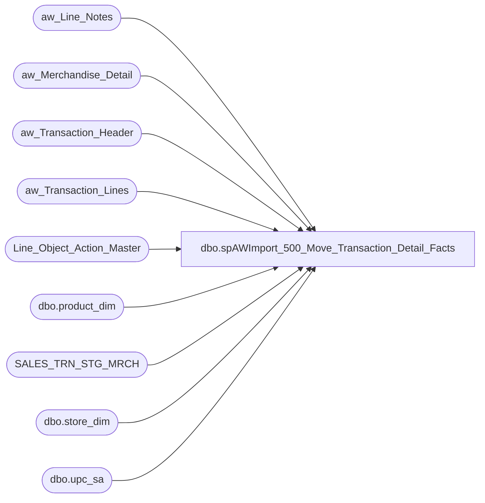

# dbo.spAWImport_500_Move_Transaction_Detail_Facts

**Database:** DWStaging  
**Server:** papamart  

## Architecture Diagram



## Table Dependencies

| Referenced Table |
|---|
| aw_Line_Notes |
| aw_Merchandise_Detail |
| aw_Transaction_Header |
| aw_Transaction_Lines |
| Line_Object_Action_Master |
| dbo.product_dim |
| SALES_TRN_STG_MRCH |
| dbo.store_dim |
| dbo.upc_sa |

## Stored Procedure Code

```sql
CREATE PROCEDURE [dbo].[spAWImport_500_Move_Transaction_Detail_Facts]
-- =============================================================================================================
-- Name: spAWImport_500_Move_Transaction_Detail_Facts
--
-- Description:	
--	Generate the Transaction Detail Fact records in Staging.
--
--
-- Input:		
--
-- Output: 
--
-- Dependencies: 
--
-- Revision History
--		Name:			Date:			Comments:
--		Gary Murrish	4/17/2013		Created
--		Mike Pelikan	07/28/2014		Added logic to vat table to clean up non numeric data
--		Gary Murrish	9/11/2014		Zeroed out ext_cost
--		Dan Tweedie		06/02/2016		A change was made in Merchandising on 5/31/2016, affecting sales on or after 6/1. 
--										The change is in merchandise_detail.upc_no. It previously contained style, now it contains upc, 
--											but we need the style, so I added code to handle this.
-- =============================================================================================================
AS

	SET NOCOUNT ON

	TRUNCATE TABLE SALES_TRN_STG_MRCH;

	-- Get the 1621 transactions records. These are VAT assigned to the next line on the transaction for 
	--	some of the records.


	-- Drop table #tmp1621VAT; drop table #tmpUse1621
	SELECT
		tl.transaction_id,
		tl.Line_Sequence,
		CAST(ln.line_note AS money) AS VatAmount
	INTO #tmp1621VAT
	FROM
		aw_Transaction_Lines tl WITH (NOLOCK)
		INNER JOIN aw_Line_Notes ln WITH (NOLOCK)
			ON tl.[transaction_id] = ln.[transaction_id]
			AND tl.[Line_ID] = ln.[Line_ID]
			AND ln.[note_type] = 35
	WHERE
		tl.Line_Object = 1621

	SELECT
		x.transaction_id,
		MAX(x.VatAmount) AS VatAmount,
		MAX(x.prev_line_sequence) AS prev_line_sequence
	INTO #tmpUse1621
	FROM
		(SELECT
				v.*,
				atl.Line_Sequence AS prev_line_sequence
			FROM
				#tmp1621VAT v WITH (NOLOCK)
				INNER JOIN aw_Transaction_Lines atl WITH (NOLOCK)
					ON v.transaction_id = atl.transaction_id
			WHERE
				atl.Line_Sequence < v.Line_Sequence) x
	GROUP BY	x.transaction_id,
				x.Line_Sequence

	DECLARE @maxBatch int
	SELECT
		@maxBatch = MAX(ath.batchNumber)
	FROM
		aw_Transaction_Header ath WITH (NOLOCK)
	DECLARE @thisBatch int 
	SET @thisBatch = 1

	WHILE @thisBatch <= @maxBatch
	BEGIN
		BEGIN TRANSACTION
			INSERT INTO SALES_TRN_STG_MRCH
				(	Transaction_Date,
					Store_No,
					Register_No,
					transaction_id,
					Transaction_No,
					Line_ID,
					Line_Sequence,
					Cashier_No,
					Gross_Line_Amount,
					POS_Discount_Amount,
					--POS_Discount_Type,
					Entry_Date_Time,
					Line_Object,
					Reference_No,
					Line_Action,
					Units,
					--Transaction_Begin,
					Vat_Tax_Amt,
					VirtualWorld_SerialNumber,
					--Dummy_Flag,
					bear_id,
					store_key,
					date_key,
					time_key,
					product_key,
					ext_Cost)
				SELECT
					x.Transaction_Date,
					x.Store_No,
					x.Register_No,
					x.transaction_id,
					x.Transaction_No,
					x.Line_ID,
					x.Line_Sequence,
					x.Cashier_No,
					x.Gross_Line_Amount,
					x.POS_Discount_Amount,
					x.Entry_Date_Time,
					x.Line_Object,
					x.Reference_No,
					x.Line_Action,
					CASE
						WHEN x.Line_Object = 292 THEN CAST(x.Gross_Line_Amount AS int)
						WHEN x.Units = 0 THEN 1
						ELSE x.Units
					END AS Units,
					CASE
						WHEN x.VAT_TAX_AMT = 0 THEN ISNULL(x.VAT_TAX_AMT, 0)
						ELSE x.VAT_TAX_AMT
					END AS VAT_TAX_AMT,
					x.VirtualWorld_SerialNumber,
					x.bear_id,
					x.store_key,
					x.date_key,
					x.time_key,
					CASE
						WHEN (x.Line_Object >= 200 AND x.Line_Object < 300)
						OR (x.Line_Object >= 400 AND x.Line_Object < 500) THEN CASE
							WHEN x.Line_Object = 200 THEN -7
							WHEN x.Line_Object = 202 THEN -8
							WHEN x.Line_Object = 203 THEN -9
							WHEN x.Line_Object = 204 THEN -10
							WHEN x.Line_Object = 205 THEN -11
							WHEN x.Line_Object = 206 THEN -12
							WHEN x.Line_Object = 250 THEN -13
							WHEN x.Line_Object = 291 THEN -15
							WHEN x.Line_Object = 292 THEN -16
							WHEN x.Line_Object = 293 THEN -17
							WHEN x.Line_Object = 294 THEN -1
							WHEN x.Line_Object = 400 THEN -2
							WHEN x.Line_Object = 401 THEN -3
							WHEN x.Line_Object = 402 THEN -4
							WHEN x.Line_Object = 403 THEN -5
							WHEN x.Line_Object = 404 THEN -6
							ELSE 0
						END
						WHEN pd1.product_key IS NULL AND (x.Line_Object >= 700 AND x.Line_Object < 800) THEN x.Line_Object * -1
						ELSE ISNULL(pd1.product_key, ISNULL(pd2.product_key, 0))
					END AS product_key,
					CAST(0 AS money) AS ext_cost
				FROM
					(SELECT
							ath.Transaction_Date,
							ath.Store_No,
							ath.Register_No,
							ath.transaction_id,
							ath.Transaction_No,
							atl.Line_ID,
							atl.Line_Sequence,
							ath.Cashier_No,
							(atl.gross_line_amount * loam.factor) AS gross_line_amount,
							atl.pos_discount_amount * loam.factor AS pos_discount_amount,
							ath.Entry_Date_Time,
							atl.Line_Object,
							atl.reference_no AS reference_no,
							atl.Line_Action,
							ISNULL(amd.Units, 1) * loam.factor AS Units,
							(CAST(ISNULL(vat.line_note, 0) AS money) + ISNULL(v.VatAmount,0)) * loam.factor * CASE
								WHEN (CAST(ISNULL(vat.line_note, 0) AS money) + ISNULL(v.VatAmount,0)) >= 0 AND atl.gross_line_amount >= 0 THEN 1
								WHEN (CAST(ISNULL(vat.line_note, 0) AS money) + ISNULL(v.VatAmount,0)) < 0 AND atl.gross_line_amount < 0 THEN 1
								ELSE -1
							END AS VAT_TAX_AMT, /* factored because sometimes the sign on the note is reversed */
							ISNULL(vwsn.line_note, '') AS VirtualWorld_SerialNumber,
							ISNULL(bearID.line_note, '') AS bear_id,
							ath.store_key,
							ath.date_key,
							ath.time_key,
							sd.Country,
							amd.upc_no AS skuID
						FROM
							aw_Transaction_Lines atl WITH (NOLOCK)
							LEFT JOIN aw_Merchandise_Detail amd WITH (NOLOCK)
								ON atl.transaction_id = amd.transaction_id
								AND atl.Line_ID = amd.Line_ID
								INNER JOIN Line_Object_Action_Master loam WITH (NOLOCK)
									ON atl.Line_Object = loam.Line_Object
									AND atl.Line_Action = loam.Line_Action
								INNER JOIN aw_Transaction_Header ath WITH (NOLOCK)
									ON atl.transaction_id = ath.transaction_id
								LEFT JOIN (
									SELECT transaction_id,line_id,note_type,line_note 
									from aw_Line_Notes WITH (NOLOCK)
									WHERE ISNUMERIC(line_note) = 1
									UNION ALL
									SELECT transaction_id,line_id,note_type, CAST(0 AS MONEY) line_note 
									from aw_Line_Notes WITH (NOLOCK)
									WHERE ISNUMERIC(line_note) = 0
								)
								vat 
									ON atl.transaction_id = vat.transaction_id
									AND atl.Line_ID = vat.Line_ID
									AND vat.note_type = 35
								LEFT JOIN aw_Line_Notes vwsn WITH (NOLOCK)
									ON atl.transaction_id = vwsn.transaction_id
									AND atl.Line_ID = vwsn.Line_ID
									AND vwsn.note_type = 36
								LEFT JOIN aw_Line_Notes bearID WITH (NOLOCK)
									ON atl.transaction_id = bearID.transaction_id
									AND atl.Line_ID = bearID.Line_ID
									AND bearID.note_type = 6
								INNER JOIN dw.dbo.store_dim sd WITH (NOLOCK)
									ON ath.store_key = sd.store_key
								LEFT JOIN #tmpUse1621 v WITH (NOLOCK)
									ON atl.transaction_id = v.transaction_id
									AND atl.Line_Sequence = v.prev_line_sequence
						WHERE
							loam.target = 'TDF'
							AND ath.batchNumber = @thisBatch
							and cast(ath.transaction_date as date) < '2016-06-01'

							UNION --ADDED 2016-06-02 -- These should have the upc number in aw_Merchandise_Detail.upc_no, whereas prior to this date, it contained style code
						SELECT
							ath.Transaction_Date,
							ath.Store_No,
							ath.Register_No,
							ath.transaction_id,
							ath.Transaction_No,
							atl.Line_ID,
							atl.Line_Sequence,
							ath.Cashier_No,
							(atl.gross_line_amount * loam.factor) AS gross_line_amount,
							atl.pos_discount_amount * loam.factor AS pos_discount_amount,
							ath.Entry_Date_Time,
							atl.Line_Object,
							atl.reference_no AS reference_no,
							atl.Line_Action,
							ISNULL(amd.Units, 1) * loam.factor AS Units,
							(CAST(ISNULL(vat.line_note, 0) AS money) + ISNULL(v.VatAmount,0)) * loam.factor * CASE
								WHEN (CAST(ISNULL(vat.line_note, 0) AS money) + ISNULL(v.VatAmount,0)) >= 0 AND atl.gross_line_amount >= 0 THEN 1
								WHEN (CAST(ISNULL(vat.line_note, 0) AS money) + ISNULL(v.VatAmount,0)) < 0 AND atl.gross_line_amount < 0 THEN 1
								ELSE -1
							END AS VAT_TAX_AMT, /* factored because sometimes the sign on the note is reversed */
							ISNULL(vwsn.line_note, '') AS VirtualWorld_SerialNumber,
							ISNULL(bearID.line_note, '') AS bear_id,
							ath.store_key,
							ath.date_key,
							ath.time_key,
							sd.Country,
							--amd.upc_no AS skuID
							isnull(upc.style_code, amd.upc_no) skuID
						FROM
							aw_Transaction_Lines atl WITH (NOLOCK)
							LEFT JOIN aw_Merchandise_Detail amd WITH (NOLOCK)
								ON atl.transaction_id = amd.transaction_id
								AND atl.Line_ID = amd.Line_ID
								INNER JOIN Line_Object_Action_Master loam WITH (NOLOCK)
									ON atl.Line_Object = loam.Line_Object
									AND atl.Line_Action = loam.Line_Action
								INNER JOIN aw_Transaction_Header ath WITH (NOLOCK)
									ON atl.transaction_id = ath.transaction_id
								LEFT JOIN (
									SELECT transaction_id,line_id,note_type,line_note 
									from aw_Line_Notes WITH (NOLOCK)
									WHERE ISNUMERIC(line_note) = 1
									UNION ALL
									SELECT transaction_id,line_id,note_type, CAST(0 AS MONEY) line_note 
									from aw_Line_Notes WITH (NOLOCK)
									WHERE ISNUMERIC(line_note) = 0
								)
								vat 
									ON atl.transaction_id = vat.transaction_id
									AND atl.Line_ID = vat.Line_ID
									AND vat.note_type = 35
								LEFT JOIN aw_Line_Notes vwsn WITH (NOLOCK)
									ON atl.transaction_id = vwsn.transaction_id
									AND atl.Line_ID = vwsn.Line_ID
									AND vwsn.note_type = 36
								LEFT JOIN aw_Line_Notes bearID WITH (NOLOCK)
									ON atl.transaction_id = bearID.transaction_id
									AND atl.Line_ID = bearID.Line_ID
									AND bearID.note_type = 6
								INNER JOIN dw.dbo.store_dim sd WITH (NOLOCK)
									ON ath.store_key = sd.store_key
								LEFT JOIN #tmpUse1621 v WITH (NOLOCK)
									ON atl.transaction_id = v.transaction_id
									AND atl.Line_Sequence = v.prev_line_sequence
						LEFT join bedrockdb01.auditworks.dbo.upc_sa upc with (nolock) on amd.upc_no = upc.upc_no
								and amd.sku_id = upc.sku_id
								and amd.style_reference_id = upc.style_reference_id
						WHERE
							loam.target = 'TDF'
							AND ath.batchNumber = @thisBatch
							and cast(ath.transaction_date as date) >= '2016-06-01'
							) x
					LEFT JOIN dw.dbo.product_dim pd1 WITH (NOLOCK)
						ON pd1.sku = x.skuID
						AND pd1.jurisdiction_code = x.Country
						LEFT JOIN (SELECT
								sku,
								MIN(product_key) AS product_key
							FROM
								dw.dbo.product_dim WITH (NOLOCK)
							GROUP BY sku) pd2
							ON pd2.sku = x.skuID
		COMMIT TRANSACTION
		SET @thisBatch = @thisBatch + 1
	END
```

