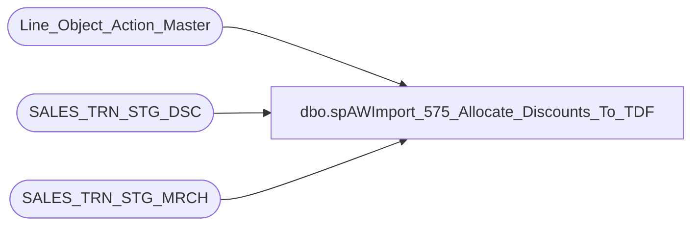

# dbo.spAWImport_575_Allocate_Discounts_To_TDF

**Database:** DWStaging  
**Server:** papamart  

## Architecture Diagram



## Table Dependencies

| Referenced Table |
|---|
| Line_Object_Action_Master |
| SALES_TRN_STG_DSC |
| SALES_TRN_STG_MRCH |

## Stored Procedure Code

```sql
CREATE PROCEDURE [dbo].[spAWImport_575_Allocate_Discounts_To_TDF]
-- =============================================================================================================
-- Name: spAWImport_575_Allocate_Discounts_To_TDF
--
-- Description:	
--	Allocate any generated Discounts to the TDF records
--
--
-- Input:		
--
-- Output: 
--
-- Dependencies: 
--
-- Revision History
--		Name:			Date:			Comments:
--		Gary Murrish	4/17/2013		Created
--		Dan Tweedie		09/14/2016		Added handling for Enterprise Selling Orders, to ensure the discount is applied properly on the line level
-- =============================================================================================================
AS

	SET NOCOUNT ON

	-- This is the allocation of discounts to the Merchandise records
	--	that were not done in Auditworks

	-- The following are the line objects to allocate:
	--		

	-- The following are the line objects not to allocate to:
	--		Party Deposits (6000 - 7000)
	--		Contributions (101, 292)


	-- Clear out all of the allocated amounts
	UPDATE SALES_TRN_STG_MRCH
	SET	POS_Discount_Amount = POS_Discount_Amount - Upsell_Discount_Allocated,
		Upsell_Discount_Allocated = 0
	WHERE Upsell_Discount_Allocated <> 0

	-- Get the transactions and the amount to be allocated
	select 
		transaction_id,
		sum(isnull(amtToAllocate,0)) as amtToAllocate,
		sum(isnull(amtToAllocateOrder,0)) as amtToAllocateOrder
	INTO #tmpToAllocate
	from
		(
			SELECT
				STSD.transaction_id,
				case when STSD.line_action not in (91,92) then SUM(STSD.Gross_Line_Amount * -1) end AS amtToAllocate,
				case when STSD.line_action in (91,92) then SUM(STSD.Gross_Line_Amount * -1) end AS amtToAllocateOrder 
			FROM SALES_TRN_STG_DSC STSD WITH (NOLOCK)
			INNER JOIN Line_Object_Action_Master loam WITH (NOLOCK)
				ON STSD.Line_Object = loam.Line_Object
				AND STSD.Line_Action = loam.Line_Action
			WHERE loam.needsAllocation = 1
			GROUP BY STSD.transaction_id, STSD.line_action
		) as ata
	group by transaction_id
	

	-- Get the total Merchandise value for these transactions
	-- drop table #tmpTotalMerchandise
	select 
		transaction_id, 
		max(isnull(ttlMerchandise,0)) ttlMerchandise,
		max(isnull(maxMerchandise,0)) maxMerchandise,
		max(isnull(ttlOrderMerchandise,0)) ttlOrderMerchandise,
		max(isnull(maxOrderMerchandise,0)) maxOrderMerchandise
	INTO #tmpTotalMerchandise
	from 
		(
			SELECT
				STSM.transaction_id,
				case when STSM.line_action not in (7,8) then SUM(STSM.Gross_Line_Amount) end AS ttlMerchandise,
				case when STSM.line_action not in (7,8) then MAX(STSM.Gross_Line_Amount) end AS maxMerchandise,
				case when STSM.line_action in (7,8) then SUM(STSM.Gross_Line_Amount) end AS ttlOrderMerchandise,
				case when STSM.line_action in (7,8) then MAX(STSM.Gross_Line_Amount) end AS maxOrderMerchandise
			FROM #tmpToAllocate ta WITH (NOLOCK)
			INNER JOIN SALES_TRN_STG_MRCH STSM WITH (NOLOCK)
				ON ta.transaction_id = STSM.transaction_id
			INNER JOIN Line_Object_Action_Master loam WITH (NOLOCK)
				ON STSM.Line_Object = loam.Line_Object
				AND STSM.Line_Action = loam.Line_Action
			WHERE loam.dontAllocationTo = 0
			GROUP BY STSM.transaction_id, STSM.line_action
		) as tm
	group by transaction_id

	-- Determine how much to allocate to each line
	-- drop table #tmpAllocationsToMake
	SELECT
		STSM.transaction_id,
		STSM.Line_Sequence,
		STSM.Gross_Line_Amount,
		CASE
			WHEN tm.ttlMerchandise = 0 THEN 0 ELSE 
				case when STSM.line_action not in (7,8) 
						then ROUND(ta.amtToAllocate * (STSM.Gross_Line_Amount / tm.ttlMerchandise), 2)
					else ROUND(ta.amtToAllocateOrder * (STSM.Gross_Line_Amount / tm.ttlOrderMerchandise), 2)
				end
		END AS amtToApply,
		STSM.line_action
	INTO #tmpAllocationsToMake
	FROM SALES_TRN_STG_MRCH STSM WITH (NOLOCK)
	INNER JOIN #tmpToAllocate ta WITH (NOLOCK)
		ON STSM.transaction_id = ta.transaction_id
	INNER JOIN #tmpTotalMerchandise tm WITH (NOLOCK)
		ON STSM.transaction_id = tm.transaction_id
	INNER JOIN Line_Object_Action_Master loam WITH (NOLOCK)
		ON STSM.Line_Object = loam.Line_Object
		AND STSM.Line_Action = loam.Line_Action
	WHERE loam.dontAllocationTo = 0

	-- Get any rounding errors 
	-- drop table #tmpAdjustments
	SELECT
		ta.transaction_id,
		ta.amtToAllocate,
		x.ttlToApply,
		ta.amtToAllocate - x.ttlToApply AS amtToAdjust,
		ta.amtToAllocateOrder - x.ttlToApplyOrder AS amtToAdjustOrder,
		tm.maxMerchandise 
	INTO #tmpAdjustments
	FROM #tmpToAllocate ta WITH (NOLOCK)
	INNER JOIN (select transaction_id, sum(isnull(ttlToApply,0)) ttlToApply, sum(isnull(ttlToApplyOrder,0)) ttlToApplyOrder
				from
					(
						SELECT
							atm.transaction_id,
							case when line_action not in (7,8) then SUM(atm.amtToApply) end AS ttlToApply,
							case when line_action in (7,8) then SUM(atm.amtToApply) end AS ttlToApplyOrder
						FROM #tmpAllocationsToMake atm WITH (NOLOCK)
						GROUP BY atm.transaction_id, line_action
					) subQ
				group by transaction_id
				) x
		ON x.transaction_id = ta.transaction_id
	INNER JOIN #tmpTotalMerchandise tm WITH (NOLOCK)
		ON x.transaction_id = tm.transaction_id
	WHERE ta.amtToAllocate <> x.ttlToApply
	or ta.amtToAllocateOrder <> x.ttlToApplyOrder

	-- Apply those rounding errors to the largest item
	UPDATE atm
	SET	
		atm.amtToApply = 
			case when line_action not in (7,8) then (atm.amtToApply + a.amtToAdjust)
				else (atm.amtToApply + a.amtToAdjustOrder)
			end
	FROM #tmpAllocationsToMake atm WITH (NOLOCK)
	INNER JOIN (SELECT
					atm.transaction_id,
					MIN(atm.Line_Sequence) AS line_Sequence_toApplyTo
				FROM #tmpAdjustments a WITH (NOLOCK)
				INNER JOIN #tmpAllocationsToMake atm WITH (NOLOCK)
				ON a.transaction_id = atm.transaction_id
				AND a.maxMerchandise = atm.Gross_Line_Amount
				GROUP BY atm.transaction_id) trig
		ON trig.transaction_id = atm.transaction_id
		AND trig.line_Sequence_toApplyTo = atm.Line_Sequence
	INNER JOIN #tmpAdjustments a WITH (NOLOCK)
		ON atm.transaction_id = a.transaction_id
		

	-- Now post these adjustments to the discounts to the Merchandise records
	UPDATE STSM
	SET	STSM.POS_Discount_Amount = (STSM.POS_Discount_Amount + atm.amtToApply),
		STSM.Upsell_Discount_Allocated = atm.amtToApply
	FROM SALES_TRN_STG_MRCH STSM WITH (NOLOCK)
	INNER JOIN #tmpAllocationsToMake atm WITH (NOLOCK)
		ON STSM.transaction_id = atm.transaction_id
		AND STSM.Line_Sequence = atm.Line_Sequence

		
	-- Review those which don't have any merchandise to post against
	--	Post it against the first merchandise item regardless of whether or not we can update to
	UPDATE STSM
	SET	STSM.POS_Discount_Amount = STSM.POS_Discount_Amount + ta.amtToAllocate,
		STSM.Upsell_Discount_Allocated = STSM.Upsell_Discount_Allocated + ta.amtToAllocate
	FROM #tmpToAllocate ta WITH (NOLOCK)
	LEFT JOIN #tmpAllocationsToMake atm WITH (NOLOCK)
		ON ta.transaction_id = atm.transaction_id
	INNER JOIN (SELECT
		transaction_id,
		MIN(line_sequence) AS line_sequence
	FROM SALES_TRN_STG_MRCH WITH (NOLOCK)
	GROUP BY transaction_id) frst
		ON frst.transaction_id = ta.transaction_id
	INNER JOIN SALES_TRN_STG_MRCH STSM WITH (NOLOCK)
		ON ta.transaction_id = STSM.transaction_id
		AND frst.Line_Sequence = STSM.Line_Sequence
	WHERE atm.transaction_id IS NULL


/* */
```

