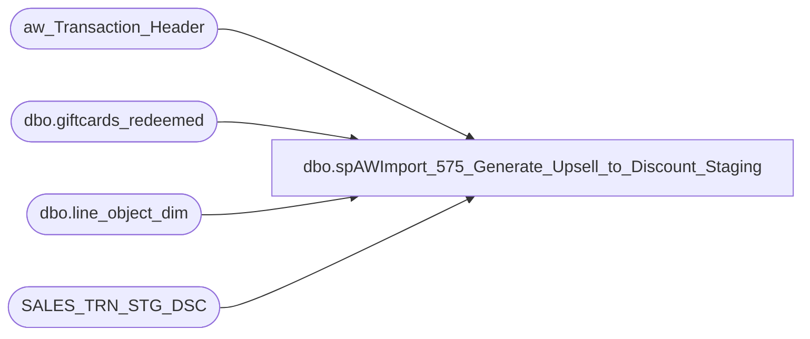

# dbo.spAWImport_575_Generate_Upsell_to_Discount_Staging

**Database:** DWStaging  
**Server:** papamart  

## Architecture Diagram



## Table Dependencies

| Referenced Table |
|---|
| aw_Transaction_Header |
| dbo.giftcards_redeemed |
| dbo.line_object_dim |
| SALES_TRN_STG_DSC |

## Stored Procedure Code

```sql
CREATE PROCEDURE [dbo].[spAWImport_575_Generate_Upsell_to_Discount_Staging]
-- =============================================================================================================
-- Name: spAWImport_575_Generate_Upsell_to_Discount_Staging
--
-- Description:	
--	Generate the Upsell records into the Discount records in Staging.
--
--
-- Input:		
--
-- Output: 
--
-- Dependencies: 
--
-- Revision History
--		Name:			Date:			Comments:
--		Gary Murrish	4/17/2013		Created

-- =============================================================================================================
AS

	SET NOCOUNT ON

	-- This job will build the upsell discounts from the activation discounts on redeemed giftcards

	IF OBJECT_ID('tempdb..#tmpUpsells') IS NOT NULL
	BEGIN
		DROP TABLE #tmpUpsells
	END

	-- Extract the upsell discounts to be applied
	SELECT
		gr.transaction_id,
		SUM(gr.activation_discount_amount) AS discount_amount INTO #tmpUpsells
	FROM dw.dbo.giftcards_redeemed gr WITH (NOLOCK)
	INNER JOIN aw_Transaction_Header ath WITH (NOLOCK)
		ON gr.transaction_id = ath.transaction_id
	WHERE gr.activation_discount_amount <> 0
	GROUP BY gr.transaction_id
	-- (424439 row(s) affected)

	-- Remove any already posted upsell discounts
	DELETE FROM SALES_TRN_STG_DSC
	WHERE Line_Object = -1617

	DECLARE @lineObjectKey int
	SELECT
		@lineObjectKey = lod.line_object_key
	FROM dw.dbo.line_object_dim lod WITH (NOLOCK)
	WHERE lod.Line_Object = -1617

	-- Now create the discount records
	INSERT INTO SALES_TRN_STG_DSC (transaction_id,
	Gross_Line_Amount,
	Line_Object,
	Reference_No,
	Line_Action,
	Units,
	origReference_no,
	line_object_key)
		SELECT
			u.transaction_id,
			-1 * u.discount_amount AS Gross_Line_Amount,
			-1617 AS Line_Object,
			'' AS Reference_No,
			0 AS Line_Action,
			1 AS Units,
			' ' AS origReference_no,
			@lineObjectKey
		FROM #tmpUpsells u WITH (NOLOCK)
```

