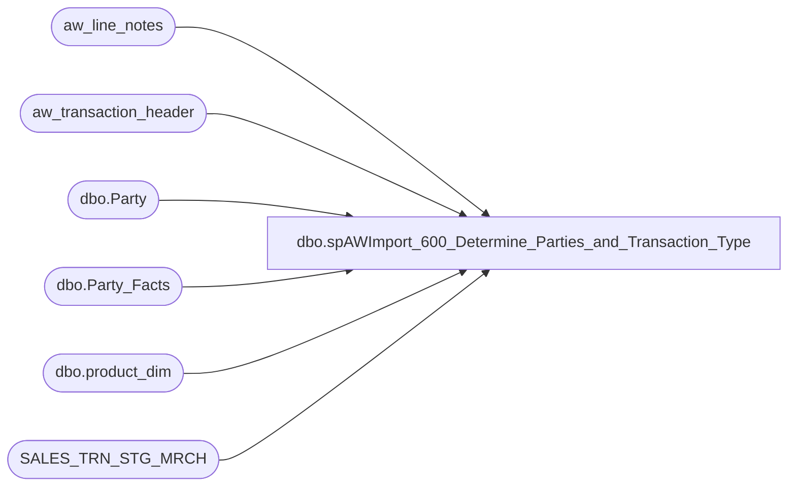

# dbo.spAWImport_600_Determine_Parties_and_Transaction_Type

**Database:** DWStaging  
**Server:** papamart  

## Architecture Diagram



## Table Dependencies

| Referenced Table |
|---|
| aw_line_notes |
| aw_transaction_header |
| dbo.Party |
| dbo.Party_Facts |
| dbo.product_dim |
| SALES_TRN_STG_MRCH |

## Stored Procedure Code

```sql
CREATE PROCEDURE [dbo].[spAWImport_600_Determine_Parties_and_Transaction_Type]
-- =============================================================================================================
-- Name: spAWImport_600_Determine_Parties_and_Transaction_Type
--
-- Description:	
--	Determine what transactions are considered as parties and determine the transaction Type
--
--
-- Input:		
--
-- Output: 
--
-- Dependencies: 
--
-- Revision History
--		Name:			Date:			Comments:
--		Kevin Shyr		1/15/2014		Modified to account for new hierarchy
--		Gary Murrish	4/17/2013		Created
--		Dan Tweedie		03/15/2016		Altered party detection code to use transaction flags from POS instead of skin count
--	    Tim Bytnar      08/23/2017	    Added a commented out join for future support of the new party database
--		TIm Bytnar		11/14/2017		Added support for the new Party Master column.
--		Tim Bytnar		4/19/2018		Adding in the party_key column to join to the Party_Facts table
--		Tim Callahan	3/5/2024		Altered @Parties Code to Account for How Party Line Notes now come into AW from JM POS
--		Tim Callahan	05/09/2024		Updated proc to exclude line notes with EventId in Line note as we are not expected to tie those to the party database per JIRA BIB 866
-- =============================================================================================================
AS

	SET NOCOUNT ON

	-- drop table #tmpSkinUnits

	SELECT
		x.transaction_id,
		SUM(CASE
			WHEN x.TransactionType = 'Skin' THEN x.Units ELSE 0
		END) AS numSkins,
		SUM(CASE
			WHEN x.TransactionType = 'Neutral' THEN x.Units ELSE 0
		END) AS numNeutral,
		SUM(CASE
			WHEN x.TransactionType = 'Non-Neutral' THEN x.Units ELSE 0
		END) AS numNonNeutral 
	INTO #tmpSkinUnits
	FROM (SELECT
		STSM.transaction_id,
		pd.TransactionType,
		SUM(CAST(ABS(STSM.Units) AS int)) AS Units
	FROM SALES_TRN_STG_MRCH STSM WITH (NOLOCK)
	INNER JOIN (SELECT
		p.product_key,
		CASE WHEN LEFT(department_code, 1) = 'W'  -- new hierarchy 2015
			THEN CASE WHEN p.ScorecardCategory = 'Animal' THEN 'Skin'
				WHEN p.ScorecardCategory = 'Human' THEN 'Neutral' -- HUMAN: the old department 35 maps to new department 18 
				WHEN RIGHT(department_code, 2) IN (35, 38, 40, 45, 46, 47, 48, 49, 50, 51, 55, 60, 65, 70, 75, 80) THEN 'Neutral' 
				ELSE 'Non-Neutral'
				END
		ELSE  -- Old hierarchy
			CASE WHEN p.ScorecardCategory = 'Animal' THEN 'Skin'
				WHEN RIGHT(department_code, 2) IN (38, 40, 45, 55, 46, 65, 70, 80, 35, 51, 75, 49, 48, 60, 47, 50) THEN 'Neutral' 
				ELSE 'Non-Neutral'
			END
		END AS TransactionType
	FROM dw.dbo.product_dim p WITH (NOLOCK)
	WHERE p.sku > 0) pd
		ON STSM.product_key = pd.product_key
	GROUP BY	STSM.transaction_id,
				pd.TransactionType) x
	GROUP BY x.transaction_id

----===========	NEW PARTY DETECTION CODE 20160315
;


--DECLARE @Parties table (transaction_id bigint, line_note bigint) -- Remarked Out 3/5/2024
DECLARE @Parties table (transaction_id bigint, line_note nvarchar (50))  -- Replaced above on 3/5/2024

INSERT INTO @Parties
select distinct th.transaction_id, ln.line_note
from aw_transaction_header th with (nolock) 
join aw_line_notes ln with (nolock) on th.transaction_id = ln.transaction_id
	and ln.line_id = 0 --ln.line_id 0 means it's a header note, per Paul Beckman
	and ln.note_type = 28 --ln.note_type 28 = Order/Party ID per Paul Beckman, and auditworks.dbo.note_type
	and ln.line_note NOT LIKE 'Web%'
	--and line_note not like '%[^0-9]%' --excludes non numeric -- Remarked out on 3/5/2024
	and left(ln.line_note,8) not in ('Barcode:') -- Added 3/5/2024 after removing condition above 
	and left(ln.line_note,7) not in ('Barcode') -- idw 091225 
	and left(ln.line_note,9) not in ('Event ID:') -- Added 5/9/2024 as related to JIRA BIB866 - We  won't be looking up "Events" in the party System
--join kodiak.bearhouse.dbo.tblParty p on cast(ln.line_note as int) = p.ieventID
--Next line adds support for the new Party database
	join [STL-SQLAAG-P-01].BABWPartyPlanner.dbo.Party p 
		--on CAST(ln.line_note as bigint) = p.EventID OR CAST(ln.line_note as bigint) = p.PartyID -- Remarked Out 3/5/2024
		--on cast(replace(ln.line_note,'Party ID: ','') as bigint)=p.EventID OR cast(replace(ln.line_note,'Party ID: ','') as bigint) = p.PartyID -- Replaced above on 3/5/2024
		on 
		cast(replace (replace (replace(ln.line_note,'Party ID: ','') , char (10), ''), char (13), '')as bigint)=p.EventID -- Replaced Above on Jun 23 2025
			OR 
		cast(replace (replace (replace(ln.line_note,'Party ID: ','') , char (10), ''), char (13), '')as bigint)= p.PartyID -- Replaced Above on Jun 23 2025
where th.store_no not in (13, 470, 990, 991, 2013, 2099, 2301);


WITH Party_Masters
AS
(
	SELECT MIN(transaction_id) as transaction_id, line_note
	FROM @Parties
	GROUP BY line_note
)
	UPDATE ath
	--OLD CODE PRE-20160315
	--SET	ath.party_y_n =
	--		CASE
	--			WHEN su.numSkins >= 6 THEN 'y' ELSE 'n'
	--		END,
	--NEW CODE 20160315
	SET ath.party_y_n = 
			case when p.transaction_id is not null 
				then 'y' 
				else 'n' 
			end,
		ath.transaction_type =
			CASE
				WHEN su.ttFlag IN (1, 3) THEN 'Bare Bear'
				WHEN su.ttFlag IN (4, 6) THEN 'Plus Only'
				WHEN su.ttFlag IN (5, 7) THEN 'Bear Plus'
				WHEN su.ttFlag IN (2) THEN 'Unclassified' ELSE 'Not Applicable'
			END,
		ath.party_master = 
			   CASE
				   WHEN pm.transaction_id IS NOT NULL THEN 1
				   ELSE 0
			   END,
	--ath.party_key = (SELECT party_key FROM dw.dbo.Party_Facts WHERE PartyID = p.line_note) -- Remarked Out 3/5/2024
	--ath.party_key = (SELECT party_key FROM dw.dbo.Party_Facts WHERE PartyID = cast(replace(p.line_note,'Party ID: ','') as bigint)) -- Replaced above on 3/5/2024
	ath.party_key = (SELECT party_key FROM dw.dbo.Party_Facts WHERE PartyID = cast(replace (replace (replace(p.line_note,'Party ID: ','') , char (10), ''), char (13), '')as bigint)) -- Replaced Above on Jun 23 2025
	FROM aw_Transaction_Header ath WITH (NOLOCK)
	INNER JOIN (SELECT*,
					CAST(CASE
						WHEN su.numSkins <> 0 THEN 1 ELSE 0
					END AS smallint) +
					CAST(CASE
						WHEN su.numNeutral <> 0 THEN 2 ELSE 0
					END AS smallint) +
					CAST(CASE
						WHEN su.numNonNeutral <> 0 THEN 4 ELSE 0
					END AS smallint) AS ttFlag
				FROM #tmpSkinUnits su WITH (NOLOCK)) su ON ath.transaction_id = su.transaction_id
	LEFT JOIN @Parties p on ath.transaction_id = p.transaction_id
	LEFT JOIN Party_Masters pm on ath.transaction_id = pm.transaction_id


	

	--SELECT *
	--FROM aw_Transaction_Header
	--WHERE party_y_n = 'y'
```

