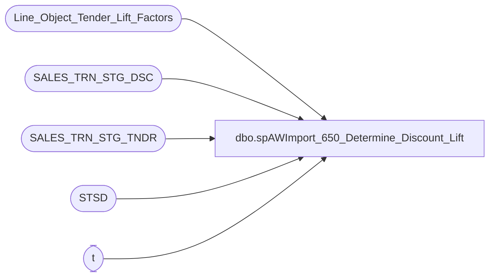

# dbo.spAWImport_650_Determine_Discount_Lift

**Database:** DWStaging  
**Server:** papamart  

## Architecture Diagram



## Table Dependencies

| Referenced Table |
|---|
| Line_Object_Tender_Lift_Factors |
| SALES_TRN_STG_DSC |
| SALES_TRN_STG_TNDR |
| STSD |
| t |

## Stored Procedure Code

```sql
CREATE PROCEDURE [dbo].[spAWImport_650_Determine_Discount_Lift]
-- =============================================================================================================
-- Name: spAWImport_650_Determine_Discount_Lift
--
-- Description:	
--	Determine the lift for each discount record.
--
--
-- Input:		
--
-- Output: 
--
-- Dependencies: 
--
-- Revision History
--		Name:			Date:			Comments:
--		Gary Murrish	4/17/2013		Created

-- =============================================================================================================
AS

	SET NOCOUNT ON


	IF OBJECT_ID('tempdb..#tmpTender') IS NOT NULL
	BEGIN
		DROP TABLE #tmpTender
	END


	-- Determine the total lift for the transaction

	SELECT
		tndr.transaction_id,
		tndr.ttlGiftcardLift,
		tndr.ttlDiscountLift,
		ISNULL(disc.ttlDiscount, 0) AS ttlDiscount,
		CAST(0 AS money) AS postedDiscountLift,
		ISNULL(disc.largestDiscountAmount, 0) AS largestDiscountAmount INTO #tmpTender
	FROM (SELECT
		STST.transaction_id,
		SUM(STST.Gross_Line_Amount * fctr.factorGiftcardLift) AS ttlGiftcardLift,
		SUM(STST.Gross_Line_Amount * fctr.factorDiscountLift) AS ttlDiscountLift

	FROM SALES_TRN_STG_TNDR STST WITH (NOLOCK)
	INNER JOIN Line_Object_Tender_Lift_Factors fctr WITH (NOLOCK)
		ON STST.Line_Object = fctr.Line_Object
	GROUP BY STST.transaction_id) tndr
	LEFT JOIN (SELECT
		STSD.transaction_id,
		SUM(STSD.Gross_Line_Amount * -1) AS ttlDiscount,
		MAX(ABS(STSD.Gross_Line_Amount)) AS largestDiscountAmount
	FROM SALES_TRN_STG_DSC STSD WITH (NOLOCK)
	GROUP BY STSD.transaction_id) disc
		ON tndr.transaction_id = disc.transaction_id

	-- Clear any lift posted.
	UPDATE SALES_TRN_STG_DSC
	SET Lift_Amount = 0
	WHERE Lift_Amount <> 0

	-- Post the Lift to each transaction
	UPDATE STSD
	SET STSD.Lift_Amount = ROUND(t.ttlDiscountLift * ((STSD.Gross_Line_Amount * -1) / t.ttldiscount), 2)
	FROM SALES_TRN_STG_DSC STSD WITH (NOLOCK)
	INNER JOIN #tmpTender t WITH (NOLOCK)
		ON STSD.transaction_id = t.transaction_id
	WHERE t.ttldiscount <> 0

	-- Post the total Lift Posted back to the trigger table
	UPDATE t
	SET t.postedDiscountLift = disc.ttlLiftPosted
	FROM #tmpTender t WITH (NOLOCK)
	INNER JOIN (SELECT
		STSD.transaction_id,
		SUM(STSD.Lift_Amount) AS ttlLiftPosted,
		MAX(ABS(STSD.Gross_Line_Amount)) AS LargestAmount
	FROM SALES_TRN_STG_DSC STSD WITH (NOLOCK)
	GROUP BY STSD.transaction_id) disc
		ON disc.transaction_id = t.transaction_id

	-- Adjust the largest entry with rounding errors
	UPDATE STSD
	SET STSD.Lift_Amount = STSD.Lift_Amount + x.adjAmount
	FROM SALES_TRN_STG_DSC STSD WITH (NOLOCK)
	INNER JOIN (SELECT
		t.transaction_id,
		MIN(STSD.recID) AS recID,
		MIN(t.ttlDiscountLift - t.postedDiscountLift) AS adjAmount
	FROM #tmpTender t WITH (NOLOCK)
	INNER JOIN SALES_TRN_STG_DSC STSD WITH (NOLOCK)
		ON t.transaction_id = STSD.transaction_id
		AND ABS(STSD.Gross_Line_Amount) = t.largestDiscountAmount
	WHERE t.ttlDiscountLift <> t.postedDiscountLift
	AND t.ttldiscount <> 0
	GROUP BY t.transaction_id) x
		ON x.recID = STSD.recID
```

