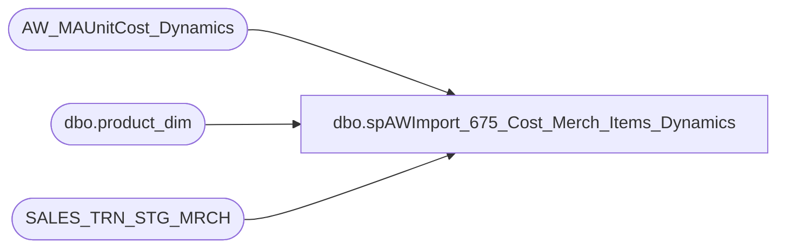

# dbo.spAWImport_675_Cost_Merch_Items_Dynamics

**Database:** DWStaging  
**Server:** papamart  

## Architecture Diagram



## Table Dependencies

| Referenced Table |
|---|
| AW_MAUnitCost_Dynamics |
| dbo.product_dim |
| SALES_TRN_STG_MRCH |

## Stored Procedure Code

```sql
CREATE PROCEDURE [dbo].[spAWImport_675_Cost_Merch_Items_Dynamics]
-- =============================================================================================================
-- Name: spAWImport_675_Cost_Merch_Items
--
-- Description:	
--	Cost each Merchandise Item (TDF)
--
--
-- Input:		
--
-- Output: 
--
-- Dependencies: 
--
-- Revision History
--		Name:			Date:			Comments:
--		Kevin Shyr		1/20/2015		Commented out class and subclass lookup to include ALL sounds without cost
--		Kevin Shyr		1/20/2015		Modified to use Scorecardcategory
--		Gary Murrish	5/2/2014		Created

-- =============================================================================================================
AS
	SET NOCOUNT ON

	-- Get the cost for the products
	UPDATE stsm
		SET stsm.ext_Cost = stsm.Units * amc.unitCost
	FROM
		SALES_TRN_STG_MRCH stsm
		INNER JOIN AW_MAUnitCost_Dynamics amc WITH (NOLOCK)
			ON stsm.product_key = amc.product_key
			AND stsm.store_key = amc.store_key
			AND stsm.date_key BETWEEN amc.prior_date_key AND amc.date_key

	-- Cost the Digital Sounds based upon the cost of the 'blank' sound
	--SELECT * FROM dw.dbo.product_dim pd with (NOLOCK) WHERE pd.sku = 116615
	-- 33406 - US
	-- 42280 - UK
	-- 42285 - CA

	UPDATE u
		SET u.ext_Cost = u.Units * mc.unitCost
	FROM
		SALES_TRN_STG_MRCH u
		INNER JOIN dw.dbo.product_dim pd WITH (NOLOCK)
			ON u.product_key = pd.product_key
		INNER JOIN AW_MAUnitCost_Dynamics mc WITH (NOLOCK)
			ON u.store_key = mc.store_key
			AND u.date_key BETWEEN mc.prior_date_key AND mc.date_key
			AND mc.product_key = 33406
	WHERE -- Looking for digital sounds
		pd.ScorecardCategory = 'Sounds'
		AND pd.jurisdiction_code = 'US'
		--AND ((LEFT(subclass_code, 1) = 'W' AND RIGHT(subclass_code, 2) = '07')  -- new hierarchy, looking for subclass code 07
		--	OR (LEFT(subclass_code, 1) = 'R' AND RIGHT(LEFT(subclass_code, 11), 2) = '07')  -- Old hierarchy, looking for class code 07
		--	)
		AND ISNULL(u.ext_Cost, 0) = 0 and u.Units <> 0

	UPDATE u
		SET u.ext_Cost = u.Units * mc.unitCost
	FROM
		SALES_TRN_STG_MRCH u
		INNER JOIN dw.dbo.product_dim pd WITH (NOLOCK)
			ON u.product_key = pd.product_key
		INNER JOIN AW_MAUnitCost_Dynamics mc WITH (NOLOCK)
			ON u.store_key = mc.store_key
			AND u.date_key BETWEEN mc.prior_date_key AND mc.date_key
			AND mc.product_key = 42280
	WHERE -- Looking for digital sounds
		pd.ScorecardCategory = 'Sounds'
		AND pd.jurisdiction_code = 'UK'
		--AND ((LEFT(subclass_code, 1) = 'W' AND RIGHT(subclass_code, 2) = '07')  -- new hierarchy, looking for subclass code 07
		--	OR (LEFT(subclass_code, 1) = 'R' AND RIGHT(LEFT(subclass_code, 11), 2) = '07')  -- Old hierarchy, looking for class code 07
		--	)
		AND ISNULL(u.ext_Cost, 0) = 0 and u.Units <> 0

	UPDATE u
		SET u.ext_Cost = u.Units * mc.unitCost
	FROM
		SALES_TRN_STG_MRCH u
		INNER JOIN dw.dbo.product_dim pd WITH (NOLOCK)
			ON u.product_key = pd.product_key
		INNER JOIN AW_MAUnitCost_Dynamics mc WITH (NOLOCK)
			ON u.store_key = mc.store_key
			AND u.date_key BETWEEN mc.prior_date_key AND mc.date_key
			AND mc.product_key = 42285
	WHERE -- Looking for digital sounds
		pd.ScorecardCategory = 'Sounds'
		AND pd.jurisdiction_code = 'CA'
		--AND ((LEFT(subclass_code, 1) = 'W' AND RIGHT(subclass_code, 2) = '07')  -- new hierarchy, looking for subclass code 07
		--	OR (LEFT(subclass_code, 1) = 'R' AND RIGHT(LEFT(subclass_code, 11), 2) = '07')  -- Old hierarchy, looking for class code 07
		--	)
		AND ISNULL(u.ext_Cost, 0) = 0 and u.Units <> 0
```

