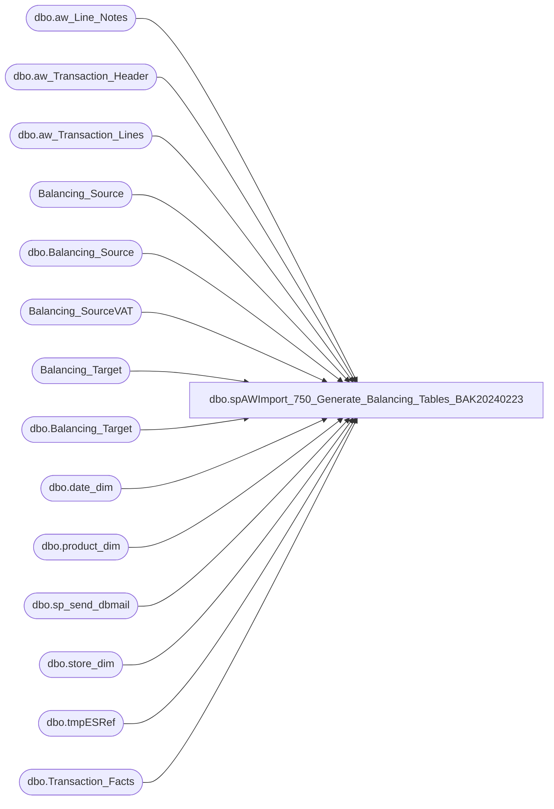

# dbo.spAWImport_750_Generate_Balancing_Tables_BAK20240223

**Database:** DWStaging  
**Server:** papamart  

## Architecture Diagram



## Table Dependencies

| Referenced Table |
|---|
| dbo.aw_Line_Notes |
| dbo.aw_Transaction_Header |
| dbo.aw_Transaction_Lines |
| Balancing_Source |
| dbo.Balancing_Source |
| Balancing_SourceVAT |
| Balancing_Target |
| dbo.Balancing_Target |
| dbo.date_dim |
| dbo.product_dim |
| dbo.sp_send_dbmail |
| dbo.store_dim |
| dbo.tmpESRef |
| dbo.Transaction_Facts |

## Stored Procedure Code

```sql
CREATE PROCEDURE [dbo].[spAWImport_750_Generate_Balancing_Tables_BAK20240223]
AS
-- =============================================================================================================
-- Name: spAWImport_750_Generate_Balancing_Tables
--
-- Description:	
--	Generate the records from Auditworks and the Datawarehouse that are used to balance the two.
--
--		Auditworks balancing information is stored in Balancing_Source
--		The datawarehouse balancing informtion is stored in Balancing_Target
--
-- Input:		
--
-- Output: 
--
-- Dependencies: 
--
-- Revision History
--		Name:			Date:			Comments:
--		Gary Murrish	4/17/2013		Created
--		Kevin Shyr		3/24/2015		Added line objects for Corporate Sales
--		Dan Tweedie		06/10/2016		Added line objects for Enterprise Selling Fulfillments & Returns, which are now included in Gaap.
--		Dan Tweedie		06/29/2016		added more explicit filters
--		Dan Tweedie		07/28/2016		altered AW query for Gaap to exclude Enterprise Selling ORDER Shipping fee, line_object 200 and line_action 95
--		Dan Tweedie		08/08/2016		Altered AW query to use original ES Order location instead ES Fulfillment location, since this is how we are posting to data warehouse
--		Dan Tweedie		2020-08-14		Added notication if variance between AW and DW is >= 75%			
--		Tim Callahan	2023-11-02		Changed Gaap Sales Logic to exlcude Bag fees by subclass code - required a join to product dim 
--		Tim Callahan	2024-01-11		Updated Bag Fee Join found that some stores have the ref_no field with 12 characters rather than 6, peforming a join on right 6
-- =============================================================================================================

	SET NOCOUNT ON

--====================================
-- STAGE ENTERPRISE SELLING REFERENCE --THIS IS STAGED FROM BUILD TRANSACTION FACTS
--====================================

--IF OBJECT_ID('tempdb..dw.dbo.tmpESRef') IS NOT NULL
--BEGIN
--	DROP TABLE dw.dbo.tmpESRef
--END

--select acl.reference_no, acl.issuing_store_no, acl.store_key, tdf.transaction_id
--into dw.dbo.tmpESRef
--from dwstaging.dbo.aw_cust_liability acl
--join dw.dbo.transaction_detail_facts tdf with (nolock) on acl.reference_no = tdf.reference_no 
--join dw.dbo.line_object_dim lod with (nolock) on tdf.line_object_key = lod.line_object_key
--join dw.dbo.line_action_dim lad with (nolock) on tdf.line_action_key = lad.line_action_key
--join dwstaging.dbo.aw_transaction_header ath on tdf.transaction_id = ath.transaction_id
--where lod.line_object = 106 --enterprise selling
--and lad.line_action in (90, 142) --fulfillment
--group by acl.reference_no, acl.issuing_store_no, acl.store_key, tdf.transaction_id

----------------------------------------------------------------------------------------
-- Build Reference Table for Product Dim Data 
-- Had to do this because for some (typically older) styles they were members of multiple subclasses
-- This Table is left joined to below in the GAAP calculation

IF OBJECT_ID('tempdb..#product_dim') IS NOT NULL
DROP TABLE #product_dim

select 
pd.style_code, 
max (pd.subclass_code) as subclass_code
into #product_dim
from dw.dbo.product_dim pd
where 1=1
and style_code is not null 
and pd.subclass_code is not null 
group by 
pd.style_code 


----------------------------------------------------------------------------------------


DECLARE @minActualDate datetime
DECLARE @maxActualDate datetime
DECLARE @minDateKey int
DECLARE @maxDateKey int

SELECT
	@minActualDate = MIN(ath.transaction_date),
	@maxActualDate = MAX(ath.transaction_date)
FROM
	DWStaging.dbo.aw_Transaction_Header ath WITH (NOLOCK)

SELECT
	@minDateKey = date_key
FROM
	dw.dbo.date_dim dd WITH (NOLOCK)
WHERE
	dd.actual_date = @minActualDate
SELECT
	@maxDateKey = date_key
FROM
	dw.dbo.date_dim dd WITH (NOLOCK)
WHERE
	dd.actual_date = @maxActualDate

-- Get the information from AuditWorks

TRUNCATE TABLE Balancing_Source
TRUNCATE TABLE Balancing_SourceVAT

INSERT INTO Balancing_Source
	(	transaction_date,
		store_no,
		transaction_id,
		gaapsales,
		VATAmount)
	
	select
		x.transaction_date,
		x.store_no,
		x.transaction_id,
		sum(x.GaapSales) GaapSales,
		sum(x.VatAmount) VatAmount
	from
	(
			SELECT
				transaction_date,
				isnull(es.issuing_store_no, h.store_no) as store_no,
				h.transaction_id,
				--(SUM(((l.Gross_line_Amount - l.Pos_Discount_amount))
				--		* l.db_cr_none * l.voiding_reversal_flag
				--		)
				--		) * -1 
				--	AS GAAPSales,
(
	SUM(
		(
			(	
			case when  pd.style_code is not null and right(pd.subclass_code,8) = ('57-01-01') -- Exclude Bag Fee Items
					then 0
				else l.gross_line_amount
				end -- End of New Logic 
				- 
				l.Pos_Discount_amount
			)
		)
		*l.db_cr_none 
		* l.voiding_reversal_flag
		)
		
) * -1 
AS GAAPSales, -- Replaced Above GAAP Sales Formula on 11/02/2023
				CAST(0 AS money) AS VATAmount,
				l.line_object, 
				l.line_action
			FROM
				DWStaging.dbo.aw_Transaction_Header h WITH (NOLOCK)
				INNER JOIN DWStaging.dbo.aw_Transaction_Lines l WITH (NOLOCK)	ON h.transaction_id = l.transaction_id				
				--left join #product_dim pd on pd.style_code COLLATE Latin1_General_CI_AS = l.reference_no COLLATE Latin1_General_CI_AS  -- Added This Join on 11/2/2023
				left join #product_dim pd on pd.style_code COLLATE Latin1_General_CI_AS = right (l.reference_no,6) COLLATE Latin1_General_CI_AS  -- Replaced Above on 1/11/2024
				left join dw.dbo.tmpESRef es on l.reference_no COLLATE Latin1_General_CI_AS = es.reference_no COLLATE Latin1_General_CI_AS
				
			WHERE 1=1
			and h.transaction_date BETWEEN @minActualDate AND @maxActualDate
			AND 
				(
					(h.transaction_category IN (1, 2) AND l.line_object_type <> 12 and h.transaction_series <> 'C' and l.line_action <> 95) --exc
						OR 
					(h.transaction_category IN (10) AND (l.line_object_type = 7 OR l.line_object BETWEEN 700 AND 799) and h.transaction_series <> 'C')
						OR
					(h.transaction_category = 242 and 
							(
								(l.line_object = 106 and l.line_action in (90,99,142)) --es fulfillments
									or
								(l.line_object in (200, 203) and line_action = 97) --es shipping on fulfillment
							
							)
							 and h.transaction_series = 'C')  --es fulfillments, returns (technically this is customer liability, which is how es fulfillments post
				)
				
			AND NOT (h.store_no = 13 AND h.register_no = 3 AND transaction_date <= '1/31/2012')
			AND 
				(
					l.Line_Object IN (100, 102, 103, 104, 200, 202, 203, 204, 206, 210, 250, 290, 291, 293, 295, 296, 623, 640, 690, 691, 1630, 1631, 1199, 115, 215, 1660) 
				 OR 
					(l.line_object = 106 and line_action in (90,142,99) )
				)

			GROUP BY	h.store_no,
						h.transaction_date,
						h.transaction_id,
						l.line_object,
						l.line_action,
						es.issuing_store_no
		) as x
		--where cast(line_object as varchar) + '/' + cast(line_action as varchar)  <> '200/95'
		group by 
			x.transaction_date,
			x.store_no,
			x.transaction_id

	OPTION (MAXDOP 1) -- Performance

-- Get the VAT amounts for the Transactions
INSERT INTO Balancing_SourceVAT
	(	transaction_date,
		store_no,
		transaction_id,
		VAT)
	SELECT
		transaction_date,
		isnull(es.issuing_store_no, h.store_no) as store_no,
		h.transaction_id,
		SUM(( 
				CASE  WHEN l.line_object=101 AND ln.note_type =35 THEN ln.line_note
					  ELSE l.Gross_line_Amount *
						CASE [Line_action]
							WHEN 13 THEN -1
							WHEN 21 THEN 1
							ELSE 0
						END
				END
			)) AS VAT
	FROM
		DWStaging.dbo.aw_Transaction_Header h WITH (NOLOCK)
		INNER JOIN DWStaging.dbo.aw_Transaction_Lines l WITH (NOLOCK)
			ON h.transaction_id = l.transaction_id
		LEFT OUTER JOIN DWStaging.dbo.aw_Line_Notes ln
			ON ln.transaction_id=h.transaction_id
			AND ln.line_id=l.line_id
			AND ln.note_type=35
		left join dw.dbo.tmpESRef es on l.reference_no COLLATE Latin1_General_CI_AS = es.reference_no COLLATE Latin1_General_CI_AS
	WHERE
		( h.transaction_date BETWEEN @minActualDate AND @maxActualDate
		AND h.transaction_category IN (1, 2)
		)
		AND l.Line_Object IN (1150,101)
	GROUP BY	h.store_no,
				transaction_date,
				h.transaction_id,
				es.issuing_store_no

	OPTION (MAXDOP 1)

-- Update the Base record with the VAT amounts
UPDATE bs
	SET bs.VATAmount = bsv.VAT
FROM
	Balancing_Source bs WITH (NOLOCK)
	INNER JOIN Balancing_SourceVAT bsv WITH (NOLOCK)
		ON bs.transaction_id = bsv.transaction_id

-- Now get the information from the Data Warehouse

TRUNCATE TABLE Balancing_Target
INSERT INTO Balancing_Target
	(	transaction_date,
		store_no,
		gaapsales)
	SELECT
		dd.actual_date AS transaction_date,
		sd.store_id AS store_no,
		SUM(tf.GAAP_sales_amount) AS GAAPSales
	FROM
		dw.dbo.Transaction_Facts tf WITH (NOLOCK)
		INNER JOIN dw.dbo.store_dim sd WITH (NOLOCK)
			ON tf.store_key = sd.store_key
		INNER JOIN dw.dbo.date_dim dd WITH (NOLOCK)
			ON tf.date_key = dd.date_key
	WHERE
		tf.date_key BETWEEN @minDateKey AND @maxDateKey
	GROUP BY	dd.actual_date,
				sd.store_id

----NEW NOTIFICATION CODE ADDED 2020-08-14----

declare 
	@Compare table 
		(
			TransactionDate date,
			AWGaapSales numeric(38,2),
			DWGaapSales numeric(38,2),
			VarianceAmount numeric(38,2),
			VariancePercent numeric(38,2)
		)

;

with
AW as
	(
		SELECT
			cast(bs.Transaction_Date as date) TransactionDate,
			SUM(bs.GAAPSales) + SUM(ISNULL(bs.VATAmount, 0)) AS AWGAAPSales
		FROM
			DWStaging.dbo.Balancing_Source bs WITH (NOLOCK)
		where datediff(dd, bs.Transaction_Date, getdate()-1)=0
		GROUP BY cast(bs.Transaction_Date as date)
	),
DW as
	(
		SELECT
			cast(bt.Transaction_Date as date) TransactionDate,
			SUM(bt.GAAPSales) AS DWGAAPSales
		FROM
			DWStaging.dbo.Balancing_Target bt WITH (NOLOCK)
		where datediff(dd, bt.Transaction_Date, getdate()-1)=0
		GROUP BY cast(bt.Transaction_Date as date)
	),
Summary as
	(
		SELECT
			aw.TransactionDate,
			aw.AWGAAPSales,
			ISNULL(dw.dwGAAPSales, 0) AS DWGaapPSales,
			aw.AWGAAPSales - ISNULL(dw.dwGAAPSales, 0) AS Difference,
			( ( aw.AWGAAPSales - ISNULL(dw.dwGAAPSales, 0) ) / aw.AWGAAPSales ) * 100 DiffPct
		FROM aw
		left join dw on aw.TransactionDate = dw.TransactionDate
		UNION ALL
		SELECT --transactions in DW that are not in AW
			dw.TransactionDate,
			ISNULL(aw.AWGAAPSales, 0) AS AWGAAPSales,
			dw.dwGAAPSales AS DWAGGPSales,
			ISNULL(aw.AWGAAPSales, 0) - ISNULL(dw.dwGAAPSales, 0) AS Difference,
			( ( ISNULL(aw.AWGAAPSales, 0) - ISNULL(dw.dwGAAPSales, 0) ) / ISNULL(aw.AWGAAPSales, 0) ) * 100 as DiffPct
		FROM dw
		left join aw on aw.TransactionDate = dw.TransactionDate
		WHERE aw.TransactionDate IS NULL
	)
insert @Compare
select *
from Summary
where DiffPct >= 75 --if 75% or more of sales are not posted, send alert


if (select count(*) from @Compare) > 0

begin
	EXEC msdb.dbo.sp_send_dbmail
	@recipients = 'BIAdminTextAlert@buildabear.com',
	@subject = 'AW to DW ETL - Variance Problem',
	@body = 'CHECK THE AW TO DW DATA LOAD - THERE IS A VARIANCE OF AT LEAST 75%. (See DWStaging..spAWImport_750_Generate_Balancing_Tables)',
	@profile_name = 'BIAdmin',
	@body_format= HTML
end
```

