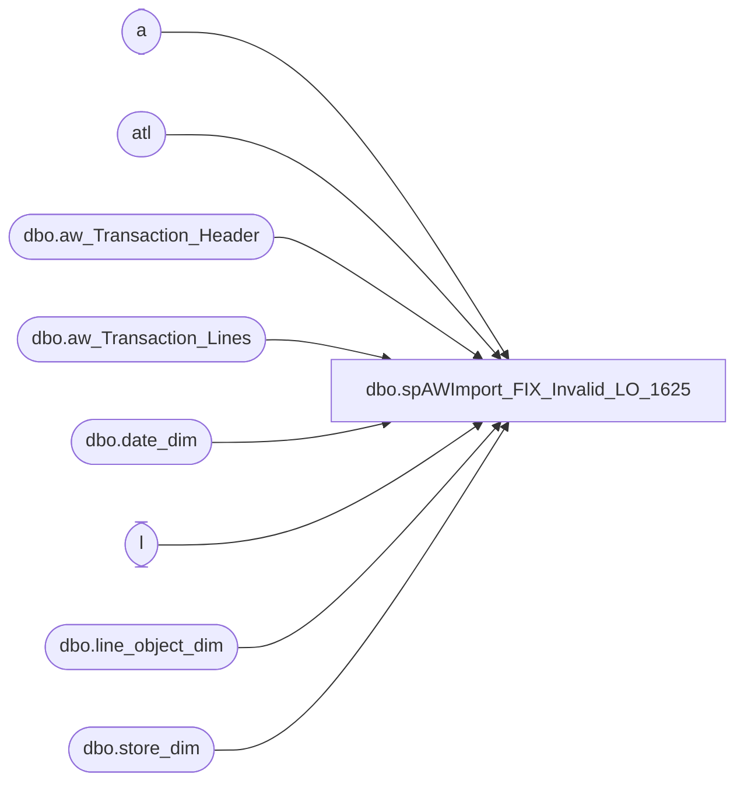

# dbo.spAWImport_FIX_Invalid_LO_1625

**Database:** DWStaging  
**Server:** papamart  

## Architecture Diagram



## Table Dependencies

| Referenced Table |
|---|
| a |
| atl |
| dbo.aw_Transaction_Header |
| dbo.aw_Transaction_Lines |
| dbo.date_dim |
| l |
| dbo.line_object_dim |
| dbo.store_dim |

## Stored Procedure Code

```sql
CREATE PROCEDURE [dbo].[spAWImport_FIX_Invalid_LO_1625]
-- =============================================================================================================
-- Name: spAWImport_FIX_Invalid_LO_1625
--
-- Description:	
--	This procedure will fix the line objects for 1625 wich were coded wrong in Audit Works. These will be changed
--		to line object 1623
--
--
-- Input:		
--
-- Output: 
--
-- Dependencies: 
--
-- Revision History
--		Name:			Date:			Comments:
--		Gary Murrish	10/14/2014		Created
--		Tim Callahan	05/07/2024		With the decomission of the Queries DB, pointed any reference to DWstaging

-- =============================================================================================================
AS

	SET NOCOUNT ON
	-- Get all of the 1625 lines

	-- drop table #1625
	SELECT
		x.transaction_id,
		x.line_sequence,
		x.gross_line_amount,
		CASE
			WHEN LEFT(x.reference_no, 7) IN ('2000997', '2000998', '2000999', '2001000') THEN 1
			ELSE 0
		END AS isGCCoupon,
		x.reference_no
	INTO #1625
	FROM
		DWStaging.dbo.aw_Transaction_Lines x WITH (NOLOCK)
		INNER JOIN DWStaging.dbo.aw_Transaction_Header ath WITH (NOLOCK)
			ON x.transaction_id = ath.transaction_id
	WHERE
		x.Line_Object = 1625
		AND ath.transaction_date BETWEEN '9/1/2014' AND '10/14/2014'
	-- (121909 row(s) affected)

	-- Drop table #mdseLine
	SELECT
		a.transaction_id,
		a.line_sequence,
		a.gross_line_amount AS discAmount,
		a.isGCCoupon,
		a.reference_no AS discReferenceNo,
		MAX(ttd.line_sequence) AS trans_line_sequence
	INTO #mdseLine
	FROM
		DWStaging.dbo.aw_Transaction_Lines ttd WITH (NOLOCK)
		INNER JOIN #1625 a WITH (NOLOCK)
			ON ttd.transaction_id = a.transaction_id
			AND ttd.line_sequence < a.line_sequence
			AND (ttd.Line_Object BETWEEN 400 AND 499
			OR ttd.Line_Object IN (100))
	GROUP BY	a.transaction_id,
				a.line_sequence,
				a.gross_line_amount,
				a.isGCCoupon,
				a.reference_no
	-- (121909 row(s) affected)


	-- Case 1, Web Merchandise that is legit coupon number isGCCoupon = 2
	UPDATE a
		SET a.isGCCoupon = 2
	FROM
		#mdseLine l
		INNER JOIN DWStaging.dbo.aw_Transaction_Lines ttd WITH (NOLOCK)
			ON l.transaction_id = ttd.transaction_id
			AND l.trans_line_sequence = ttd.line_sequence
		INNER JOIN DWStaging.dbo.aw_Transaction_Header tttp WITH (NOLOCK)
			ON l.transaction_id = tttp.transaction_id
		INNER JOIN #1625 a
			ON l.transaction_id = a.transaction_id
			AND l.line_sequence = a.line_sequence
	WHERE ttd.Line_Object = 100
	AND l.isGCCoupon = 1

	UPDATE l
		SET l.isGCCoupon = a.isGCCoupon
	FROM
		#mdseLine l
		INNER JOIN #1625 a
			ON l.transaction_id = a.transaction_id
			AND l.line_sequence = a.line_sequence
	WHERE l.isGCCoupon <> a.isGCCoupon
	-- (223 row(s) affected)

	-- Case 2, Coupons that are not legit coupon number, the discount is a multiple of 5 and it matches the discount on the coupon isGCCoupon = 3
	--		These to be considered Okay
	UPDATE a
		SET a.isGCCoupon = 3
	FROM
		#mdseLine l WITH (NOLOCK)
		INNER JOIN DWStaging.dbo.aw_Transaction_Lines ttd WITH (NOLOCK)
			ON l.transaction_id = ttd.transaction_id
			AND l.trans_line_sequence = ttd.line_sequence
		INNER JOIN #1625 a
			ON l.transaction_id = a.transaction_id
			AND l.line_sequence = a.line_sequence
	WHERE ttd.Line_Object IN (400, 404)
	AND l.isGCCoupon = 0
	AND l.discAmount = ttd.pos_discount_amount
	AND l.discAmount % 5 = 0
	-- (51896 row(s) affected)

	UPDATE l
		SET l.isGCCoupon = a.isGCCoupon
	FROM
		#mdseLine l
		INNER JOIN #1625 a
			ON l.transaction_id = a.transaction_id
			AND l.line_sequence = a.line_sequence
	WHERE l.isGCCoupon <> a.isGCCoupon
	-- (91784 row(s) affected)

	-- Case 3, Coupons that are not legit coupon number, the discount is a multiple of 5 and it is less than the discount on the transaction isGCCoupon = 4
	--		These to be considered Okay
	UPDATE a
		SET a.isGCCoupon = 4
	FROM
		#mdseLine l WITH (NOLOCK)
		INNER JOIN DWStaging.dbo.aw_Transaction_Lines ttd WITH (NOLOCK)
			ON l.transaction_id = ttd.transaction_id
			AND l.trans_line_sequence = ttd.line_sequence
		INNER JOIN #1625 a
			ON l.transaction_id = a.transaction_id
			AND l.line_sequence = a.line_sequence
	WHERE ttd.Line_Object = 404
	AND l.isGCCoupon = 0
	AND l.discAmount <= ttd.pos_discount_amount
	AND l.discAmount % 5 = 0
	-- (3233 row(s) affected)

	UPDATE l
		SET l.isGCCoupon = a.isGCCoupon
	FROM
		#mdseLine l
		INNER JOIN #1625 a
			ON l.transaction_id = a.transaction_id
			AND l.line_sequence = a.line_sequence
	WHERE l.isGCCoupon <> a.isGCCoupon
	-- (5486 row(s) affected)

	-- Summary
	--SELECT
	--	ttd.Line_Object,
	--	lod.Line_Object_Description,
	--	l.isGCCoupon,
	--	COUNT(*) AS numRecs,
	--	SUM(l.discAmount) AS discAmount
	--FROM
	--	#mdseLine l
	--	INNER JOIN DWStaging.dbo.aw_Transaction_Lines ttd WITH (NOLOCK)
	--		ON l.transaction_id = ttd.transaction_id
	--	INNER JOIN dw.dbo.line_object_dim lod WITH (NOLOCK)
	--		ON ttd.Line_Object = lod.Line_Object
	--		AND l.trans_line_sequence = ttd.line_sequence
	--GROUP BY	ttd.Line_Object,
	--			lod.Line_Object_Description,
	--			l.isGCCoupon
	--ORDER BY 1


	-- ******************************************************************************
	-- * At this stage all of those with a zero in isGCCoupon should be switched from 1625 to 1623
	-- ******************************************************************************
	UPDATE atl
		SET Line_Object = 1623
	FROM
		DWStaging.dbo.aw_Transaction_Lines atl
		INNER JOIN #mdseLine l WITH (NOLOCK)
			ON atl.transaction_id = l.transaction_id
			AND atl.line_sequence = l.line_sequence
	WHERE l.isGCCoupon = 0

	-- Log of those changed
	--IF OBJECT_ID('queries.dbo.tmp_gm1625Adjustments') IS NOT NULL
	--BEGIN
	--	DROP TABLE queries.dbo.tmp_gm1625Adjustments
	--END

	IF OBJECT_ID('DWStaging.dbo.tmp_gm1625Adjustments') IS NOT NULL
	BEGIN
		DROP TABLE DWStaging.dbo.tmp_gm1625Adjustments
	END

	SELECT
		*
	INTO DWStaging.dbo.tmp_gm1625Adjustments
	FROM
		#mdseLine l
	WHERE
		l.isGCCoupon = 0

	-- Summary by Month
	--IF OBJECT_ID('queries.dbo.tmp_gmSummary1625Adjustments') IS NOT NULL
	--BEGIN
	--	DROP TABLE queries.dbo.tmp_gmSummary1625Adjustments
	--END

	IF OBJECT_ID('DWStaging.dbo.tmp_gmSummary1625Adjustments') IS NOT NULL
	BEGIN
		DROP TABLE DWStaging.dbo.tmp_gmSummary1625Adjustments
	END

	SELECT
		dd.fiscal_period,
		sd.country,
		ttd.Line_Object,
		lod.Line_Object_Description,
		l.isGCCoupon,
		COUNT(*) AS numRecs,
		SUM(l.discAmount) AS discAmount,
		MIN(dd.actual_date) AS minDate,
		MAX(dd.actual_date) AS maxDate
	INTO DWStaging.dbo.tmp_gmSummary1625Adjustments
	FROM
		#mdseLine l
		INNER JOIN DWStaging.dbo.aw_Transaction_Lines ttd WITH (NOLOCK)
			ON l.transaction_id = ttd.transaction_id
		INNER JOIN dw.dbo.line_object_dim lod WITH (NOLOCK)
			ON ttd.Line_Object = lod.Line_Object
			AND l.trans_line_sequence = ttd.line_sequence
		INNER JOIN DWStaging.dbo.aw_Transaction_Header hdr WITH (NOLOCK)
			ON l.transaction_id = hdr.transaction_id
		INNER JOIN dw.dbo.date_dim dd WITH (NOLOCK)
			ON dd.actual_date = hdr.transaction_date
		INNER JOIN dw.dbo.store_dim sd WITH (NOLOCK)
			ON sd.store_id = hdr.store_no
	WHERE
		l.isGCCoupon = 0
	GROUP BY	dd.fiscal_period,
				sd.country,
				ttd.Line_Object,
				lod.Line_Object_Description,
				l.isGCCoupon
	ORDER BY	1,
				2,
				3
-- Chase Details
--SELECT --TOP 10 
--	tttp.transaction_id,
--	tttp.store_no,
--	tttp.transaction_date,
--	l.*,
--	ttd.*
--FROM
--	#mdseLine l
--	INNER JOIN DWStaging.dbo.aw_Transaction_Lines ttd WITH (NOLOCK)
--		ON l.transaction_id = ttd.transaction_id
--		AND l.trans_line_sequence = ttd.line_sequence
--	INNER JOIN DWStaging.dbo.aw_Transaction_Header tttp WITH (NOLOCK)
--		ON l.transaction_id = tttp.transaction_id
--WHERE
--	--ttd.line_object = 404 AND l.isGCCoupon = 0
--	ttd.Line_Object = 100
--	AND l.isGCCoupon = 0
----AND (LEN(ISNULL(l.discReferenceNo,'')) = 0 OR LEN(ISNULL(l.discReferenceNo,'')) <=7)
----AND tttp.store_no <> 13
----AND l.discAmount <= ttd.pos_discount_amount
----AND l.discAmount%5 = 0
----AND tttp.transaction_date = '10/14/2014'
--ORDER BY tttp.transaction_date DESC
```

