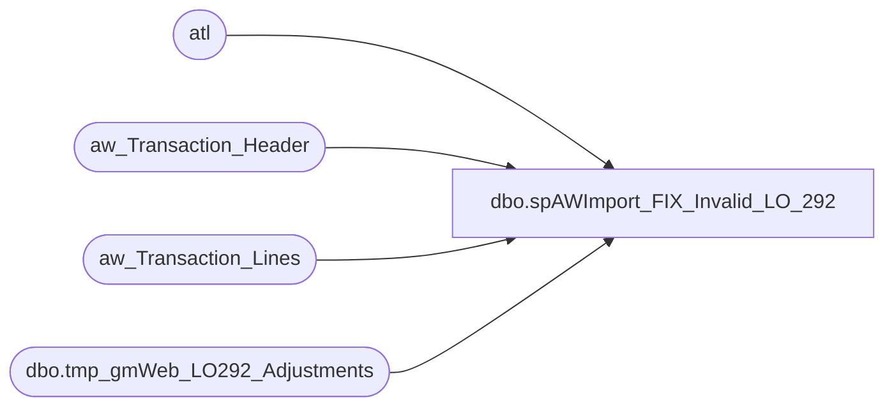

# dbo.spAWImport_FIX_Invalid_LO_292

**Database:** DWStaging  
**Server:** papamart  

## Architecture Diagram



## Table Dependencies

| Referenced Table |
|---|
| atl |
| aw_Transaction_Header |
| aw_Transaction_Lines |
| dbo.tmp_gmWeb_LO292_Adjustments |

## Stored Procedure Code

```sql
CREATE PROCEDURE [dbo].[spAWImport_FIX_Invalid_LO_292]
-- =============================================================================================================
-- Name: spAWImport_FIX_Invalid_LO_292
--
-- Description:	
--	This procedure will fix the line objects for 292 which were coded wrong in Audit Works. These will be changed
--		to line object 100
--
--
-- Input:		
--
-- Output: 
--
-- Dependencies: 
--
-- Revision History
--		Name:			Date:			Comments:
--		Gary Murrish	12/15/2014		Created
--		Tim Callahan	05/07/2024		With the decomission of the Queries DB, pointed any reference to DWstaging
-- =============================================================================================================
AS

	SET NOCOUNT ON
	-- Get all of the 292 lines

	-- Log of those changed
	--IF OBJECT_ID('queries.dbo.tmp_gmWeb_LO292_Adjustments') IS NOT NULL
	--BEGIN
	--	DROP TABLE queries.dbo.tmp_gmWeb_LO292_Adjustments
	--END

	IF OBJECT_ID('DWStaging.dbo.tmp_gmWeb_LO292_Adjustments') IS NOT NULL
	BEGIN
		DROP TABLE DWStaging.dbo.tmp_gmWeb_LO292_Adjustments
	END	


	SELECT
		atl.transaction_id,
		atl.line_id,
		ath.store_no,
		atl.line_object,
		atl.line_object_type,
		atl.gross_line_amount,
		atl.pos_discount_amount
	--INTO queries.dbo.tmp_gmWeb_LO292_Adjustments
	INTO DWStaging.dbo.tmp_gmWeb_LO292_Adjustments
	FROM
		aw_Transaction_Lines atl WITH (NOLOCK)
		INNER JOIN aw_Transaction_Header ath WITH (NOLOCK)
			ON atl.transaction_id = ath.transaction_id
	WHERE
		ath.transaction_date BETWEEN '12/10/2014' AND '12/22/2014'
		AND ath.store_no = 13
		AND atl.line_object = 292
		AND atl.reference_no = '022108'
		AND atl.line_action = 11


	UPDATE atl
		SET	line_object = 100,
			line_action = 1
	FROM
		aw_Transaction_Lines atl
		--INNER JOIN queries.dbo.tmp_gmWeb_LO292_Adjustments x WITH (NOLOCK)
		INNER JOIN DWStaging.dbo.tmp_gmWeb_LO292_Adjustments x WITH (NOLOCK)
			ON atl.transaction_id = x.transaction_id
			AND atl.line_id = x.line_id
```

