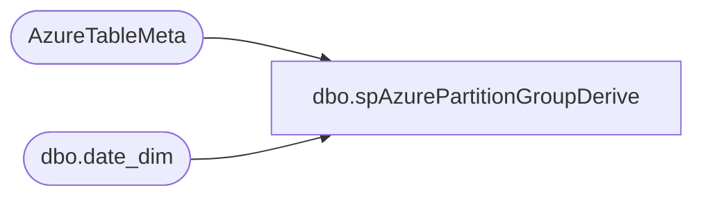

# dbo.spAzurePartitionGroupDerive

**Database:** DWStaging  
**Server:** papamart  

## Architecture Diagram



## Table Dependencies

| Referenced Table |
|---|
| AzureTableMeta |
| dbo.date_dim |

## Stored Procedure Code

```sql
CREATE proc [dbo].[spAzurePartitionGroupDerive]

as set nocount on


IF (Object_ID('DWStaging..tmpAzurePartitionGroups') IS NOT null) DROP TABLE tmpAzurePartitionGroups;
with
FiscalRanges as
 (
  select 
   concat(fiscal_year, right(('0' + cast(fiscal_period as varchar)),2)) as PartitionName,
   cast(min(actual_date) as date) as StartDate,
   cast(max(actual_date) as date) as StopDate,
   case 
    when cast(getdate() as date) between cast(min(actual_date) as date) and cast(max(actual_date) as date) 
     then 1 
    else 0
   end as CurrentPartition,
   case 
    when dateadd(m,-1, getdate()+15) between cast(min(actual_date) as date) and cast(max(actual_date) as date) 
     then 1 
    else 0 
   end as LMPartition,
   case 
    when getdate()-365 between cast(min(actual_date) as date) and cast(max(actual_date) as date) 
     then 1 
    else 0 
   end as LYPartition,
   case 
    when dateadd(m,-1, getdate()+15-365) between cast(min(actual_date) as date) and cast(max(actual_date) as date) 
     then 1 
    else 0 
   end as LYLMPartition
  from DW.dbo.date_dim
  where fiscal_Year Between 
   (
    Select Fiscal_year - 2 
    from dw.dbo.date_dim 
    where actual_date >= GetDate()-1 and actual_date < GetDate()
   )
   and  
   (
    Select Fiscal_year 
    from dw.dbo.date_dim 
    where actual_date >= GetDate()-1 and actual_date < GetDate()
   )
  and concat(fiscal_year, right(('0' + cast(fiscal_period as varchar)),2)) <= (select concat(fiscal_year, right(('0' + cast(fiscal_period as varchar)),2)) from dw.dbo.date_dim where datediff(dd, actual_date, getdate())=0)
  group by 
   concat(fiscal_year, right(('0' + cast(fiscal_period as varchar)),2))
 ),
TableTypes as
	(
		select
			TableName,
			case 
				when TableName in 
					(
						'Azure vwFcastDays',
						'Azure vwFcastMonths',
						'CatalogAttributes',
						'CategoryMap',
						'CRM_Data_Dictionary',
						'CurrencyExchangeFact',
						'Filter Products',
						'FWOSFactors',
						'NewDateDim',
						'Pricebooks',
						'Products',
						'ProductsStyleGroup',
						'SalesPlanFact',
						'StoreCompDim',
						'StoreList',
						'Stores'
					)
					then 'Dimension'
				when TableName in 
					( --MORNING LOAD TABLES 
						'GiftCardFact',
						'InventoryRollups',
						'merchonOrder',
						'MerchSales',
						'PoOnOrder',
						'ServiceDeskClosed',
						'ServiceDeskOpen',
						'StoreCount',
						'StoreInventory',
						'WHInventory',
						'FranchiseeMonthlyRoyalty',
						'FranchiseeTSPA',
						'GiftCardLocations',
						'PartyFact',
						'CRMtrendMonths',
						'CRMtrendQuarters',
						'WMS_cycleCount_accuracy',
						'WMS_cycleCount_accuracy2',
						'WMS_cycleCount_adjustments',
						'WMS_cycleCount_occurrence',
						'WebOrderTrueAttachmentConcatenatedSkus'
					)
					then 'MorningLoad'
				when TableName in 
					(
						'AWTransactionPostVoids',
						'CRMTransactionKeyStoryRanking',
						'CRMTransactionKeyStoryRankingPurchases',
						'CRMCustomerDim',
						'CRMCustomerMasterData',
						'CRMsurveyQuestions',
						'CRMsurveyResults',
						'CRMTransactionFact',
						'NameMeTransactionFact',
						'TrafficFact',
						'TransactionDetailFact',
						'TransactionFact',
						'DiscountFact',
						'EntepriseSellingFact',
						'EnterpriseSellingLifecycleFacts',
						'DailyInventory',
						'FlashGaapSales',
						'PCHealthChecks',
						'ShipFromStoresUnshipped',
						'SQLBackupsSummary',
						'UKLoyatly',
						'WebOrderInboundDemandTrackingFacts',
						'WebOrderInboundIntegrationTracking',
						'WebOrderOutboundIntegrationTracking',
						--'WMS_cycleCount_accuracy',
						--'WMS_cycleCount_accuracy2',
						--'WMS_cycleCount_adjustments',
						--'WMS_cycleCount_occurrence',
						'WebTransactions',
						'WebOrders',
						'WebOrderItems',
						'WebOrderShippingFacts',
						'WebShippingDiscounts'
					)
				then 'OnDemand'
				else
					'MorningLoad' --'Model' --we are never processing the 'model' in this scenario --all new tables should get caught with morningLoad
			end as TableType,
			Rows_count
		from DWStaging..AzureTableMeta
		group by TableName, Rows_Count
	),
Groups as
	(
		select distinct
			a.TableName, 
			tt.TableType,
			NTILE(4) OVER(partition by tt.TableType ORDER BY tt.Rows_count, /*a.TableName,*/ newid()) GroupNum,
			1 as PartitionedTable
		from DWStaging..AzureTableMeta a
		join TableTypes tt on a.TableName=tt.TableName
		cross join FiscalRanges x
		where 1=1
		and a.PartitionName<>'Partition' 
		and a.PartitionName not like 'Calculated%'
		and 
			(
				x.CurrentPartition=1
				or
				x.LMPartition=1
				or
				a.State<>1 --or x.State=3
			)
		group by tt.TableType, tt.rows_count, a.TableName
		UNION
		select distinct
			a.TableName,
			tt.TableType,
			NTILE(4) OVER(partition by tt.TableType ORDER BY tt.Rows_count, /*a.TableName,*/ newid()) GroupNum,
			0 as PartitionedTable
		from DWStaging..AzureTableMeta a
		join TableTypes tt on a.TableName=tt.TableName
		where 1=1
		and a.PartitionName='Partition' 
		and a.PartitionName not like 'Calculated%'
		group by tt.TableType, tt.rows_count, a.TableName
	),
PreStage as
	(
			select distinct
				a.TableName,
				a.PartitionName,
				dateadd(hh, -6, case when datepart(yyyy, PartitionRefreshedTime) = 1699 then NULL else cast(PartitionRefreshedTime as datetime) end) PartitionRefreshedTime,---5 during dst
				g.GroupNum,
				g.TableType,
				g.PartitionedTable,
				a.[state] PartitionState,
				x.StartDate,
				x.StopDate,
				x.CurrentPartition,
				x.LMPartition,
				x.LYPartition,
				x.LYLMPartition,
				a.Rows_Count as TotalTableRowCount
			from DWStaging..AzureTableMeta a
			join Groups g on a.TableName=g.Tablename
			join FiscalRanges x on x.PartitionName=right(a.PartitionName,6)
			where 1=1
			and a.PartitionName<>'Partition' 
			and a.PartitionName not like 'Calculated%'
			and 
				(
					x.CurrentPartition=1
					or
					x.LMPartition=1
					or
					a.State<>1 --or x.State=3
				)
			group by 
				a.TableName,
				a.PartitionName,
				dateadd(hh, -6, case when datepart(yyyy, PartitionRefreshedTime) = 1699 then NULL else cast(PartitionRefreshedTime as datetime) end),
				g.GroupNum,
				g.TableType,
				g.PartitionedTable,
				a.[state],
				x.StartDate,
				x.StopDate,
				x.CurrentPartition,
				x.LMPartition,
				x.LYPartition,
				x.LYLMPartition,
				a.Rows_Count
			UNION
			select distinct
				a.TableName,
				a.PartitionName,
				case when datepart(yyyy, PartitionRefreshedTime) = 1699 then NULL
					else dateadd(hh, -6, cast(PartitionRefreshedTime as datetime))
				end as PartitionRefreshedTime,
				g.GroupNum,
				g.TableType,
				g.PartitionedTable,
				a.[state],
				cast(getdate()-(365*3) as date) as StartDate,
				cast(getdate() as date) as StopDate,
				1 as CurrentPartition,
				1 as LMPartition,
				1 as LYPartition,
				1 as LYLMPartition,
				a.Rows_Count as TotalTableRowCount
			from DWStaging..AzureTableMeta a
			join Groups g on a.TableName=g.Tablename
			where 1=1
			and a.PartitionName='Partition' 
			and a.PartitionName not like 'Calculated%'
	)
select 
	TableName,	
	PartitionName,
	PartitionRefreshedTime,	
	GroupNum,	
	TableType,
	PartitionedTable,	
	PartitionState,	
	StartDate,	
	StopDate,	
	CurrentPartition,	
	LMPartition,	
	LYPartition,	
	LYLMPartition,	
	TotalTableRowCount,
	getdate() as InsertDate
into tmpAzurePartitionGroups
from PreStage
order by TableName, PartitionName desc
```

