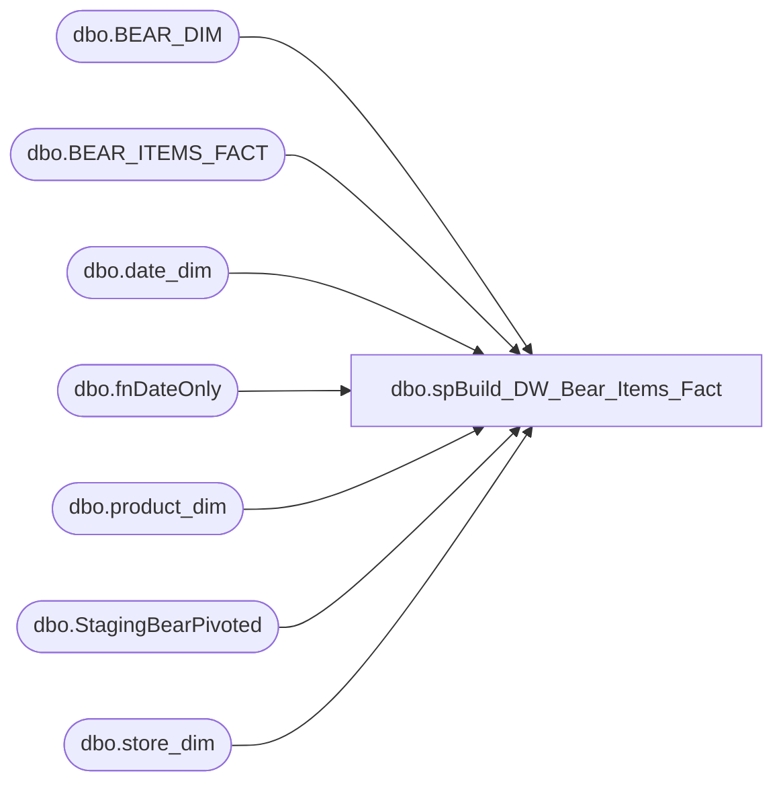

# dbo.spBuild_DW_Bear_Items_Fact

**Database:** DWStaging  
**Server:** papamart  

## Architecture Diagram



## Table Dependencies

| Referenced Table |
|---|
| dbo.BEAR_DIM |
| dbo.BEAR_ITEMS_FACT |
| dbo.date_dim |
| dbo.fnDateOnly |
| dbo.product_dim |
| dbo.StagingBearPivoted |
| dbo.store_dim |

## Stored Procedure Code

```sql
CREATE PROCEDURE [dbo].[spBuild_DW_Bear_Items_Fact]
-- =============================================================================================================
-- Name: spBuild_DW_Bear_Items_Fact
--
-- Description:	
--	This is Insert for the Bear_Items_Fact from the Enterprise return server
--
--
-- Input:		
--
-- Output: 
--
-- Dependencies: 
--
-- Revision History
--		Name:			Date:			Comments:
--		Gary Murrish	12/16/2013		Created

-- =============================================================================================================
AS

	SET NOCOUNT ON

	IF OBJECT_ID('tempdb..#tmpBears') IS NOT NULL
	BEGIN
		DROP TABLE #tmpBears
	END

	SELECT DISTINCT
		P.BearId,
		P.StoreNumber,
		P.ItemNumber,
		dw.dbo.fnDateOnly(P.TransactionDate) AS transaction_date
	INTO #tmpBears
	FROM
		dbo.StagingBearPivoted P WITH (NOLOCK)


	INSERT INTO dw.dbo.BEAR_ITEMS_FACT
		(	BEARKEY,
			product_key)
		SELECT
			BD.BEARKEY,
			pd.product_key
		FROM
			#tmpBears b WITH (NOLOCK)
			INNER JOIN dw.dbo.store_dim SD WITH (NOLOCK)
				ON b.StoreNumber = SD.store_id
			INNER JOIN dw.dbo.date_dim dd WITH (NOLOCK)
				ON dd.actual_date = b.transaction_date
			INNER JOIN dw.dbo.product_dim pd WITH (NOLOCK)
				ON b.ItemNumber = pd.sku
			INNER JOIN dw.dbo.BEAR_DIM BD WITH (NOLOCK)
				ON b.BearId = BD.BearId
				AND SD.store_key = BD.store_key
				AND dd.date_key = BD.date_key
				AND pd.product_key = BD.product_key
			LEFT JOIN dw.dbo.BEAR_ITEMS_FACT BIF WITH (NOLOCK)
				ON BD.BEARKEY = BIF.BEARKEY
				AND pd.product_key = BIF.product_key
		WHERE
			BIF.BearItemID IS NULL
```

