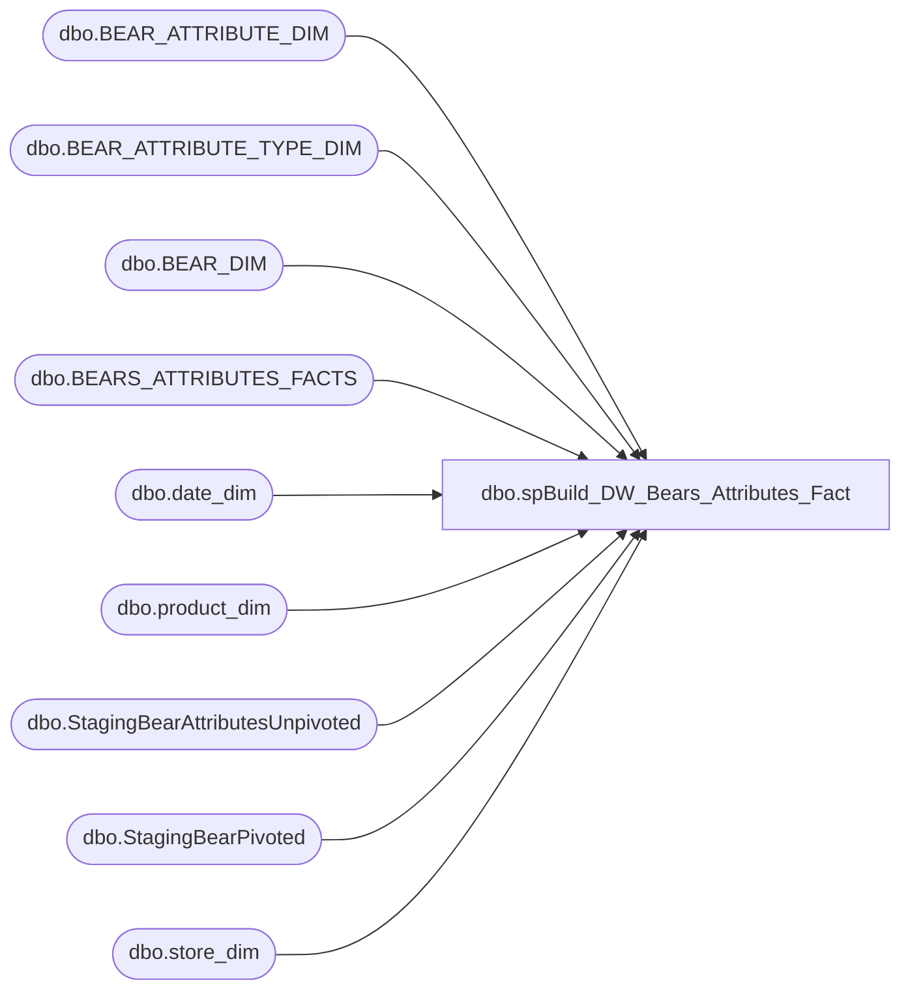

# dbo.spBuild_DW_Bears_Attributes_Fact

**Database:** DWStaging  
**Server:** papamart  

## Architecture Diagram



## Table Dependencies

| Referenced Table |
|---|
| dbo.BEAR_ATTRIBUTE_DIM |
| dbo.BEAR_ATTRIBUTE_TYPE_DIM |
| dbo.BEAR_DIM |
| dbo.BEARS_ATTRIBUTES_FACTS |
| dbo.date_dim |
| dbo.product_dim |
| dbo.StagingBearAttributesUnpivoted |
| dbo.StagingBearPivoted |
| dbo.store_dim |

## Stored Procedure Code

```sql
CREATE PROCEDURE [dbo].[spBuild_DW_Bears_Attributes_Fact]
-- =============================================================================================================
-- Name: spBuild_DW_Bears_Attributes_Fact
--
-- Description:	
--	This is Insert for the Bears_Attributes_Fact from the Enterprise return server
--
--
-- Input:		
--
-- Output: 
--
-- Dependencies: 
--
-- Revision History
--		Name:			Date:			Comments:
--		Gary Murrish	12/16/2013		Created

-- =============================================================================================================
AS

	SET NOCOUNT ON
	INSERT INTO dw.dbo.BEARS_ATTRIBUTES_FACTS
		(	BEARKEY,
			AttributeValueID)

		SELECT
			BD.BEARKEY,
			BAD.AttributeValueID
		FROM
			(SELECT DISTINCT
					P.BearId,
					P.StoreNumber,
					P.ItemNumber,
					DATEADD(DAY, DATEDIFF(DAY, 0, P.TransactionDate), 0) AS TransactionDate,
					U.AttributeType,
					UPPER(U.AttributeValue) AS AttributeValue
				FROM
					dbo.StagingBearPivoted P WITH (NOLOCK)
					INNER JOIN dbo.StagingBearAttributesUnpivoted U WITH (NOLOCK)
						ON P.StagingBearPivotedId = U.StagingBearPivotedId
					INNER JOIN dw.dbo.store_dim SD WITH (NOLOCK)
						ON P.StoreNumber = SD.store_id) base
			INNER JOIN dw.dbo.store_dim sd WITH (NOLOCK)
				ON base.StoreNumber = sd.store_id
			INNER JOIN dw.dbo.date_dim dd WITH (NOLOCK)
				ON base.TransactionDate = dd.actual_date
			INNER JOIN dw.dbo.product_dim pd WITH (NOLOCK)
				ON base.ItemNumber = pd.sku
			INNER JOIN dw.dbo.BEAR_DIM BD WITH (NOLOCK)
				ON base.BearId = BD.BearId
				AND sd.store_key = BD.store_key
				AND dd.date_key = BD.date_key
			INNER JOIN dw.dbo.BEAR_ATTRIBUTE_TYPE_DIM BATD WITH (NOLOCK)
				ON BATD.AttributeTypeName = base.AttributeType
			INNER JOIN dw.dbo.BEAR_ATTRIBUTE_DIM BAD WITH (NOLOCK)
				ON BAD.AttributeTypeID = BATD.AttributeTypeID
				AND BAD.AttributeValueName = base.AttributeValue
			LEFT JOIN dw.dbo.BEARS_ATTRIBUTES_FACTS BAF WITH (NOLOCK)
				ON BAD.AttributeValueID = BAF.AttributeValueID
				AND BD.BEARKEY = BAF.BEARKEY
		WHERE
			BAF.BearAttributeID IS NULL
```

