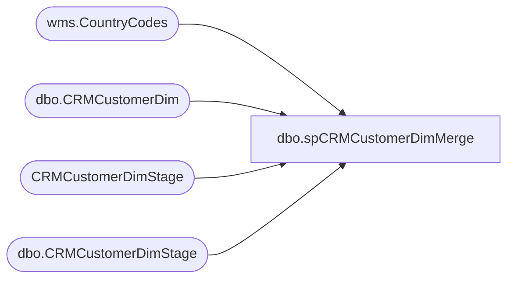

# dbo.spCRMCustomerDimMerge

**Database:** DWStaging  
**Server:** papamart  

## Architecture Diagram



## Table Dependencies

| Referenced Table |
|---|
| wms.CountryCodes |
| dbo.CRMCustomerDim |
| CRMCustomerDimStage |
| dbo.CRMCustomerDimStage |

## Stored Procedure Code

```sql
CREATE PROC [dbo].[spCRMCustomerDimMerge] as


-- =====================================================================================================
-- Name: spCRMCustomerDimMerge
--
--Description: Merges data from dwstaging.dbo.CRMCustomerDimStage into dw.dbo.CRMCustomerDim
--				
-- Revision History
--		Name:			Date:			Comments:
--		Dan Tweedie		09/19/2016		Created proc.	
--		Tim Bytnar		05/21/2018		Added SubscriberKey
--		Kelly Farrar	04/16/2019		Add HasPhoneNumber logic
--		Dan Tweedie		2021-03-04		Added more columns
--		Dan Tweedie		2022-08-10		Added cleanup handling 
--      Ian Wallace     2022-09-10      added logic for CountryCode to use UK for GB
--	    Ian Wallace     2022-11-15      added MembershipPlan
--	    Ian Wallace     2023-08-09      added OriginDate
-- =====================================================================================================


IF (Object_ID('tempdb..#countryCodes') IS NOT NULL) DROP TABLE #countryCodes;
select *
into #countryCodes
from [stl-ssis-p-01].IntegrationStaging.wms.CountryCodes


set nocount on

if (select count(*) from dwstaging.dbo.CRMCustomerDimStage) > 0

BEGIN

	declare 
		@Output table 
			(
				Action varchar(10),
				CustomerNumber1 varchar(20),
				CustomerNumber2 varchar(20)
			)

	MERGE into dw.dbo.CRMCustomerDim as target
	using (
			select distinct
				c.CustomerID,	
				c.CustomerNumber,	
				c.MembershipDate,
				c.OriginDate,
				c.Gender,	
				c.BirthDate,	
				c.LanguageCode,	
				c.CRMUpdateDate,	
				c.StoreKey,	
				--isnull(cc.CountryCode2D, 'US') CountryCode,
					case when cc.CountryCode2D is null then 'US'
				     when cc.CountryCode2D = 'GB' then 'UK'
					 else cc.CountryCode2D end as CountryCode,
				--c.PostalCode,	
				CAST(REPLACE(REPLACE(REPLACE(REPLACE(REPLACE(REPLACE(REPLACE(REPLACE(REPLACE(REPLACE(REPLACE(REPLACE(REPLACE(REPLACE(REPLACE(REPLACE(REPLACE(REPLACE(c.PostalCode,
				'"',' '),'à', 'a'),'è', 'e'),'ì', 'i'),'ò', 'o'),'ù', 'u'),'ç', 'c'),',',' '),'"',' '),'''',' '),'“', ''),'‚',''),CHAR(13), ''),CHAR(10), ''),CHAR(9), ''),'"', ''),'“', ''),'”', '') as nvarchar(50)) as PostalCode,

				c.PointsEligible,	
				c.MembershipType,	
				c.MembershipPlan,
				c.InsertedDate,
				c.ETLLogID,	
				c.ETLEventID,	
				c.Emailable,	
				
				case 
				 when c.SubscriberKey like '%@aolcom'		then	replace(c.SubscriberKey, '@aolcom', '@aol.com')		
				 when c.SubscriberKey like '%@aol'			then	replace(c.SubscriberKey, '@aol', '@aol.com')		
				 when c.SubscriberKey like '%@hotmail.'		then	replace(c.SubscriberKey, '@hotmail.', '@hotmail.com')	
				 when c.SubscriberKey like '%@hotmail'		then	replace(c.SubscriberKey, '@hotmail', '@hotmail.com')	
				 when c.SubscriberKey like '%@comcast'		then	replace(c.SubscriberKey, '@comcast', '@comcast.com')	
				 when c.SubscriberKey like '%@outlook,com'	then	replace(c.SubscriberKey, '@outlook,com', '@outlook.com')
				 when c.SubscriberKey like '%@outlookcom'	then	replace(c.SubscriberKey, '@outlookcom', '@outlook.com')
				 when c.SubscriberKey like '%@outlook'		then	replace(c.SubscriberKey, '@outlook', '@outlook.com')	
				 when c.SubscriberKey like '%@icloud,com'	then	replace(c.SubscriberKey, '@icloud,com', '@icloud.com')
				 when c.SubscriberKey like '%@icloud'		then	replace(c.SubscriberKey, '@icloudcom', '@icloud.com')	
				 when c.SubscriberKey like '%@icloud'		then	replace(c.SubscriberKey, '@icloud', '@icloud.com')	
				 when c.SubscriberKey like '%@yahoo,com'	then	replace(c.SubscriberKey, '@yahoo,com', '@yahoo.com')
				 when c.SubscriberKey like '%@yahoocom'		then	replace(c.SubscriberKey, '@yahoocom', '@yahoo.com')	
				 when c.SubscriberKey like '%@yahoo'		then	replace(c.SubscriberKey, '@yahoo', '@yahoo.com')		
				 when c.SubscriberKey like '%@gmail,com'	then	replace(c.SubscriberKey, '@gmail,com', '@gmail.com')
				 when c.SubscriberKey like '%@gmailcom'		then	replace(c.SubscriberKey, '@gmailcom', '@gmail.com')	
				 when c.SubscriberKey like '%@gmail'		then	replace(c.SubscriberKey, '@gmail', '@gmail.com')
				 when left(c.SubscriberKey,1)='@'			then	NULL
				else c.SubscriberKey end as SubscriberKey,

				c.DirectMailOptIn,	
				c.HasPhoneNumber,	
				c.Locale,	
				c.TextOptIn,	
				c.PhoneNumber,	
				c.EmailOptInDate,
				
				case 
				 when c.EmailAddress like '%@aolcom'		then	replace(c.EmailAddress, '@aolcom', '@aol.com')			
				 when c.EmailAddress like '%@aol'			then	replace(c.EmailAddress, '@aol', '@aol.com')		
				 when c.EmailAddress like '%@hotmail.'		then	replace(c.EmailAddress, '@hotmail.', '@hotmail.com')	
				 when c.EmailAddress like '%@hotmail'		then	replace(c.EmailAddress, '@hotmail', '@hotmail.com')		
				 when c.EmailAddress like '%@comcast'		then	replace(c.EmailAddress, '@comcast', '@comcast.com')		
				 when c.EmailAddress like '%@outlook,com'	then	replace(c.EmailAddress, '@outlook,com', '@outlook.com')	
				 when c.EmailAddress like '%@outlookcom'	then	replace(c.EmailAddress, '@outlookcom', '@outlook.com')	
				 when c.EmailAddress like '%@outlook'		then	replace(c.EmailAddress, '@outlook', '@outlook.com')		
				 when c.EmailAddress like '%@icloud,com'	then	replace(c.EmailAddress, '@icloud,com', '@icloud.com')
				 when c.EmailAddress like '%@icloud'		then	replace(c.EmailAddress, '@icloudcom', '@icloud.com')		
				 when c.EmailAddress like '%@icloud'		then	replace(c.EmailAddress, '@icloud', '@icloud.com')	
				 when c.EmailAddress like '%@yahoo,com'		then	replace(c.EmailAddress, '@yahoo,com', '@yahoo.com')
				 when c.EmailAddress like '%@yahoocom'		then	replace(c.EmailAddress, '@yahoocom', '@yahoo.com')		
				 when c.EmailAddress like '%@yahoo'			then	replace(c.EmailAddress, '@yahoo', '@yahoo.com')		
				 when c.EmailAddress like '%@gmail,com'		then	replace(c.EmailAddress, '@gmail,com', '@gmail.com')
				 when c.EmailAddress like '%@gmailcom'		then	replace(c.EmailAddress, '@gmailcom', '@gmail.com')		
				 when c.EmailAddress like '%@gmail'			then	replace(c.EmailAddress, '@gmail', '@gmail.com')
				 when left(c.EmailAddress,1)='@'			then	NULL
				else c.EmailAddress end as EmailAddress,

				c.ClubStatus,	
				c.CurrentRewardPoints,	
				c.SignUpSource,	
				CAST(REPLACE(REPLACE(REPLACE(REPLACE(REPLACE(REPLACE(REPLACE(REPLACE(REPLACE(REPLACE(REPLACE(REPLACE(REPLACE(REPLACE(REPLACE(REPLACE(REPLACE(REPLACE(c.address_1,
					'"',' '),'à', 'a'),'è', 'e'),'ì', 'i'),'ò', 'o'),'ù', 'u'),'ç', 'c'),',',' '),'"',' '),'''',' '),'“', ''),'‚',''),CHAR(13), ''),CHAR(10), ''),CHAR(9), ''),'"', ''),'“', ''),'”', '') as nvarchar(50)) as address_1,


				CAST(REPLACE(REPLACE(REPLACE(REPLACE(REPLACE(REPLACE(REPLACE(REPLACE(REPLACE(REPLACE(REPLACE(REPLACE(REPLACE(REPLACE(REPLACE(REPLACE(REPLACE(REPLACE(c.address_2,
				'"',' '),'à', 'a'),'è', 'e'),'ì', 'i'),'ò', 'o'),'ù', 'u'),'ç', 'c'),',',' '),'"',' '),'''',' '),'“', ''),'‚',''),CHAR(13), ''),CHAR(10), ''),CHAR(9), ''),'"', ''),'“', ''),'”', '') as nvarchar(50)) as address_2,


				CAST(REPLACE(REPLACE(REPLACE(REPLACE(REPLACE(REPLACE(REPLACE(REPLACE(REPLACE(REPLACE(REPLACE(REPLACE(REPLACE(REPLACE(REPLACE(REPLACE(REPLACE(REPLACE(c.address_3,
				'"',' '),'à', 'a'),'è', 'e'),'ì', 'i'),'ò', 'o'),'ù', 'u'),'ç', 'c'),',',' '),'"',' '),'''',' '),'“', ''),'‚',''),CHAR(13), ''),CHAR(10), ''),CHAR(9), ''),'"', ''),'“', ''),'”', '') as nvarchar(50)) as address_3,


				CAST(REPLACE(REPLACE(REPLACE(REPLACE(REPLACE(REPLACE(REPLACE(REPLACE(REPLACE(REPLACE(REPLACE(REPLACE(REPLACE(REPLACE(REPLACE(REPLACE(REPLACE(REPLACE(c.address_4,
				'"',' '),'à', 'a'),'è', 'e'),'ì', 'i'),'ò', 'o'),'ù', 'u'),'ç', 'c'),',',' '),'"',' '),'''',' '),'“', ''),'‚',''),CHAR(13), ''),CHAR(10), ''),CHAR(9), ''),'"', ''),'“', ''),'”', '') as nvarchar(50)) as address_4,

				c.hasOnlineAccount,	
				c.isBonusClubMember,	
				c.LifetimeTotalPointsEarned,	
				--c.FirstName,	
				--case when c.LastName is NULL then 'BABGuest' else c.LastName end as LastName

				case when c.FirstName is NULL or c.FirstName='-' or c.FirstName='' or c.FirstName not like '%[^0-9]%' or c.FirstName not like '%[^0-9]%' or isnumeric(c.FirstName)=1 or left(c.FirstName,1)='-'
					then 'BABGuest'
				else
				CAST(REPLACE(REPLACE(REPLACE(REPLACE(REPLACE(REPLACE(REPLACE(REPLACE(REPLACE(REPLACE(REPLACE(REPLACE(REPLACE(REPLACE(REPLACE(REPLACE(REPLACE(REPLACE(c.FirstName,
				'"',' '),'à', 'a'),'è', 'e'),'ì', 'i'),'ò', 'o'),'ù', 'u'),'ç', 'c'),',',' '),'"',' '),'''',' '),'“', ''),'‚',''),CHAR(13), ''),CHAR(10), ''),CHAR(9), ''),'"', ''),'“', ''),'”', '') as nvarchar(100)) end as FirstName,

				case when c.LastName is NULL or c.LastName='-' or c.LastName='' or c.LastName not like '%[^0-9]%' or c.LastName not like '%[^0-9]%' or isnumeric(c.LastName)=1 or left(c.LastName,1)='-'
					then 'BABGuest'
				else 
				CAST(REPLACE(REPLACE(REPLACE(REPLACE(REPLACE(REPLACE(REPLACE(REPLACE(REPLACE(REPLACE(REPLACE(REPLACE(REPLACE(REPLACE(REPLACE(REPLACE(REPLACE(REPLACE(c.LastName,
				'"',' '),'à', 'a'),'è', 'e'),'ì', 'i'),'ò', 'o'),'ù', 'u'),'ç', 'c'),',',' '),'"',' '),'''',' '),'“', ''),'‚',''),CHAR(13), ''),CHAR(10), ''),CHAR(9), ''),'"', ''),'“', ''),'”', '') as nvarchar(100)) end as LastName
				--MembershipPlan
			from dwstaging.dbo.CRMCustomerDimStage c 
			left join #CountryCodes cc on c.CountryCode=cc.CountryCode3D
		  ) as source
		--using CRMCustomerDimStage as source
		on
			(
				target.CustomerID=source.CustomerID
			)
	
		when matched
			and target.DataSource <> 'Salesforce'
			and
				(
					--isnull(target.CustomerID, 0) <> isnull(source.CustomerID,0) OR
					isnull(target.CustomerNumber,'x')<>isnull(source.CustomerNumber,'x') OR
					isnull(target.MembershipDate, '') <> isnull(source.MembershipDate, '') OR
					isnull(target.OriginDate, '') <> isnull(source.OriginDate, '') OR
					isnull(target.Gender, '') <> isnull(source.Gender, '') OR
					isnull(target.BirthDate, '') <> isnull(source.BirthDate, '') OR
					isnull(target.LanguageCode, '') <> isnull(source.LanguageCode, '') OR
					isnull(target.CRMUpdateDate, '') <> isnull(source.CRMUpdateDate, '') OR
					isnull(target.StoreKey, 0) <> isnull(source.StoreKey, 0) OR
					isnull(target.CountryCode, '') <> isnull(source.CountryCode, '') OR
					isnull(target.PostalCode, '') <> isnull(source.PostalCode, '') OR
					isnull(target.PointsEligible, 0) <> isnull(source.PointsEligible, 0) OR
					isnull(target.MembershipType, '') <> isnull(source.MembershipType, '') OR 
					isnull(target.MembershipPlan, '') <> isnull(source.MembershipPlan, '') OR 
					isnull(target.Emailable, 0) <> isnull(source.Emailable, 0) OR 
					isnull(target.SubscriberKey, 0) <> isnull(source.SubscriberKey, 0) OR 
					isnull(target.DirectMailOptIn,9) <> isnull(source.DirectMailOptIn,9) OR 
					isnull(target.HasPhoneNumber, 9) <> isnull(source.HasPhoneNumber, 9) or
					isnull(target.Locale,'x')<>isnull(source.Locale,'x') or
					isnull(target.TextOptIn,0)<>isnull(source.TextOptIn,0) or
					isnull(target.PhoneNumber,'x')<>isnull(source.PhoneNumber,'x') or
					isnull(target.EmailOptInDate,getdate()) <>isnull(source.EmailOptInDate,getdate()) or
					isnull(target.EmailAddress,'x')<>isnull(source.EmailAddress,'x') or
					isnull(target.ClubStatus,'x')<>isnull(source.ClubStatus,'x') or
					isnull(target.CurrentRewardPoints,0)<>isnull(source.CurrentRewardPoints,0) or
					isnull(target.SignUpSource,'x') <>isnull(source.SignUpSource,'x') or
					isnull(target.address_1,'x')<>isnull(source.address_1,'x') or
					isnull(target.address_2,'x')<>isnull(source.address_2,'x') or
					isnull(target.address_3,'x')<>isnull(source.address_3,'x') or
					isnull(target.address_4,'x')<>isnull(source.address_4,'x') or
					isnull(target.hasOnlineAccount,0)<>isnull(source.hasOnlineAccount,0) or
					isnull(target.isBonusClubMember,0)<>isnull(source.isBonusClubMember,0) or
					isnull(target.LifetimeTotalPointsEarned,0)<>isnull(source.LifetimeTotalPointsEarned,0) or 
					isnull(target.FirstName,'x')<>isnull(source.FirstName,'x') or
					isnull(target.LastName,'x')<>isnull(source.LastName,'x') or
					isnull(target.MembershipPlan,'x')<>isnull(source.MembershipPlan,'x')
				)
				then UPDATE
					set
						--target.CustomerID = source.CustomerID,
						target.CustomerNumber=source.CustomerNumber,
						target.MembershipDate = source.MembershipDate,
						target.OriginDate = source.OriginDate,
						target.Gender = source.Gender,
						target.BirthDate = source.BirthDate,
						target.LanguageCode = source.LanguageCode,
						target.CRMUpdateDate = source.CRMUpdateDate,
						target.StoreKey = source.StoreKey,
						target.CountryCode = source.CountryCode,
						target.PostalCode = source.PostalCode,
						target.PointsEligible = source.PointsEligible,
						target.MembershipType = source.MembershipType,
						target.MembershipPlan = source.MembershipPlan,
						target.Emailable = source.Emailable,
						target.SubscriberKey = source.SubscriberKey,
						target.DirectMailOptIn = source.DirectMailOptIn,
						target.HasPhoneNumber = source.HasPhoneNumber,
						target.UpdatedDate = source.InsertedDate,
						target.UpdatedBy = 'spCRMCustomerDimMerge',
						target.Locale=source.Locale,
						target.TextOptIn=source.TextOptIn,
						target.PhoneNumber=source.PhoneNumber,
						target.EmailOptInDate=source.EmailOptInDate,
						target.EmailAddress=source.EmailAddress,
						target.ClubStatus=source.ClubStatus,
						target.CurrentRewardPoints=source.CurrentRewardPoints,
						target.SignUpSource=source.SignUpSource,
						target.address_1=source.address_1,
						target.address_2=source.address_2,
						target.address_3=source.address_3,
						target.address_4=source.address_4,
						target.hasOnlineAccount=source.hasOnlineAccount,
						target.isBonusClubMember=source.isBonusClubMember,
						target.LifetimeTotalPointsEarned=source.LifetimeTotalPointsEarned,
						target.FirstName=source.FirstName,
						target.LastName=source.LastName
						--target.MembershipPlan=source.MembershipPlan
	
		when not matched by target
			then insert
				(
					CustomerID,
					CustomerNumber,
					MembershipDate,
					OriginDate,
					Gender,
					BirthDate,
					LanguageCode,
					CRMUpdateDate,
					StoreKey,
					CountryCode,
					PostalCode,
					PointsEligible,
					MembershipType,
					MembershipPlan,
					Emailable,
					SubscriberKey,
					DirectMailOptIn,
					HasPhoneNumber,
					InsertedDate,
					UpdatedDate,
					InsertedBy,
					UpdatedBy,
					ETLLogID,
					ETLEventID,
					Locale,
					TextOptIn,
					PhoneNumber,
					EmailOptInDate,
					EmailAddress,
					ClubStatus,
					CurrentRewardPoints,
					SignUpSource,
					address_1,
					address_2,
					address_3,
					address_4,
					hasOnlineAccount,
					isBonusClubMember,
					LifetimeTotalPointsEarned,
					FirstName,
					LastName,
					DataSource
					--MembershipPlan
					
				)
			values
				(
					source.CustomerID,
					source.CustomerNumber,
					source.MembershipDate,
					source.OriginDate,
					source.Gender,
					source.BirthDate,
					source.LanguageCode,
					source.CRMUpdateDate,
					source.StoreKey,
					source.CountryCode,
					source.PostalCode,
					source.PointsEligible,
					source.MembershipType,
					source.MembershipPlan,
					source.Emailable,
					source.SubscriberKey,
					source.DirectMailOptIn,
					source.HasPhoneNumber,
					source.InsertedDate,
					NULL,
					'spCRMCustomerDimMerge',
					NULL,
					source.ETLLogID,
					source.ETLEventID,
					source.Locale,
					source.TextOptIn,
					source.PhoneNumber,
					source.EmailOptInDate,
					source.EmailAddress,
					source.ClubStatus,
					source.CurrentRewardPoints,
					source.SignUpSource,
					source.address_1,
					source.address_2,
					source.address_3,
					source.address_4,
					source.hasOnlineAccount,
					source.isBonusClubMember,
					source.LifetimeTotalPointsEarned,
					source.FirstName,
					source.LastName,
					'Aptos'
					--source.MembershipPlan
					
				)			

		OUTPUT 
			$action, 
			inserted.CustomerNumber, 
			deleted.CustomerNumber
			into @Output


	; --A MERGE statement must be terminated by a semi-colon (;).		
	
		
		with MergeOutput as
			(
				select 
					InsertedRows = (select count(*) from @Output where Action = 'INSERT'), 
					UpdatedRows = 0
				UNION 
				select 
					InsertedRows = 0, 
					UpdatedRows = (select count(*) from @Output where Action = 'UPDATE')
			),
		ValidationStatus as
			(
				select case when count(*) = 0 then 1 else 0 end as ValidationStatus 
				from CRMCustomerDimStage s 
				where not exists 
					(
						select d.CustomerID 
						from DW.dbo.CRMCustomerDim d with (nolock)
						where 
							isnull(d.CustomerID, 0) = isnull(s.CustomerID, 0)
							and isnull(d.CustomerNumber, '') = isnull(s.CustomerNumber,'')
							and isnull(d.MembershipDate, '') = isnull(s.MembershipDate, '')
							and isnull(d.OriginDate, '') = isnull(s.OriginDate, '')
							and isnull(d.Gender, '') = isnull(s.Gender, '')
							and isnull(d.BirthDate, '') = isnull(s.BirthDate, '')
							and isnull(d.LanguageCode, '') = isnull(s.LanguageCode, '')
							and isnull(d.CRMUpdateDate, '') = isnull(s.CRMUpdateDate, '')
							and isnull(d.StoreKey, 0) = isnull(s.StoreKey, 0)
							--and isnull(d.CountryCode, '') = isnull(s.CountryCode, '')
							--and isnull(d.PostalCode, '') = isnull(s.PostalCode, '')
							and isnull(d.PointsEligible, 0) = isnull(s.PointsEligible, 0)
							and isnull(d.MembershipType, '') = isnull(s.MembershipType, '') 
							and isnull(d.MembershipPlan, '') = isnull(s.MembershipPlan, '') 
							and isnull(d.Emailable, 0) = isnull(s.Emailable, 0) 
							--and isnull(d.SubscriberKey, 0) = isnull(s.SubscriberKey, 0) 
							and isnull(d.DirectMailOptIn,9) = isnull(s.DirectMailOptIn,9)
							and isnull(d.HasPhoneNumber, 9) = isnull(s.HasPhoneNumber, 9) 
							and isnull(d.Locale,'x')=isnull(s.Locale,'x') 
							and isnull(d.TextOptIn,0)=isnull(s.TextOptIn,0) 
							and isnull(d.PhoneNumber,'x')=isnull(s.PhoneNumber,'x') 
							and isnull(d.EmailOptInDate,getdate()) =isnull(s.EmailOptInDate,getdate()) 
							--and isnull(d.EmailAddress,'x')=isnull(s.EmailAddress,'x') 
							and isnull(d.ClubStatus,'x')=isnull(s.ClubStatus,'x') 
							and isnull(d.CurrentRewardPoints,0)=isnull(s.CurrentRewardPoints,0) 
							and isnull(d.SignUpSource,'x') =isnull(s.SignUpSource,'x') 
							--and isnull(d.address_1,'x')=isnull(s.address_1,'x') 
							--and isnull(d.address_2,'x')=isnull(s.address_2,'x') 
							--and isnull(d.address_3,'x')=isnull(s.address_3,'x') 
							--and isnull(d.address_4,'x')=isnull(s.address_4,'x') 
							and isnull(d.hasOnlineAccount,0)=isnull(s.hasOnlineAccount,0)
							and isnull(d.isBonusClubMember,0)=isnull(s.isBonusClubMember,0)
							and isnull(d.LifetimeTotalPointsEarned,0)=isnull(s.LifetimeTotalPointsEarned,0) 
							--and isnull(d.FirstName,'x')=isnull(s.FirstName,'x')
							--and isnull(d.LastName,'x')=isnull(s.LastName,'x')
							and isnull(d.MembershipPlan,'x')=isnull(s.MembershipPlan,'x')
					)
		) 
		select 
			sum(m.InsertedRows) as InsertedRows,
			sum(m.UpdatedRows) as UpdatedRows,
			v.ValidationStatus
		from
			MergeOutput m
			cross join ValidationStatus v
		group by v.ValidationStatus

END
				
else

begin
	select 0 as InsertedRows, 0 as UpdatedRows, 1 as ValidationStatus
end
```

