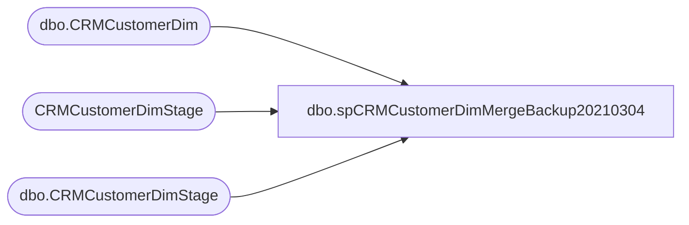

# dbo.spCRMCustomerDimMergeBackup20210304

**Database:** DWStaging  
**Server:** papamart  

## Architecture Diagram



## Table Dependencies

| Referenced Table |
|---|
| dbo.CRMCustomerDim |
| CRMCustomerDimStage |
| dbo.CRMCustomerDimStage |

## Stored Procedure Code

```sql
CREATE PROC [dbo].[spCRMCustomerDimMergeBackup20210304] as


-- =====================================================================================================
-- Name: spCRMCustomerDimMerge
--
--Description: Merges data from dwstaging.dbo.CRMCustomerDimStage into dw.dbo.CRMCustomerDim
--				
-- Revision History
--		Name:			Date:			Comments:
--		Dan Tweedie		09/19/2016		Created proc.	
--		Tim Bytnar		05/21/2018		Added SubscriberKey
--		Kelly Farrar	04/16/2019		Add HasPhoneNumber logic
-- =====================================================================================================


set nocount on

if (select count(*) from dwstaging.dbo.CRMCustomerDimStage) > 0

BEGIN

	declare 
		@Output table 
			(
				Action varchar(10),
				CustomerNumber1 varchar(20),
				CustomerNumber2 varchar(20)
			)

	MERGE into dw.dbo.CRMCustomerDim as target
		using
			(
				select
					CustomerID,
					CustomerNumber,
					MembershipDate,
					Gender,
					BirthDate,
					LanguageCode,
					CRMUpdateDate,
					StoreKey,
					CountryCode,
					PostalCode,
					PointsEligible,
					MembershipType,
					Emailable,
					SubscriberKey,
					DirectMailOptIn,
					HasPhoneNumber,
					ETLLogID,
					ETLEventID,
					InsertedDate
				from
					dwstaging.dbo.CRMCustomerDimStage 
			) as source
		on
			(
				--target.CustomerNumber = source.CustomerNumber
				target.CustomerID=source.CustomerID
			)
	
		when matched
			and
				(
					--isnull(target.CustomerID, 0) <> isnull(source.CustomerID,0) OR
					isnull(target.CustomerNumber,'x')<>isnull(source.CustomerNumber,'x') OR
					isnull(target.MembershipDate, '') <> isnull(source.MembershipDate, '') OR
					isnull(target.Gender, '') <> isnull(source.Gender, '') OR
					isnull(target.BirthDate, '') <> isnull(source.BirthDate, '') OR
					isnull(target.LanguageCode, '') <> isnull(source.LanguageCode, '') OR
					isnull(target.CRMUpdateDate, '') <> isnull(source.CRMUpdateDate, '') OR
					isnull(target.StoreKey, 0) <> isnull(source.StoreKey, 0) OR
					isnull(target.CountryCode, '') <> isnull(source.CountryCode, '') OR
					isnull(target.PostalCode, '') <> isnull(source.PostalCode, '') OR
					isnull(target.PointsEligible, 0) <> isnull(source.PointsEligible, 0) OR
					isnull(target.MembershipType, '') <> isnull(source.MembershipType, '') OR 
					isnull(target.Emailable, 0) <> isnull(source.Emailable, 0) OR 
					isnull(target.SubscriberKey, 0) <> isnull(source.SubscriberKey, 0) OR 
					isnull(target.DirectMailOptIn,9) <> isnull(source.DirectMailOptIn,9) OR 
					isnull(target.HasPhoneNumber, 9) <> isnull(source.HasPhoneNumber, 9)
				)
				then UPDATE
					set
						--target.CustomerID = source.CustomerID,
						target.CustomerNumber=source.CustomerNumber,
						target.MembershipDate = source.MembershipDate,
						target.Gender = source.Gender,
						target.BirthDate = source.BirthDate,
						target.LanguageCode = source.LanguageCode,
						target.CRMUpdateDate = source.CRMUpdateDate,
						target.StoreKey = source.StoreKey,
						target.CountryCode = source.CountryCode,
						target.PostalCode = source.PostalCode,
						target.PointsEligible = source.PointsEligible,
						target.MembershipType = source.MembershipType,
						target.Emailable = source.Emailable,
						target.SubscriberKey = source.SubscriberKey,
						target.DirectMailOptIn = source.DirectMailOptIn,
						target.HasPhoneNumber = source.HasPhoneNumber,
						target.UpdatedDate = source.InsertedDate,
						target.UpdatedBy = 'spCRMCustomerDimMerge'
	
		when not matched by target
			then insert
				(
					CustomerID,
					CustomerNumber,
					MembershipDate,
					Gender,
					BirthDate,
					LanguageCode,
					CRMUpdateDate,
					StoreKey,
					CountryCode,
					PostalCode,
					PointsEligible,
					MembershipType,
					Emailable,
					SubscriberKey,
					DirectMailOptIn,
					HasPhoneNumber,
					InsertedDate,
					UpdatedDate,
					InsertedBy,
					UpdatedBy,
					ETLLogID,
					ETLEventID
				)
			values
				(
					source.CustomerID,
					source.CustomerNumber,
					source.MembershipDate,
					source.Gender,
					source.BirthDate,
					source.LanguageCode,
					source.CRMUpdateDate,
					source.StoreKey,
					source.CountryCode,
					source.PostalCode,
					source.PointsEligible,
					source.MembershipType,
					source.Emailable,
					source.SubscriberKey,
					source.DirectMailOptIn,
					source.HasPhoneNumber,
					source.InsertedDate,
					NULL,
					'spCRMCustomerDimMerge',
					NULL,
					source.ETLLogID,
					source.ETLEventID
				)			

		OUTPUT 
			$action, 
			inserted.CustomerNumber, 
			deleted.CustomerNumber
			into @Output


	; --A MERGE statement must be terminated by a semi-colon (;).		
	
		
		with MergeOutput as
			(
				select 
					InsertedRows = (select count(*) from @Output where Action = 'INSERT'), 
					UpdatedRows = 0
				UNION 
				select 
					InsertedRows = 0, 
					UpdatedRows = (select count(*) from @Output where Action = 'UPDATE')
			),
		ValidationStatus as
			(
				select case when count(*) = 0 then 1 else 0 end as ValidationStatus 
				from CRMCustomerDimStage s 
				where not exists 
					(
						select d.CustomerID 
						from DW.dbo.CRMCustomerDim d with (nolock)
						where 
							isnull(d.CustomerID, 0) = isnull(s.CustomerID, 0)
							and isnull(d.CustomerNumber, '') = isnull(s.CustomerNumber,'')
							and isnull(d.MembershipDate, '') = isnull(s.MembershipDate, '')
							and isnull(d.Gender, '') = isnull(s.Gender, '')
							and isnull(d.BirthDate, '') = isnull(s.BirthDate, '')
							and isnull(d.LanguageCode, '') = isnull(s.LanguageCode, '')
							and isnull(d.CRMUpdateDate, '') = isnull(s.CRMUpdateDate, '')
							and isnull(d.StoreKey, 0) = isnull(s.StoreKey, 0)
							and isnull(d.CountryCode, '') = isnull(s.CountryCode, '')
							and isnull(d.PostalCode, '') = isnull(s.PostalCode, '')
							and isnull(d.PointsEligible, 0) = isnull(s.PointsEligible, 0)
							and isnull(d.MembershipType, '') = isnull(s.MembershipType, '') 
							and isnull(d.Emailable, 0) = isnull(s.Emailable, 0) 
							and isnull(d.SubscriberKey, 0) = isnull(s.SubscriberKey, 0) 
							and isnull(d.DirectMailOptIn,9) = isnull(s.DirectMailOptIn,9)
							and isnull(d.HasPhoneNumber, 9) = isnull(s.HasPhoneNumber, 9) 
					)
		) 
		select 
			sum(m.InsertedRows) as InsertedRows,
			sum(m.UpdatedRows) as UpdatedRows,
			v.ValidationStatus
		from
			MergeOutput m
			cross join ValidationStatus v
		group by v.ValidationStatus

END
				
else

begin
	select 0 as InsertedRows, 0 as UpdatedRows, 1 as ValidationStatus
end
```

