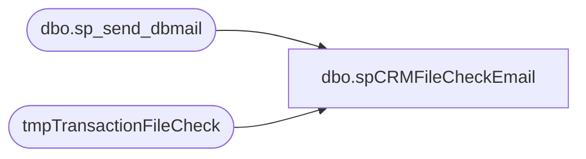

# dbo.spCRMFileCheckEmail

**Database:** DWStaging  
**Server:** papamart  

## Architecture Diagram



## Table Dependencies

| Referenced Table |
|---|
| dbo.sp_send_dbmail |
| tmpTransactionFileCheck |

## Stored Procedure Code

```sql
CREATE proc [dbo].[spCRMFileCheckEmail] 
@FilePath varchar(1000) 


as

set nocount on;

with 
FileTypes as
	(
		select 'CIM_header.txt' as FileType
		UNION
		select 'CIM_detail.txt' as FileType
		UNION
		select 'CIM_tender.txt' as FileType
		--UNION
		--select 'CUST.dat' as FileType
		--UNION
		--select 'Attr.dat' as FileType
	),
MaxFiles as
	(
		select 
			ft.FileType,
			Max(fc.FullFileName) as MaxFile
		from FileTypes ft
		left join tmpTransactionFileCheck fc 
			on ft.FileType = case when ft.FileType in ('CIM_header.txt','CIM_detail.txt', 'CIM_tender.txt') 
									then substring(fc.FullFileName, 1,14)
									else substring(fc.FullFilename, 1,8)
							 end
		group by ft.FileType
	),
FileStats as
	(
		select 
				ft.FileType, 
				mf.MaxFile as FullFileName,
				fc.FileDateTime,
				isnull(fc.FileProcessed,0) FileProcessed, 
				getdate() as CurrentDateTime,
				case 
					when isnull(fc.FileProcessed,0) = 1
						and datediff(mi, fc.FileDateTime, getdate()) >= 60
					then 1
					else 0
				end as ProcessedAgeOK,
				case when isnull(fc.FileProcessed,0) = 1
					then datediff(mi, fc.FileDateTime, getdate()) 
					else 0
				end as ProcessedAge,
				case 
					when isnull(fc.FileProcessed,0) = 0 
						 OR datediff(dd, fc.FileDateTime, getdate()) <> 0
						then 60
					when isnull(fc.FileProcessed,0) = 1
						and datediff(mi, fc.FileDateTime, getdate()) < 60
						and datediff(dd, fc.FileDateTime, getdate()) = 0
						then 60 - datediff(mi, fc.FileDateTime, getdate()) 
					else 0
					end as WaitMinutes
		from FileTypes ft 
		left join MaxFiles mf on ft.FileType = mf.FileType
		left join tmpTransactionFileCheck fc 
							on ft.FileType = case when ft.FileType in ('CIM_header.txt','CIM_detail.txt', 'CIM_tender.txt') 
														then substring(fc.FullFileName, 1,14)
														else substring(fc.FullFilename, 1,8)
												 end
							and mf.MaxFile = fc.FullFileName 
			--and 
			--	(
			--		datediff(dd, fc.FileDateTime, getdate()) <> 0
			--		OR
			--		fc.FileProcessed = 0
			--	)
	) 
select 
	FileType, 
	isnull(FullFileName, 'no file found') as FullFileName,
	case when datediff(dd, FileDateTime, getdate()) = 0 then 'YES' else 'NO' end as FileStaged,
	case when datediff(dd, FileDateTime, getdate()) = 0 and FileProcessed = 1 then 'YES' else 'NO' end as FileProcessed,
	WaitMinutes 
into #TMP
from FileStats 

declare 
	@Stat varchar(100),
	@Subj varchar(100),
	@Statement varchar(1000)

select @Stat = case when (select count(*) from #TMP where FileProcessed = 'NO') > 0 then 'File(s) Not Staged and/or Files Not Yet Processed' else 'Files Staged and Processed' end 
select @Subj = case when @Stat = 'Files Staged and Processed' then 'CRM File Check: Pass' else 'CRM File Check: Fail' end 
select @Statement = case when  @Stat = 'Files Staged and Processed' then '' else 'Please verify that the CIM Transaction files have processed into CRM so the CustomerTransactionETL can run.' end 

begin
				
	declare @text nvarchar(max)
	
	set @text = '<font face =arial size = 2>' + 
	'</b>CRM File Check Status: <b>' + @Stat + '</b> </b> <br>' + @Statement + '<br>This process has verified whether the CRM files were staged today and processed at least 60 minutes ago. 
	<br>If the files have yet to be processed, this procedure has already looped and waited an additional 120 minutes before checking again and sending this alert.<br><br> ' +
		'<table border="1">' +
		'<tr><th>FileType</th><th>FilePath</th><th>FileName (max)</th><th>FileStagedToday</th><th>FileProcessedToday</th></tr>' +
		CAST ( ( SELECT td = FileType,'',
						td = @FilePath,'',
						td = FullFileName,'',
						td = FileStaged, '',
						td = FileProcessed, ''
				  from #TMP
				  FOR XML PATH('tr'), TYPE 
		) AS NVARCHAR(MAX) ) +
		'</font></table></font></p></p>
		<br>
		<font face =arial size = 1>This report was run from papamart.dwstaging.dbo.spCRMFileCheckEmail.</font>
		<br>
		<br>
	<font face =arial size = 1><i>The information in this message may be privileged, “confidential” and protected from disclosure and/or intended only for the addressee(s) named above.  If the reader of this message is not the intended recipient, or an employee or agent responsible for delivering this message to the intended recipient, you are hereby notified that any dissemination, distribution or copying of the communication is strictly prohibited.  If you have received this communication in error, please notify us immediately by replying to the message and deleting it from your computer.  Thank you beary much.</i></font>'


	exec msdb.dbo.sp_send_dbmail
		@profile_name = 'biadmin',
		@recipients = 'biadmin@buildabear.com',
		@body = @text,
		@subject = @Subj,
		@body_format = 'HTML'

end

select cast(count(*) as int) as UnprocessedCount from #TMP where FileProcessed = 'NO'
```

