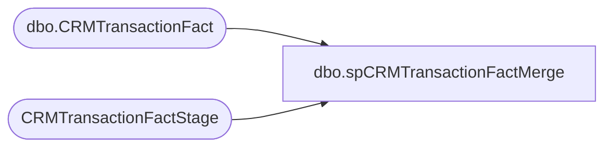

# dbo.spCRMTransactionFactMerge

**Database:** DWStaging  
**Server:** papamart  

## Architecture Diagram



## Table Dependencies

| Referenced Table |
|---|
| dbo.CRMTransactionFact |
| CRMTransactionFactStage |

## Stored Procedure Code

```sql
CREATE PROC [dbo].[spCRMTransactionFactMerge] as

-- =====================================================================================================
-- Name: spCRMTransactionFactMerge
--
--Description: Merges data from dwstaging.dbo.CRMTransactionFactStage into dw.dbo.CRMTransactionFact
--				
-- Revision History
--		Name:			Date:			Comments:
--		Dan Tweedie		09/19/2016		Created proc.	
-- =====================================================================================================


if (select count(*) from CRMTransactionFactStage) > 0

BEGIN

declare 
	@Output table 
		(
			Action varchar(10),
			TransactionID1 int,
			TransactionID2 int
		)
	

	MERGE into dw.dbo.CRMTransactionFact as target
		using
			(
				select
					TransactionID,
					GaapSales,
					GaapUnits,
					CRMTransactionID,
					StoreKey,
					TransactionDate,
					TransactionPostedDate,
					CRMTransactionType,
					POSTransactionNumber,
					POSRegisterNumber,
					CustomerNumber,
					PointsEarned,
					InsertedDate,
					ETLLogID,
					ETLEventID
				from
					CRMTransactionFactStage 
			) as source
		on
			(
				target.TransactionID = source.TransactionID
			)

		when matched
			and 
				(
					isnull(target.GaapSales,0)<>isnull(source.GaapSales,0) or
					isnull(target.GaapUnits,0)<>isnull(source.GaapUnits,0) or 
					isnull(target.CRMTransactionID, 0) <> isnull(source.CRMTransactionID, 0) OR
					isnull(target.StoreKey, 0) <> isnull(source.StoreKey, 0) OR
					isnull(target.TransactionDate, '') <> isnull(source.TransactionDate, '') OR
					isnull(target.TransactionPostedDate, '') <> isnull(source.TransactionPostedDate, '') OR
					isnull(target.CRMTransactionType, '') <> isnull(source.CRMTransactionType, '') OR
					isnull(target.POSTransactionNumber, '') <> isnull(source.POSTransactionNumber, '') OR
					isnull(target.POSRegisterNumber, 0) <> isnull(source.POSRegisterNumber, 0) OR
					isnull(target.CustomerNumber, '') <> isnull(source.CustomerNumber, '') OR
					isnull(target.PointsEarned, 0) <> isnull(source.PointsEarned, 0) 
				)
				then UPDATE
					set
						target.GaapSales=source.GaapSales,
						target.GaapUnits=source.GaapUnits,
						target.CRMTransactionID = source.CRMTransactionID,
						target.StoreKey = source.StoreKey,
						target.TransactionDate = source.TransactionDate,
						target.TransactionPostedDate = source.TransactionPostedDate,
						target.CRMTransactionType = source.CRMTransactionType,
						target.POSTransactionNumber = source.POSTransactionNumber,
						target.POSRegisterNumber = source.POSRegisterNumber,
						target.CustomerNumber = source.CustomerNumber,
						target.PointsEarned = source.PointsEarned,
						target.UpdatedDate = source.InsertedDate,
						target.UpdatedBy = 'spCRMTransactionFactMerge'

		when not matched by target
			then INSERT
				(
					TransactionID,
					GaapSales,
					GaapUnits,
					CRMTransactionID,
					StoreKey,
					TransactionDate,
					TransactionPostedDate,
					CRMTransactionType,
					POSTransactionNumber,
					POSRegisterNumber,
					CustomerNumber,
					PointsEarned,
					ETLLogID,
					ETLEventID,
					InsertedDate,
					UpdatedDate,
					InsertedBy,
					UpdatedBy
				)
			values
				(
					source.TransactionID,
					source.GaapSales,
					source.GaapUnits,
					source.CRMTransactionID,
					source.StoreKey,
					source.TransactionDate,
					source.TransactionPostedDate,
					source.CRMTransactionType,
					source.POSTransactionNumber,
					source.POSRegisterNumber,
					source.CustomerNumber,
					source.PointsEarned,
					source.ETLLogID,
					source.ETLEventID,
					source.InsertedDate,
					NULL,
					'spCRMTransactionFactMerge',
					NULL
				)

		OUTPUT 
			$action, 
			inserted.TransactionID, 
			deleted.TransactionID
			into @Output


	; --A MERGE statement must be terminated by a semi-colon (;).		
	
		
		with MergeOutput as
			(
				select 
					InsertedRows = (select count(*) from @Output where Action = 'INSERT'), 
					UpdatedRows = 0
				UNION 
				select 
					InsertedRows = 0, 
					UpdatedRows = (select count(*) from @Output where Action = 'UPDATE')
			),
		ValidationStatus as
			(
				select case when count(*) = 0 then 1 else 0 end as ValidationStatus 
				from CRMTransactionFactStage s 
				where not exists 
					(
						select d.TransactionID 
						from DW.dbo.CRMTransactionFact d with (nolock) 
						where 
							d.TransactionID = s.TransactionID
						and isnull(d.GaapSales,0)=isnull(s.GaapSales,0)
						and isnull(d.GaapUnits,0)=isnull(s.GaapUnits,0)
						and isnull(d.CRMTransactionID, 0) = isnull(s.CRMTransactionID, 0)
						and isnull(d.StoreKey, 0) = isnull(s.StoreKey, 0)
						and isnull(d.TransactionDate, '') = isnull(s.TransactionDate, '')
						and isnull(d.TransactionPostedDate, '') = isnull(s.TransactionPostedDate, '')
						and isnull(d.CRMTransactionType, '') = isnull(s.CRMTransactionType, '')
						and isnull(d.POSTransactionNumber, '') = isnull(s.POSTransactionNumber, '')
						and isnull(d.POSRegisterNumber, 0) = isnull(s.POSRegisterNumber, 0)
						and isnull(d.CustomerNumber, '') = isnull(s.CustomerNumber, '')
						and isnull(d.PointsEarned, 0) = isnull(s.PointsEarned, 0) 
					)
			)
		select 
			sum(m.InsertedRows) as InsertedRows,
			sum(m.UpdatedRows) as UpdatedRows,
			v.ValidationStatus
		from
			MergeOutput	m
			cross join ValidationStatus v	
		group by v.ValidationStatus		

END

else

begin
	select 0 as InsertedRows, 0 as UpdatedRows, 1 as ValidationStatus
end
```

