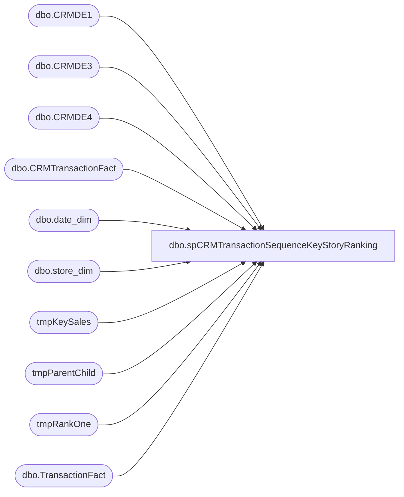

# dbo.spCRMTransactionSequenceKeyStoryRanking

**Database:** DWStaging  
**Server:** papamart  

## Architecture Diagram



## Table Dependencies

| Referenced Table |
|---|
| dbo.CRMDE1 |
| dbo.CRMDE3 |
| dbo.CRMDE4 |
| dbo.CRMTransactionFact |
| dbo.date_dim |
| dbo.store_dim |
| tmpKeySales |
| tmpParentChild |
| tmpRankOne |
| dbo.TransactionFact |

## Stored Procedure Code

```sql
CREATE proc [dbo].[spCRMTransactionSequenceKeyStoryRanking] 
@daystoGoBack int

as
--====================================================================================================================================--
--	Dan Tweedie	2020-03-19	Created proc to prestage data for Azure / Power BI - To be queried from vwCRMTransactionKeyStoryRanking 
--====================================================================================================================================--

set nocount on

IF (Object_ID('dwstaging..tmpPromo') IS NOT NULL) DROP TABLE tmpPromo
select 
	TransactionID,
	sum(case 
			when coupon_desc='Count Your Candles' 
				then 1
			else 0
		end) as hasCountYourCandles,
	sum(case
			when coupon_desc like '%birthday%gift%'
				then 1
			else 0
		end) as hasBirthdayGift,
	sum(case
			when coupon_desc like '%half%bday%' or coupon_desc like '%half%birthday%'
				then 1
			else 0
		end) as hasHalfBirthday,
	sum(case
			when coupon_desc like '%winback%'
				then 1
			else 0
		end) as hasWinback,
	sum(case 
			when coupon_desc<>'Count Your Candles' 
				and coupon_desc not like '%birthday%gift%'
				and coupon_desc not like '%half%bday%' 
				and coupon_desc not like '%half%birthday%'
				and coupon_desc not like '%winback%'
				then 1
			else 0
		end) as hasOther
into tmpPromo
from dw.dbo.CRMDE4 c with (nolock)
join dw.dbo.TransactionFact tf with (nolock) on c.TransactionID=tf.transaction_id
join dw.dbo.date_dim dd with (nolock) on tf.date_key=dd.date_key
where dd.actual_date >= dateadd(dd, -@daystoGoBack, getdate())
group by TransactionID


--use dwstaging..
IF (Object_ID('dwstaging..tmpKeySales') IS NOT NULL) DROP TABLE tmpKeySales
select 
	case c3.country 
		when 'United Kingdom' then 'UK' 
		when 'United States' then 'US'
		when 'Canada' then 'CA'
		else c3.country
	end as country,
	c3.PurchaseChannel,
	c3.customerNumber,
	c3.transactionID,
	cast(c3.purchaseDate as date) as TransactionDate,
	case 
		when isnull(c3.keyStory,'')='' 
			then 'No Key' 
		else c3.keyStory 
	end as KeyStory,
	--KeyStory,
	sum(c3.purchaseRevenue) Sales,
	sum(c3.purchaseUnitCount) Units,
	c1.FirstTransactionDate as CustomerFirstTransactionDate,
	cast(case when isnull(c1.FirstTransactionDate,'1997-01-01') >= dateadd(mm,-24, getdate()) then 1 else 0 end as int) as isFreshCustomer, --globally speaking, this is a 'fresh customer' from 2017 to present
	cast(case when ctf.LifetimeTransactionSequence=1 then 1 else 0 end as int) as isFirstPurchaseChannel,
	cast(case when ctf.LifetimeTransactionSequence=1 then 1 else 0 end as int) as isFirstPurchase,
	cast(case when ctf.LifetimeTransactionSequence=1 then 1 else 0 end as int) as isNewCustomer, -- per this transaction, this is a new customer
	cast(case when ctf.LifetimeTransactionSequence>1 then 1 else 0 end as int) as isRepeatCustomer, --this is not customer's first transaction
	cast(case when sd.store_id in (13,2013) then 1 else 0 end as int) as isWeb,
	cast(case when sd.store_id in (13,2013) then 0 else 1 end as int) as isRetail,
	ctf.LifetimeTransactionSequence,
	ctf.LifetimeVisitSequence,
	ctf.GaapSales GaapSalesTranTotal,
	c1.bonusClubMember 
	,0 as nonCrmTransFlag
into tmpKeySales
from dw.dbo.CRMDE3 c3 with (nolock) 
join dw.dbo.CRMDE1 c1 with (nolock) on c3.CustomerNumber=c1.CustomerNumber
join dw.dbo.CRMTransactionFact ctf on c3.TransactionID=ctf.TransactionID
join dw.dbo.store_dim sd with (nolock) on ctf.StoreKey=sd.store_key
where 1=1
--and c3.purchaseRevenue <> 0
--and isnull(c3.keyStory,'')<>''
and ctf.TransactionDate >= dateadd(dd, -@daystoGoBack, getdate())
group by 
	c3.country,
	c3.PurchaseChannel,
	c3.customerNumber,
	c3.transactionID,
	cast(c3.purchaseDate as date),
	case 
		when isnull(c3.keyStory,'')='' 
			then 'No Key' 
		else c3.keyStory 
	end,
	--c3.KeyStory,
	c1.FirstTransactionDate,
	sd.store_id,
	ctf.LifetimeTransactionSequence,
	ctf.LifetimeVisitSequence,
	ctf.GaapSales,
	c1.bonusClubMember 

	union

select 
        case sd.country 
                when 'United Kingdom' then 'UK' 
                when 'United States' then 'US'
                when 'Canada' then 'CA'
                else sd.country
        end as country,
'' as PurchaseChannel,
'' as customerNumber,
tf.transaction_ID,
cast(dd.actual_date as date) as TransactionDate,
'' as KeyStory,
        tf.GAAP_sales_amount as  Sales,
        0 as Units,
        '' as CustomerFirstTransactionDate,
        0 as isFreshCustomer,
        0 as isFirstPurchaseChannel,
        0 as isFirstPurchase,
        0 as isNewCustomer, 
        0 as isRepeatCustomer, 
        cast(case when sd.store_id in (13,2013) then 1 else 0 end as int) as isWeb,
        cast(case when sd.store_id in (13,2013) then 0 else 1 end as int) as isRetail,
        0 as LifetimeTransactionSequence,
        0 as LifetimeVisitSequence,
        tf.GAAP_sales_amount as GaapSalesTranTotal,
        0 as bonusClubMember,
        1 as nonCrmTransFlag
        --,sd.store_name
from papamart.dw.dbo.TransactionFact tf
join papamart.dw.dbo.date_dim dd on tf.date_key = dd.date_key
join dw.dbo.store_dim sd with (nolock) on tf.store_key=sd.store_key
where [transaction_id] not in 
(
select transactionID from dw.dbo.CRMTransactionFact
)
and tf.GAAP_transaction_flag = 1


IF (Object_ID('dwstaging..tmpParentChild') IS NOT NULL) DROP TABLE tmpParentChild
select
	t1.transactionID,
	t1.LifetimeTransactionSequence,
	t1.LifetimeVisitSequence,
	t2.transactionID as ChildTransactionID,
	t3.transactionID as ParentTransactionID
into tmpParentChild
from tmpKeySales t1
left join tmpKeySales t2 
	on t1.CustomerNumber=t2.CustomerNumber
	and t1.LifetimeTransactionSequence+1=t2.LifetimeTransactionSequence
left join tmpKeySales t3
	on t1.CustomerNumber=t3.CustomerNumber
	and t1.LifetimeTransactionSequence-1=t3.LifetimeTransactionSequence
group by 
	t1.transactionID,
	t1.LifetimeTransactionSequence,
	t1.LifetimeVisitSequence,
	t2.transactionID,
	t3.transactionID


	--RANKING NEW CUSTOMERS (FROM 2017+) SEPARATELY SINCE WE'LL BE FOCUSING ON THESE IN THE REPORTING
IF (Object_ID('dwstaging..tmpRankOne') IS NOT NULL) DROP TABLE tmpRankOne
select 
	k.Country,
	k.PurchaseChannel,
	k.customerNumber,
	k.transactionID,
	k.TransactionDate,
	k.keyStory,
	DENSE_RANK() OVER (partition by k.TransactionID ORDER BY k.Sales desc) as KeyRankPerTransaction, --ranked per transaction
	--DENSE_RANK() OVER (partition by k.LifetimeVisitSequence ORDER BY k.Sales desc) as KeyRankPerSequenceNewVOldCustomers, --ranked per transaction sequence - all first purchases, second purchase, etc
	k.sales,
	k.Units,
	k.CustomerFirstTransactionDate,
	k.isFreshCustomer,
	k.isFirstPurchaseChannel,
	k.isFirstPurchase,
	k.isNewCustomer,
	k.isRepeatCustomer,
	k.isWeb,
	k.isRetail,
	k.GaapSalesTranTotal,
	k.LifetimeTransactionSequence,
	k.LifetimeVisitSequence,
	pc.ParentTransactionID,
	pc.ChildTransactionID,
	k.bonusClubMember 
	,k.nonCrmTransFlag
into tmpRankOne
from tmpKeySales k
join tmpParentChild pc on k.TransactionID=pc.TransactionID
--where k.isFreshCustomer=1
--UNION
--select 
--	k.Country,
--	k.PurchaseChannel,
--	k.customerNumber,
--	k.transactionID,
--	k.TransactionDate,
--	k.keyStory,
--	DENSE_RANK() OVER (partition by k.TransactionID ORDER BY k.Sales desc) as KeyRankPerTransaction, --ranked per transaction
--	--DENSE_RANK() OVER (partition by k.LifetimeVisitSequence ORDER BY k.Sales desc) as KeyRankPerSequenceNewVOldCustomers, --ranked per transaction sequence - all first purchases, second purchase, etc
--	k.sales,
--	k.Units,
--	k.CustomerFirstTransactionDate,
--	k.isFreshCustomer,
--	k.isFirstPurchaseChannel,
--	k.isFirstPurchase,
--	k.isNewCustomer,
--	k.isRepeatCustomer,
--	k.isWeb,
--	k.isRetail,
--	k.GaapSalesTranTotal,
--	k.LifetimeTransactionSequence,
--	k.LifetimeVisitSequence,
--	pc.ParentTransactionID,
--	pc.ChildTransactionID
--from tmpKeySales k
--join tmpParentChild pc on k.TransactionID=pc.TransactionID
--where k.isFreshCustomer=0

IF (Object_ID('dwstaging.dbo.tmpRankTwo') IS NOT NULL) DROP TABLE tmpRankTwo
select 
	LifetimeVisitSequence,
	keyStory,
	isFreshCustomer,
	DENSE_RANK() OVER (partition by isFreshCustomer, LifetimeVisitSequence ORDER BY sum(Sales) desc) as KeyRankPerSequenceNewVOldCustomers,
	DENSE_RANK() OVER (partition by LifetimeVisitSequence ORDER BY sum(Sales) desc) as KeyRankPerSequenceGlobal
into tmpRankTwo
from tmpRankOne
group by 
	LifetimeVisitSequence,
	keyStory,
	isFreshCustomer

--IF (Object_ID('dw.Azure.CRMTransactionSequencedKeyStoryRanking') IS NOT NULL) DROP TABLE dw.Azure.CRMTransactionSequencedKeyStoryRanking
--select 
--	t1.Country,
--	t1.PurchaseChannel,
--	t1.customerNumber,
--	t1.transactionID,
--	t1.TransactionDate,
--	t1.keyStory,
--	t1.KeyRankPerTransaction, --ranked per transaction
--	t2.KeyRankPerSequenceNewVOldCustomers,
--	t2.KeyRankPerSequenceGlobal,
--	t1.sales,
--	t1.Units,
--	t1.CustomerFirstTransactionDate,
--	t1.isFreshCustomer,
--	t1.isFirstPurchaseChannel,
--	t1.isFirstPurchase,
--	t1.isNewCustomer,
--	t1.isRepeatCustomer,
--	t1.isWeb,
--	t1.isRetail,
--	t1.GaapSalesTranTotal,
--	t1.LifetimeTransactionSequence,
--	t1.LifetimeVisitSequence,
--	t1.ParentTransactionID,
--	t1.ChildTransactionID
--into dw.Azure.CRMTransactionSequencedKeyStoryRanking
--from tmpRankOne t1
--join tmpRankTwo t2 on t1.KeyStory=t2.KeyStory


IF (Object_ID('dwstaging..tmpKeySales') IS NOT NULL) DROP TABLE tmpKeySales
IF (Object_ID('dwstaging..tmpParentChild') IS NOT NULL) DROP TABLE tmpParentChild
--IF (Object_ID('dwstaging..tmpRankOne') IS NOT NULL) DROP TABLE tmpRankOne
--IF (Object_ID('dwstaging..tmpRankOne') IS NOT NULL) DROP TABLE tmpRankTwo


CREATE NONCLUSTERED INDEX [NCI_rRankOneKeyFreshLife]
ON [dbo].[tmpRankOne] ([keyStory],[isFreshCustomer],[LifetimeVisitSequence])
INCLUDE ([Country],[PurchaseChannel],[customerNumber],[transactionID],[TransactionDate],[KeyRankPerTransaction],[sales],[Units],[CustomerFirstTransactionDate],[isFirstPurchaseChannel],[isFirstPurchase],[isNewCustomer],[isRepeatCustomer],[isWeb],[isRetail],[GaapSalesTranTotal],[LifetimeTransactionSequence],[ParentTransactionID],[ChildTransactionID])
```

