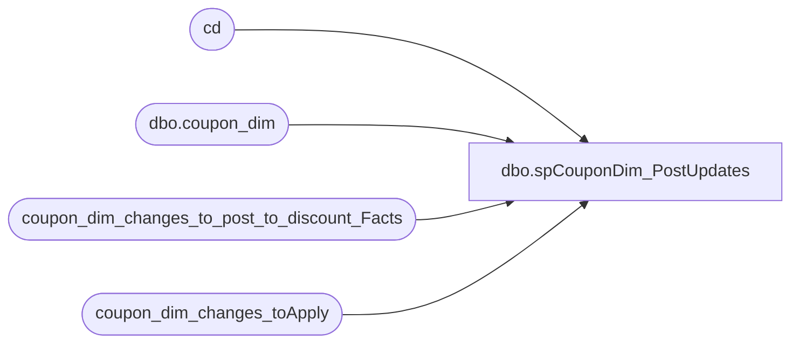

# dbo.spCouponDim_PostUpdates

**Database:** DWStaging  
**Server:** papamart  

## Architecture Diagram



## Table Dependencies

| Referenced Table |
|---|
| cd |
| dbo.coupon_dim |
| coupon_dim_changes_to_post_to_discount_Facts |
| coupon_dim_changes_toApply |

## Stored Procedure Code

```sql
CREATE PROCEDURE [dbo].[spCouponDim_PostUpdates]
-- =============================================================================================================
-- Name: spCouponDim_PostUpdates
--
-- Description:	
--	This will update the Coupon_Dim records in the data warehouse with the identified changes
--		and create a 'trigger' table of all of the changes that will affect discount_facts
--
-- Input:	coupon_dim_changes_toApply		
--
-- Output: coupon_dim_changes_to_post_to_discount_Facts,
--			coupon_dim
--
-- Dependencies: 
--
-- Revision History
--		Name:			Date:			Comments:
--		Gary Murrish	4/17/2013		Created
--		Gary Murrish	3/6/2014		Added start date as part of the triggering of updating discount_facts
-- =============================================================================================================
AS

	SET NOCOUNT ON

	TRUNCATE TABLE coupon_dim_changes_to_post_to_discount_Facts

	-- Identify any coupons which must be changed because the dates
	--		or the category changed
	INSERT INTO coupon_dim_changes_to_post_to_discount_Facts
		(	coupon_key,
			dmDiscountID)
		SELECT
			cd.coupon_key,
			cd.dmDiscountID
		FROM
			coupon_dim_changes_toApply cdca WITH (NOLOCK)
			INNER JOIN dw.dbo.coupon_dim cd WITH (NOLOCK)
				ON cdca.coupon_key = cd.coupon_key
		WHERE
			cd.categoryTypeID <> cdca.categoryTypeID
			OR cd.stop_date <> cdca.stop_date
			OR cd.start_date <> cdca.start_date

	-- Now update the Coupon_Dim
	UPDATE cd
		SET	cd.coupon_desc = cdca.coupon_desc,
			cd.start_date = cdca.start_date,
			cd.stop_date = cdca.stop_date,
			cd.qty_distributed = cdca.qty_distributed,
			cd.event_name = cdca.event_name,
			cd.category = cdca.category,
			cd.UPDT_DT = cdca.UPDT_DT,
			cd.dmDiscountID = cdca.dmDiscountID,
			cd.categoryTypeID = cdca.categoryTypeID
	FROM
		dw.dbo.coupon_dim cd WITH (NOLOCK)
		INNER JOIN coupon_dim_changes_toApply cdca WITH (NOLOCK)
			ON cd.coupon_key = cdca.coupon_key
```

