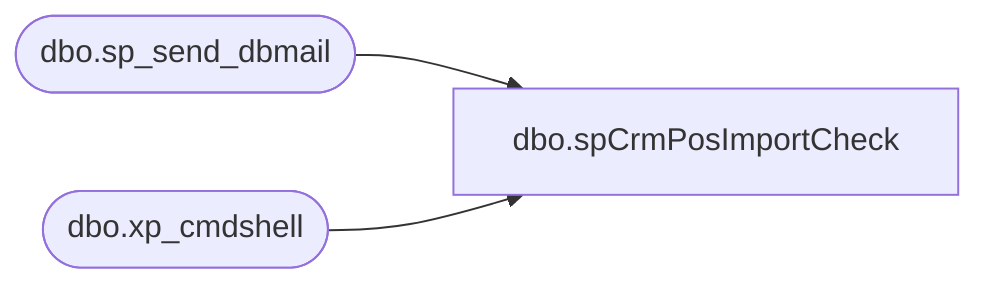

# dbo.spCrmPosImportCheck

**Database:** DWStaging  
**Server:** papamart  

## Architecture Diagram



## Table Dependencies

| Referenced Table |
|---|
| dbo.sp_send_dbmail |
| dbo.xp_cmdshell |

## Stored Procedure Code

```sql
CREATE proc [dbo].[spCrmPosImportCheck] as

set nocount on


/*  This is to check CRM import location for new files for today.
	
	Logic flow:
		If files have not arrived by 6 AM, throw an error
		If files are not there, loop every 20 minutes to check
		When files are there, extract the date time information and make sure we wait at least 45 minutes after file arrival
*/
-- DROP TABLE #CRMImportFileCheck
DECLARE 
	  @CurrentDateTime DATETIME 
	, @TodayString VARCHAR(8)
	, @cmd1 VARCHAR(1000)
	, @cmd2 VARCHAR(1000)
	, @cmd3 VARCHAR(1000)
	, @path VARCHAR(3000)
	, @CheckFileNameMask01 VARCHAR(1000)
	, @CheckFileNameMask02 VARCHAR(1000)
	, @CheckFileNameMask03 VARCHAR(1000)
	, @CountOfFilesMustValidateTo INT
	, @CountOfFilesCurrentlyPresent INT
	, @EmailRecipients VARCHAR(1000)
	, @EmailFromAddress VARCHAR(1000)
	, @EmailCCAddress VARCHAR(1000)
	, @EmailSubject VARCHAR(1000)
	, @FileArrivalDateTime DATETIME
	, @JobKickoffWaitMinutes INT
	, @JobKickoffWaitTimeString VARCHAR(5)
	, @EmailBody VARCHAR(2000)

SELECT
	 @CurrentDateTime = GETDATE()
	,@TodayString = CAST((YEAR(@CurrentDateTime)*10000 + MONTH(@CurrentDateTime)*100 + DAY(@CurrentDateTime)) AS VARCHAR(8))
	,@path = '\\crmapp02\IMPORT\'
	,@CheckFileNameMask01 = 'CIM_tender.dat.' + @TodayString + '.*'
	,@CheckFileNameMask02 = 'CIM_detail.dat.' + @TodayString + '.*'
	,@CheckFileNameMask03 = 'CIM_header.dat.' + @TodayString + '.*'
	,@CountOfFilesMustValidateTo = 3
	,@CountOfFilesCurrentlyPresent = 0
	,@EmailRecipients = 'CRMadmin@buildabear.com'
	,@EmailFromAddress = 'BIAdmin@buildabear.com' 
	,@EmailCCAddress = 'BIAdmin@buildabear.com'

CREATE TABLE #CRMImportFileCheck
(	FileFullUNCPathAndName VARCHAR(4000))

/*  If files available do not match count validation, run the check every 5 minutes until it does
*/
WHILE (@CountOfFilesCurrentlyPresent <> @CountOfFilesMustValidateTo)
BEGIN
	-- Build the command that will list out all of the files in a directory
	SELECT @cmd1 = 'dir ' + @path + @CheckFileNameMask01 + ' /OD'
	SELECT @cmd2 = 'dir ' + @path + @CheckFileNameMask02 + ' /OD'
	SELECT @cmd3 = 'dir ' + @path + @CheckFileNameMask03 + ' /OD'
	-- Run the dir command and put the results into a temp table
	INSERT INTO #CRMImportFileCheck EXEC master.dbo.xp_cmdshell @cmd1
	INSERT INTO #CRMImportFileCheck EXEC master.dbo.xp_cmdshell @cmd2
	INSERT INTO #CRMImportFileCheck EXEC master.dbo.xp_cmdshell @cmd3

	-- We get a lot of drive info from resulting query, so remove those
	DELETE
	FROM #CRMImportFileCheck
	WHERE ISDATE(SUBSTRING(FileFullUNCPathAndName, 1, 10)) = 0 OR FileFullUNCPathAndName LIKE '%
	%' OR SUBSTRING(FileFullUNCPathAndName, 25, 5) = '<DIR>'

	SELECT @CountOfFilesCurrentlyPresent = COUNT(*) 
	FROM #CRMImportFileCheck
	
	IF (@CountOfFilesCurrentlyPresent <> @CountOfFilesMustValidateTo)
	BEGIN
		-- If it's past 6 AM, enough time waiting, lets get someone to look at this problem
		IF GETDATE() > CAST(CONVERT(VARCHAR, @CurrentDateTime, 101) + ' 06:00:00 AM' AS DATETIME)
		BEGIN
			GOTO ERROR_PAST6AM
		END
		ELSE BEGIN
			
			WAITFOR DELAY '00:20:00' --wait 20 minutes
			CONTINUE
		END
	END
END

/*  At this point, all 3 files have arrived
	Start Calculating time to wait
     Files get renamed with the proper timestamp to reach this part of the code once CRM begins importing them.
                The rename operation does not change the file arrival date time, and therefore the job can kick off
                 without the data being available in CRM.  There is no way around this - we cannot tell when the file has been 
                 renamed so there will be times when the 45 minute wait is satisfied but no new data exists in CRM.
                The fix is to re-run the job a bit after the failure comes in.
*/
SELECT TOP 1 @FileArrivalDateTime = CAST(SUBSTRING(FileFullUNCPathAndName, 1, 20) AS DATETIME)
FROM #CRMImportFileCheck

SET @JobKickoffWaitMinutes = 45 - DATEDIFF(MINUTE, @FileArrivalDateTime, GETDATE())

IF (@JobKickoffWaitMinutes > 0)
BEGIN
	SET @JobKickoffWaitTimeString = '00:' + RIGHT('00' + CAST(@JobKickoffWaitMinutes AS VARCHAR(2)), 2)
	SET @EmailSubject =  'Guest Load CRM POS ETL - INFO'
	SET @EmailBody = 'Time now is ' + CAST(GETDATE() AS VARCHAR(50)) 
					+ '.  Files have arrived at ' + CAST(@FileArrivalDateTime AS VARCHAR(50)) 
					+ '.  Going to wait ' + CAST(@JobKickoffWaitMinutes AS VARCHAR(2)) + ' minutes before starting job'

	EXEC msdb.dbo.sp_send_dbmail 
		@recipients = 'biadmin@buildabear.com'
		, @copy_recipients = 'crmadmin@buildabear.com'
		, @from_address = @EmailFromAddress
		, @reply_to = @EmailFromAddress
		, @subject = @EmailSubject
		, @body = @EmailBody
		, @body_format = 'HTML' 
		, @importance = 'Normal'
	WAITFOR DELAY @JobKickoffWaitTimeString
END

-- Done
GOTO Finishing

/* Error section  */
ERROR_PAST6AM:
	SET @EmailSubject = 'Guest Load CRM POS ETL - ERROR'
	SET @EmailBody = 'The CRM data does not appear to be available yet in CRM, so cannot be pushed to our Data Warehouse. <br>
	After the CRM Administrator has verified that the files were successfully loaded into CRM from \\crmapp02\import, the data warehouse load can resume.'

	EXEC msdb.dbo.sp_send_dbmail 
		@recipients = @EmailRecipients 
		, @copy_recipients = @EmailCCAddress
		, @from_address = @EmailFromAddress
		, @reply_to = @EmailFromAddress
		, @subject = @EmailSubject
		, @body = @EmailBody
		, @body_format = 'HTML' 
		, @importance = 'High'
	RAISERROR ( 'Time is past 6 AM; please have someone look at the POS export system to see what is going on with the file export', 16, 1 )

-- Clean up
Finishing:
	DROP TABLE #CRMImportFileCheck
```

