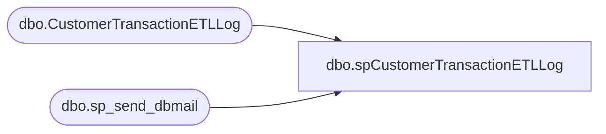

# dbo.spCustomerTransactionETLLog

**Database:** DWStaging  
**Server:** papamart  

## Architecture Diagram



## Table Dependencies

| Referenced Table |
|---|
| dbo.CustomerTransactionETLLog |
| dbo.sp_send_dbmail |

## Stored Procedure Code

```sql
CREATE proc [dbo].[spCustomerTransactionETLLog] 
	@PackageStartTime datetime,
	@CRMCustomerDimStaged int,
	@CRMCustomerDimMergeInserted int,
	@CRMCustomerDimMergeUpdated int,
	@CRMTransactionFactStaged int,
	@CRMTransactionFactMergeInserted int,
	@CRMTransactionFactMergeUpdated int,
	@NameMeTransactionFactStaged int,
	@NameMeTransactionFactMergeInserted int,
	@NameMeTransactionFactMergeUpdated int,
	@ETLLogID int,
	@CRMCustomerDimStatus int,
	@CRMTransactionFactStatus int,
	@NameMeTransactionFactStatus int


as

-- =====================================================================================================
-- Name: spCustomerTransactionETLLog
--
--Description: Executed from SSIS package CustomerTransactionETL
--				
-- Revision History
--		Name:			Date:			Comments:
--		Dan Tweedie		10/05/2016		Created proc.	
-- =====================================================================================================
set nocount on

declare
	@ValidationStatus varchar(4),
	@CRMCustomerStat varchar(4),
	@CRMTransactionStat varchar(4),
	@NameMeTransactionStat varchar(4)


select @ValidationStatus = 
	case 
		when 
				@CRMCustomerDimStatus = 1
			and @CRMTransactionFactStatus = 1
			and @NameMeTransactionFactStatus = 1
		then 'PASS'
		else 'FAIL'
	end 

select @CRMCustomerStat = case when @CRMCustomerDimStatus = 1 then 'PASS' else 'FAIL' end
select @CRMTransactionStat = case when @CRMTransactionFactStatus = 1 then 'PASS' else 'FAIL' end
select @NameMeTransactionStat = case when @NameMeTransactionFactStatus = 1 then 'PASS' else 'FAIL' end
				

insert DWStaging.dbo.CustomerTransactionETLLog
	(
		PackageStartTime,
		CRMCustomerDimStaged,
		CRMCustomerDimMergeInserted,
		CRMCustomerDimMergeUpdated,
		CRMTransactionFactStaged,
		CRMTransactionFactMergeInserted,
		CRMTransactionFactMergeUpdated,
		NameMeTransactionFactStaged,
		NameMeTransactionFactMergeInserted,
		NameMeTransactionFactMergeUpdated,
		ETLLogID,
		ValidationStatus
	)
values
	(
		@PackageStartTime,
		@CRMCustomerDimStaged,
		@CRMCustomerDimMergeInserted,
		@CRMCustomerDimMergeUpdated,
		@CRMTransactionFactStaged,
		@CRMTransactionFactMergeInserted,
		@CRMTransactionFactMergeUpdated,
		@NameMeTransactionFactStaged,
		@NameMeTransactionFactMergeInserted,
		@NameMeTransactionFactMergeUpdated,
		@ETLLogID,
		@ValidationStatus
	)
	
--if 
--	(
--		select count(*) 
--		from DWStaging.dbo.CustomerTransactionETLLog 
--		where ETLLogID = @ETLLogID
--		and ValidationStatus = 'FAIL'
--	) > 0

begin
declare 
	@text nvarchar(max),
	@subj varchar(100)

	set @text = '
	<font face =arial size = 2> ' +
		'<b>CustomerTransactionETL Validation Status: ' + @ValidationStatus + '</b>' +
		'<br>The CustomerTransactionETL SSIS validation has completed.' +
		'<br>The validation SQL confirms whether the data warehouse matches the staged data.' + 
		'<br><br>' +
		'<table border="1"><font face =arial size = 2>' +
		'<tr>
			 <th>Package Name</th>
			 <th>Package <br>StartTime</th>
			 <th>ETLLogID</th>
			 <th>Validation Status</th>
			 </tr></font>'+
		'<font face =arial size = 2>' +
		CAST ( ( SELECT 
						td = 'CustomerTransactionETL', '',
						td = convert(varchar, @PackageStartTime, 100), '',
						td = @ETLLogID,'',
						td = @ValidationStatus, ''
					FOR XML PATH('tr'), TYPE 
		) AS NVARCHAR(MAX) ) +
		'</font></table></font></p></p>
		<br>
		<br>
		<font face =arial size = 2> ' +
		'<b>CRMCustomerDim Validation Status: ' + @CRMCustomerStat + '</b>' +
		'<br>' +
		'<table border="1"><font face =arial size = 2>' +
		'<tr>
			 <th>CRM <br>CustomerDim <br>Staged</th>
			 <th>CRM <br>CustomerDim <br>Inserted</th>
			 <th>CRM <br>CustomerDim <br>Updated</th>
			 </tr></font>'+
		'<font face =arial size = 2>' +
		CAST ( ( SELECT 
						td = @CRMCustomerDimStaged,'',
						td = @CRMCustomerDimMergeInserted,'',
						td = @CRMCustomerDimMergeUpdated,''	
					FOR XML PATH('tr'), TYPE 
		) AS NVARCHAR(MAX) ) +
		'</font></table></font></p></p>
		<br>
		<br>
		<font face =arial size = 2> ' +
		'<b>CRMTransactionFact Validation Status: ' + @CRMTransactionStat + '</b>' +
		'<br>' +
		'<table border="1"><font face =arial size = 2>' +
		'<tr>
			 <th>CRM <br>TransactionFact <br>Staged</th>
			 <th>CRM <br>TransactionFact <br>Inserted</th>
			 <th>CRM <br>TransactionFact <br>Updated</th>
			 </tr></font>'+
		'<font face =arial size = 2>' +
		CAST ( ( SELECT 
						td = @CRMTransactionFactStaged,'',
						td = @CRMTransactionFactMergeInserted,'',
						td = @CRMTransactionFactMergeUpdated,''
					FOR XML PATH('tr'), TYPE 
		) AS NVARCHAR(MAX) ) +
		'</font></table></font></p></p>
		<br>
		<br>
		<font face =arial size = 2> ' +
		'<b>NameMeTransactionFact Validation Status: ' + @NameMeTransactionStat + '</b>' +
		'<br>' +
		'<table border="1"><font face =arial size = 2>' +
		'<tr>
			 <th>NameMe <br>TransactionFact <br>Staged</th>
			 <th>NameMe <br>TransactionFact <br>Inserted</th>
			 <th>NameMe <br>TransactionFact <br>Updated</th>
			 </tr></font>'+
		'<font face =arial size = 2>' +
		CAST ( ( SELECT 
						td = @NameMeTransactionFactStaged,'',
						td = @NameMeTransactionFactMergeInserted,'',
						td = @NameMeTransactionFactMergeUpdated,''
					FOR XML PATH('tr'), TYPE 
		) AS NVARCHAR(MAX) ) +
		'</font></table></font></p></p>'

	select @subj = 'Customer Transaction ETL Validation Status: ' + @ValidationStatus

	exec msdb.dbo.sp_send_dbmail
		@profile_name = 'BIAdmin',
		@recipients = 'biadmin@buildabear.com',
		@body = @text,
		@subject = @subj,
		@body_format = 'HTML'
end
```

