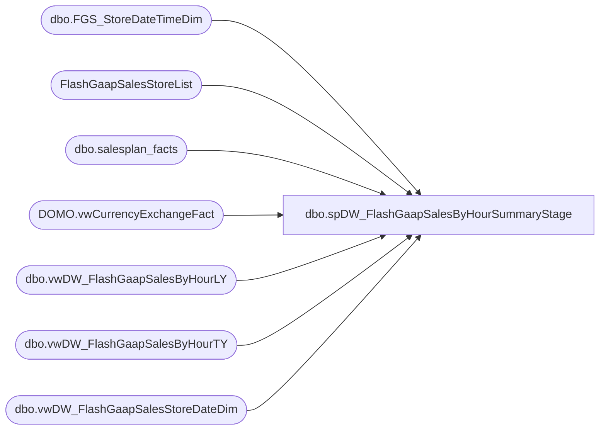

# dbo.spDW_FlashGaapSalesByHourSummaryStage

**Database:** DWStaging  
**Server:** papamart  

## Architecture Diagram



## Table Dependencies

| Referenced Table |
|---|
| dbo.FGS_StoreDateTimeDim |
| FlashGaapSalesStoreList |
| dbo.salesplan_facts |
| DOMO.vwCurrencyExchangeFact |
| dbo.vwDW_FlashGaapSalesByHourLY |
| dbo.vwDW_FlashGaapSalesByHourTY |
| dbo.vwDW_FlashGaapSalesStoreDateDim |

## Stored Procedure Code

```sql
CREATE proc [dbo].[spDW_FlashGaapSalesByHourSummaryStage]

as 

-- =====================================================================================================
-- Name: spDW_FlashGaapSalesByHourSummaryStage
--
-- Description:	Used with FlashGaapSalesByHour SSIS, stages TY vs LY side by side
--
-- Revision History
--		Name:			Date:			Comments:
--		Dan Tweedie		2016-12-09		Created Proc
--		Dan Tweedie		2017-01-10		Altered proc to stage Ty and Ly side by side for full 24 hour days, added CurrentStoreHour to identify if the BusinessHour is the current hour at the store
-- =====================================================================================================

set nocount on 

truncate table dwstaging.dbo.FGS_StoreDateTimeDim

insert dwstaging.dbo.FGS_StoreDateTimeDim
select 
	StoreID,
	StoreName,
	BusinessDate,
	BusinessHour,
	CompStatus,
	FiscalYear,
	FiscalMonth,
	store_key,
	date_key,
	time_key,
	CurrencyCode,
	TradingGroup,
	Jurisdiction
from dwstaging.dbo.vwDW_FlashGaapSalesStoreDateDim


if (object_id('tempdb..#ExchangeRate') is not null) drop table #ExchangeRate
select 
	FiscalYear,
	FiscalMonth,
	FromCurrencyCode,
	ToCurrencyCode,
	round(ExchangeRate, 8) ExchangeRate
into #ExchangeRate
from dw.DOMO.vwCurrencyExchangeFact c
where 
	ToCurrencyCode = 'USD' and FromCurrencyCode <> 'CAD'
UNION
select
	FiscalYear,
	FiscalMonth,
	ToCurrencyCode as FromCurrencyCode,
	FromCurrencyCode as ToCurrencyCode,
	round((1 / ExchangeRate), 8) ExchangeRate
from dw.DOMO.vwCurrencyExchangeFact	
where
	FromCurrencyCode = 'USD' and ToCurrencyCode = 'CAD'

if (object_id('tempdb..#ty') is not null) drop table #ty
select 
	StoreID,
	FiscalYear,
	FiscalMonth,
	CurrencyCode,
	BusinessDate,
	BusinessHour,
	TYGaapByHour,
	TYTransCountByHour,
	TYNetUnitsByHour,
	sum(TYGaapByHour) OVER (partition by StoreID, BusinessDate order by BusinessHour) TYGaapRunningTotal,
	sum(TYTransCountByHour) over (partition by StoreID, BusinessDate order by BusinessHour) TYTransCountRunningTotal,
	sum(TYNetUnitsByHour) over (partition by StoreID, BusinessDate order by BusinessHour) TYNetUnitsRunningTotal,
	date_key,
	time_key,
	store_key,
	CompStatus,
	Jurisdiction,
	TradingGroup
into #ty
from dwstaging.dbo.vwDW_FlashGaapSalesByHourTY

if (object_id('tempdb..#TYDayTotal') is not null) drop table #TYDayTotal
select 
	store_key,
	date_key,
	sum(TYGaapByHour) as TYDayTotalSales,
	sum(TYTransCountByHour) as TYDayTotalTrans,
	sum(TYNetUnitsByHour) as TYDayTotalUnits
into #TYDayTotal
from #ty
group by 
	store_key,
	date_key

if (object_id('tempdb..#ThisYear') is not null) drop table #ThisYear
select
	ty.*,
	tydt.TYDayTotalSales,
	tydt.TYDayTotalTrans,
	tydt.TYDayTotalUnits
into #ThisYear
from #ty ty
join #TYDayTotal tydt on ty.store_key = tydt.store_key and ty.date_key = tydt.date_key
order by ty.BusinessDate, ty.StoreID, ty.BusinessHour
	
if (object_id('tempdb..#ly') is not null) drop table #ly
select 
	StoreID,
	StoreName,
	BusinessDate,
	BusinessHour,
	LYGaapByHour,
	LYTransCountByHour,
	LYNetUnitsByHour,
	sum(LYGaapByHour) OVER (partition by StoreID, BusinessDate order by BusinessHour) LYGaapRunningTotal,
	sum(LYTransCountByHour) OVER (partition by StoreID, BusinessDate order by BusinessHour) LYTransCountRunningTotal,
	sum(LYNetUnitsByHour) OVER (partition by StoreID, BusinessDate order by BusinessHour) LYNetUnitsRunningTotal,
	date_key,
	time_key,
	store_key
into #ly
from dwstaging.dbo.vwDW_FlashGaapSalesByHourLY

if (object_id('tempdb..#LYDayTotal') is not null) drop table #LYDayTotal
select 
	StoreID,
	store_key,
	BusinessDate,
	date_key,
	sum(LYGaapByHour) as LYDayTotalSales,
	sum(LYTransCountByHour) as LYDayTotalTrans,
	sum(LYNetUnitsByHour) as LYDayTotalNetUnits
into #LYDayTotal
from #ly
group by 
	StoreID,
	store_key,
	date_key,
	BusinessDate

if (object_id('tempdb..#LastYear') is not null) drop table #LastYear
select
	ly.*,
	lydt.LYDayTotalSales,
	lydt.LYDayTotalTrans,
	lydt.LYDayTotalNetUnits
into #LastYear
from #ly ly
join #lYDayTotal lydt on ly.store_key = lydt.store_key and ly.date_key = lydt.date_key
order by ly.BusinessDate, ly.StoreID, ly.BusinessHour

if (object_id('dwstaging..FlashSummary') is not null) drop table dwstaging.dbo.FlashSummary
select 
	sl.LocationCode as StoreKey,
	TY.FiscalYear,
	TY.FiscalMonth,
	TY.BusinessDate,
	TY.StoreID,
	LY.StoreName,
	TY.BusinessHour,
	TY.TYGaapByHour as TYGaapByHourNative,
	cast((TY.TYGaapByHour * isnull(er.ExchangeRate, 1)) as decimal(38,2)) as TYGaapByHourUSD,
	TY.TYGaapRunningTotal as TYGaapByHourRunningTotalNative,
	cast((TY.TYGaapRunningTotal * isnull(er.ExchangeRate, 1)) as decimal(38,2)) as TYGaapByHourRunningTotalUSD, 
	TY.TYDayTotalSales as TYDayTotalSalesNative,
	cast((TY.TYDayTotalSales * isnull(er.ExchangeRate, 1)) as decimal(38,2)) as TYDayTotalSalesUSD,
	LY.LYGaapByHour as LYGaapByHourNative,
	cast((LY.LYGaapByHour * isnull(er.ExchangeRate, 1)) as decimal(38,2)) as LYGaapByHourUSD,
	LY.LYGaapRunningTotal as LYGaapByHourRunningTotalNative,
	cast((LY.LYGaapRunningTotal * isnull(er.ExchangeRate, 1)) as decimal(38,2)) as LYGaapByHourRunningTotalUSD,
	LY.LYDayTotalSales as LYDayTotalSalesNative,
	cast((LY.LYDayTotalSales * isnull(er.ExchangeRate, 1)) as decimal(38,2)) as LYDayTotalSalesUSD,

	TY.TYTransCountByHour,
	TY.TYDayTotalTrans,
	TY.TYTransCountRunningTotal,
	TY.TYNetUnitsByHour,
	TY.TYDayTotalUnits,
	TY.TYNetUnitsRunningTotal,

	ty.CompStatus,
	ty.Jurisdiction,
	ty.TradingGroup,
	isnull(sp.amount,0) DaySalesPlan,
	sl.CurrentStoreTime,
	case when (
				(datediff(dd, TY.BusinessDate, getdate()) = 0 or datediff(dd, TY.BusinessDate, getdate()+1) = 0) 
				and Ty.BusinessHour = datepart(hh, sl.CurrentStoreTime)
			   )
		then 1 
		else 0 
	end as CurrentHour
into dwstaging.dbo.FlashSummary
from #ThisYear Ty
join #LastYear LY  
	on TY.StoreID = LY.StoreID
	and TY.date_key - 364 = LY.date_key
	and TY.BusinessHour = LY.BusinessHour
join FlashGaapSalesStoreList sl on TY.StoreID = sl.StoreID
left join dw.dbo.salesplan_facts sp 
	on ty.store_key = sp.store_key
	and ty.date_key = sp.date_key
left join #ExchangeRate er
	on ty.FiscalYear = er.FiscalYear 
	and ty.FiscalMonth = er.FiscalMonth 
	and ty.CurrencyCode = er.FromCurrencyCode
order by TY.BusinessDate, TY.StoreID, TY.BusinessHour
```

