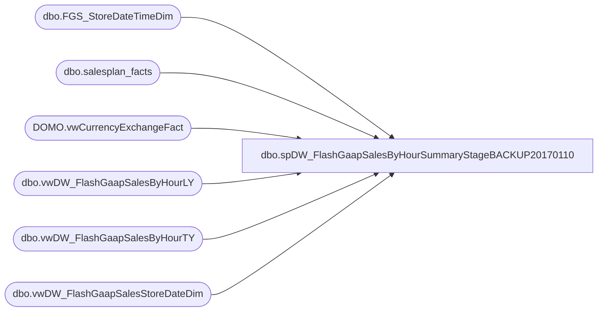

# dbo.spDW_FlashGaapSalesByHourSummaryStageBACKUP20170110

**Database:** DWStaging  
**Server:** papamart  

## Architecture Diagram



## Table Dependencies

| Referenced Table |
|---|
| dbo.FGS_StoreDateTimeDim |
| dbo.salesplan_facts |
| DOMO.vwCurrencyExchangeFact |
| dbo.vwDW_FlashGaapSalesByHourLY |
| dbo.vwDW_FlashGaapSalesByHourTY |
| dbo.vwDW_FlashGaapSalesStoreDateDim |

## Stored Procedure Code

```sql
CREATE proc [dbo].[spDW_FlashGaapSalesByHourSummaryStageBACKUP20170110]

as 

-- =====================================================================================================
-- Name: spDW_FlashGaapSalesByHourSummaryStage
--
-- Description:	Used with FlashGaapSalesByHour SSIS, stages TY vs LY side by side
--
-- Revision History
--		Name:			Date:			Comments:
--		Dan Tweedie		2016-12-09		Created Proc
-- =====================================================================================================

set nocount on 

truncate table dwstaging.dbo.FGS_StoreDateTimeDim

insert dwstaging.dbo.FGS_StoreDateTimeDim
select 
	StoreID,
	StoreName,
	BusinessDate,
	BusinessHour,
	CompStatus,
	FiscalYear,
	FiscalMonth,
	store_key,
	date_key,
	time_key,
	CurrencyCode,
	TradingGroup,
	Jurisdiction
from dwstaging.dbo.vwDW_FlashGaapSalesStoreDateDim

if (object_id('tempdb..#ExchangeRate') is not null) drop table #ExchangeRate
select 
	FiscalYear,
	FiscalMonth,
	FromCurrencyCode,
	ToCurrencyCode,
	round(ExchangeRate, 8) ExchangeRate
into #ExchangeRate
from dw.DOMO.vwCurrencyExchangeFact c
where 
	ToCurrencyCode = 'USD' and FromCurrencyCode <> 'CAD'
UNION
select
	FiscalYear,
	FiscalMonth,
	ToCurrencyCode as FromCurrencyCode,
	FromCurrencyCode as ToCurrencyCode,
	round((1 / ExchangeRate), 8) ExchangeRate
from dw.DOMO.vwCurrencyExchangeFact	
where
	FromCurrencyCode = 'USD' and ToCurrencyCode = 'CAD'

if (object_id('tempdb..#ty') is not null) drop table #ty
select *
into #ty
from dwstaging.dbo.vwDW_FlashGaapSalesByHourTY

if (object_id('tempdb..#TYDayTotal') is not null) drop table #TYDayTotal
select 
	store_key,
	date_key,
	sum(TYGaapByHour) as TYDayTotalSales,
	sum(TYTransCountByHour) as TYDayTotalTrans
into #TYDayTotal
from #ty
group by 
	store_key,
	date_key
	
if (object_id('tempdb..#ly') is not null) drop table #ly
select *
into #ly
from dwstaging.dbo.vwDW_FlashGaapSalesByHourLY

if (object_id('tempdb..#LYDayTotal') is not null) drop table #LYDayTotal
select 
	StoreID,
	store_key,
	BusinessDate,
	date_key,
	sum(LYGaapByHour) as LYDayTotalSales,
	sum(LYTransCountByHour) as LYDayTotalTrans
into #LYDayTotal
from #ly
group by 
	StoreID,
	store_key,
	date_key,
	BusinessDate

if (object_id('dwstaging..FGSNotInTY') is not null) drop table dwstaging.dbo.FGSNotInTY
select distinct
	right((replicate('0', 4) + cast(LY.StoreID as varchar)),4) StoreKey,
	sd.StoreName,
	ly.store_key,
	ly.date_key+364 as date_key,
	dateadd(dd, +364, ly.BusinessDate) as BusinessDate,
	ly.LYDayTotalSales as LYSalesDayTotalLocal,
	cast((ly.LYDayTotalSales * isnull(er.ExchangeRate, 1)) as decimal(38,2)) as LYSalesDayTotalUSD,
	case when sd.CompStatus = 1
		then ly.LYDayTotalSales
		else 0
	end as CompLYSalesDayTotalLocal,
	case when sd.CompStatus = 1
		then cast((ly.LYDayTotalSales * isnull(er.ExchangeRate, 1)) as decimal(38,2))
		else 0
	end as CompLYSalesDayTotalUSD,
	ly.LYDayTotalTrans,
	isnull(sp.amount,0) DaySalesPlan,
	sd.CompStatus,
	sd.CurrencyCode,
	sd.TradingGroup,
	sd.Jurisdiction
into dwstaging.dbo.FGSNotInTY
from #LYDayTotal ly
left join #TYDayTotal ty 
	on ly.store_key = ty.store_key
	and ly.date_key = ty.date_key-364
left join dw.dbo.salesplan_facts sp with (nolock)
	on ly.store_key = sp.store_key
	and ly.date_key+364 = sp.date_key
join dwstaging.dbo.FGS_StoreDateTimeDim sd 
	on ly.store_key = sd.store_key
	and ly.date_key+364 = sd.date_key
left join #ExchangeRate er
	on sd.FiscalYear = er.FiscalYear 
	and sd.FiscalMonth = er.FiscalMonth 
	and sd.CurrencyCode = er.FromCurrencyCode
where 
	ly.LYDayTotalSales > 0
	and ty.store_key is NULL

if (object_id('tempdb..#TyLy') is not null) drop table #TyLy
select 
	ty.StoreID,
	ty.StoreName,
	ty.FiscalYear,
	ty.FiscalMonth,
	ty.BusinessDate,
	ty.BusinessHour,
	ty.TYGaapByHour as TYGaapByHourNative,
	cast((ty.TYGaapByHour * isnull(ExchangeRate, 1)) as decimal(38,2)) as TYGaapByHourUSD,
	ty.TYTransCountByHour,
	ty.CurrencyCode,
	ty.CompStatus,
	ty.Jurisdiction,
	ty.TradingGroup,
	isnull(sp.amount,0) DaySalesPlan,
	ly.LYGaapByHour as LYGaapByHourNative,
	cast((ly.LYGaapByHour * isnull(ExchangeRate, 1)) as decimal(38,2)) as LYGaapByHourUSD,
	ly.LYTransCountByHour,
	tydt.TYDayTotalSales as TYDayTotalSalesNative,
	cast((tydt.TYDayTotalSales * isnull(ExchangeRate, 1)) as decimal(38,2)) as TYDayTotalSalesUSD,
	tydt.TYDayTotalTrans,
	lydt.LYDayTotalSales as LYDayTotalSalesNative,
	cast((lydt.LYDayTotalSales * isnull(ExchangeRate, 1)) as decimal(38,2)) as LYDayTotalSalesUSD,
	lydt.LYDayTotalTrans
into #TyLy
from #ty ty
join #ly ly
	on ty.store_key = ly.store_key
	and ty.time_key = ly.time_key
	and ty.date_key - 364 = ly.date_key
join #LYDayTotal lydt 
	on ty.store_key = lydt.store_key
	and ty.date_key -364 = lydt.date_key
join #TYDayTotal tydt 
	on ty.store_key = tydt.store_key
	and ty.date_key = tydt.date_key
left join dw.dbo.salesplan_facts sp 
	on ty.store_key = sp.store_key
	and ty.date_key = sp.date_key
left join #ExchangeRate er
	on ty.FiscalYear = er.FiscalYear 
	and ty.FiscalMonth = er.FiscalMonth 
	and ty.CurrencyCode = er.FromCurrencyCode


if (object_id('tempdb..#RunningTotal') is not null) drop table #RunningTotal
select 
	StoreID,
	BusinessDate,
	BusinessHour,
	sum(TYGaapByHourNative) OVER (partition by StoreID, BusinessDate order by BusinessHour) as TYGaapByHourRunningTotalNative,
	sum(TYGaapByHourUSD) OVER (partition by StoreID, BusinessDate order by BusinessHour) as TYGaapByHourRunningTotalUSD,
	sum(TYTransCountByHour) OVER (partition by StoreID, BusinessDate order by BusinessHour) as TYTransCountByHourRunningTotal,
	sum(LYGaapByHourNative) OVER (partition by StoreID, BusinessDate order by BusinessHour) as LYGaapByHourRunningTotalNative,
	sum(LYGaapByHourUSD) OVER (partition by StoreID, BusinessDate order by BusinessHour) as LYGaapByHourRunningTotalUSD,
	sum(LYTransCountByHour) OVER (partition by StoreID, BusinessDate order by BusinessHour) as LYTransCountByHourRunningTotal
into #RunningTotal
from #TyLy
order by 
	StoreID,
	BusinessDate,
	BusinessHour

if (object_id('dwstaging..FGSummary') is not null) drop table dwstaging.dbo.FGSummary
select 
	TyLy.StoreID,
	TyLy.StoreName,
	TyLy.FiscalYear,
	TyLy.FiscalMonth,
	TyLy.BusinessDate,
	TyLy.BusinessHour,
	TyLy.TYGaapByHourNative,
	TyLy.TYGaapByHourUSD,
	rt.TYGaapByHourRunningTotalNative,
	rt.TYGaapByHourRunningTotalUSD,
	TyLy.TYTransCountByHour,
	rt.TYTransCountByHourRunningTotal,
	TyLy.TYDayTotalSalesNative,
	TyLy.TYDayTotalSalesUSD,
	TyLy.TYDayTotalTrans,
	TyLy.CurrencyCode,
	TyLy.CompStatus,
	TyLy.Jurisdiction,
	TyLy.TradingGroup,
	TyLy.DaySalesPlan,
	TyLy.LYGaapByHourNative,
	TyLy.LYGaapByHourUSD,
	rt.LYGaapByHourRunningTotalNative,
	rt.LYGaapByHourRunningTotalUSD,
	TyLy.LYTransCountByHour,
	rt.LYTransCountByHourRunningTotal,
	TyLy.LYDayTotalSalesNative,
	TyLy.LYDayTotalSalesUSD,
	TyLy.LYDayTotalTrans,

	cast
			(
				100 * isnull(
						nullif(rt.TYGaapByHourRunningTotalNative,0) / nullif(rt.LYGaapByHourRunningTotalNative,0) -1
					,0)
				as decimal (38,2)
			) as SalesPercentToLYRunningTotal,
	cast
			(
				100 * isnull(
						nullif(rt.TYGaapByHourRunningTotalNative,0) / nullif(TyLy.LYDayTotalSalesNative,0) -1
					,0)
				as decimal (38,2)
			) as SalesPercentToLYDayTotal
into dwstaging.dbo.FGSummary
from #TyLy TyLy 
join #RunningTotal rt 
	on	TyLy.StoreID = rt.StoreID
	and TyLy.BusinessDate = rt.BusinessDate
	and TyLy.BusinessHour = rt.BusinessHour
order by 
	TyLY.BusinessDate,
	TyLy.StoreID,
	TyLy.BusinessHour


--------
```

